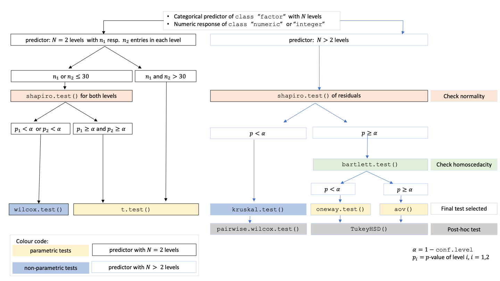

```{r, include = FALSE}
knitr::opts_chunk$set(
  echo = TRUE,
  eval = TRUE,
  collapse = TRUE,
  warning = FALSE,
  comment = "#>",
  fig.width = 8,
  fig.height = 5,
  out.width = "100%",
  fig.path = "man/figures/README-"
)
```
<!-- pkgdown::start -->


# visStatistics: The right test, visualised.

The R package `visStatistics` allows for rapid **vis**ualisation and statistical
analysis of raw data. It automatically selects and visualises the most
appropriate **statistic**al hypothesis test between two vectors of class
`integer`, `numeric` or `factor`.
<!-- (an input vector of class -->
<!-- `character` will be internally transformed to class `factor`). -->

While numerous R packages provide statistical testing functionality, few are
designed with pedagogical accessibility as a primary concern. `visStatistics` 
addresses this gap
by automating the test selection process and presenting results using annotated,
publication-ready visualisations. 
This helps the user to focus on interpretation rather than technical execution.

The automated workflow is particularly suited for browser-based interfaces that
rely on  server-side R applications connected to secure databases, where users have no
direct access, or for quick data visualisation, e.g. in statistical consulting
projects or educational settings. 


# Installation of latest stable version from CRAN

#### 1. Install the package

``` {r install, eval = FALSE}
install.packages("visStatistics")
```
#### 2. Load the package

```{r load, eval = FALSE}
library(visStatistics)
```
# Installation of the development version from GitHub

#### 1.Install `devtools` from CRAN if not already installed:

``` {r install-devtools, eval = FALSE}
install.packages("devtools")
```
####  2. Load the `devtools` package:

``` {r load-devtools, eval = FALSE}
library(devtools)
```
#### 3. Install the `visStatistics` package from GitHub:

``` {r install-github, eval = FALSE}
install_github("shhschilling/visStatistics")
```
####  4. Load the `visStatistics` package:

``` {r load-library, eval = FALSE}
library(visStatistics)
```
#### 5. View help for the main function:

``` {r, eval = FALSE }
? visstat
```

#### 6. Study all the details in the packages' vignette: 

``` {r load-visstat, eval = FALSE}
vignette("visStatistics")
```

# Getting Started

The function `visstat()` accepts input in two ways:

```r
# Standardised form (recommended):
visstat(x, y)

# Backward-compatible form:
visstat(dataframe, "namey", "namex")
```

In the standardised form, `x` and `y` must be vectors of class `"numeric"`,
`"integer"`, or `"factor"`.

In the backward-compatible form, `"namex"` and `"namey"` must be
character strings naming columns in a `data.frame` named `dataframe`. These column must be of 
class `"numeric"`, `"integer"`, or `"factor"`. This is equivalent to writing:

```r
visstat(dataframe[["namex"]], dataframe[["namey"]])
```


To simplify the notation, throughout the remainder, data of class `numeric` or
`integer` are both referred to by their common `mode` **`numeric`**,
while data of class `factor` are
referred to as **`categorical`**.

The interpretation of `x` and `y` depends on their classes:

- If one is numeric and the other is a factor, the numeric must be passed as 
response `y`
  and the factor as predictor `x`. This supports tests for central tendencies.

- If both are numeric, a simple linear regression model is fitted with `y` 
as the response and `x` as the predictor.

- If both are factors, a test of association is performed (Chi-squared or
  Fisher’s exact). The test is symmetric, but the plot layout depends on which
  variable is supplied as `x`.


`visstat()` selects the appropriate statistical test
and generates visualisations accompanied by the main test statistics.

# Examples


```{r load-library-real, eval = TRUE}
library(visStatistics)
```


## Numerical response and categorical predictor
When the response is numerical and the predictor is categorical, test of
central tendencies are selected.

### Welch two sample t-test 

#### InsectSprays data set — both input forms

```{r insect-sprays, eval = TRUE}
insect_sprays_ab <- InsectSprays[InsectSprays$spray %in% c("A", "B"), ]
insect_sprays_ab$spray <- factor(insect_sprays_ab$spray)

# Standardised input fom
visstat(insect_sprays_ab$spray, insect_sprays_ab$count)
```


<!-- # #### mtcars data set -->
<!-- #  -->
<!-- # ```{r mtcars} -->
<!-- # mtcars$am <- as.factor(mtcars$am) -->
<!-- # t_test_statistics <- visstat(mtcars$am, mtcars$mpg) -->

```

### Wilcoxon rank sum test


```{r sex-grades2}
grades_gender <- data.frame(
  sex = factor(rep(c("girl", "boy"), times = c(21, 23))),
  grade = c(
    19.3, 18.1, 15.2, 18.3, 7.9, 6.2, 19.4, 20.3, 9.3, 11.3,
    18.2, 17.5, 10.2, 20.1, 13.3, 17.2, 15.1, 16.2, 17.0, 16.5, 5.1,
    15.3, 17.1, 14.8, 15.4, 14.4, 7.5, 15.5, 6.0, 17.4, 7.3, 14.3,
    13.5, 8.0, 19.5, 13.4, 17.9, 17.7, 16.4, 15.6, 17.3, 19.9, 4.4, 2.1
  )
)

wilcoxon_statistics <- visstat(grades_gender$sex, grades_gender$grade)
```


### One-way test

```{r npk-onewy}
one_way_npk <- visstat(npk$block,npk$yield)
```

### Kruskal-Wallis test
```{r iris-kruskal}
kruskal_iris=visstat(iris$Species, iris$Petal.Width)
```


## Numerical response and numerical predictor: Linear Regression

```{r lin-reg-dist-speed}
linreg_cars <- visstat(cars$speed ,cars$dist)
```

Increasing the confidence level `conf.level` from the default 0.95 to
0.99 leads two wider confidence and prediction bands:

```{r pressure, echo = FALSE}
linreg_cars_99 <- invisible(visstat(cars$speed ,cars$dist, conf.level = 0.99))
```

## Both variables categorical

### Pearson's Chi-squared test

Count data sets are often presented as multidimensional arrays, so - called contingency tables, whereas `visstat()` requires a
`data.frame` with a column structure. Arrays can be transformed to this
column wise structure with the helper function `counts_to_cases()`:

```{r pearson}
hair_eye_color_df <- counts_to_cases(as.data.frame(HairEyeColor))
visstat(hair_eye_color_df$Eye, hair_eye_color_df$Hair)
```

### Fisher's exact test

```{r haireye-fisher}
hair_eye_color_male <- HairEyeColor[, , 1]
# Slice out a 2 by 2 contingency table
black_brown_hazel_green_male <- hair_eye_color_male[1:2, 3:4]
# Transform to data frame
black_brown_hazel_green_male <- counts_to_cases(as.data.frame(black_brown_hazel_green_male))
# Fisher test
fisher_stats <- visstat(black_brown_hazel_green_male$Eye,black_brown_hazel_green_male$Hair)
```


#  Saving the graphical output

All generated graphics can be saved in any file format supported by `Cairo()`, 
including "png", "jpeg", "pdf", "svg", "ps", and "tiff" in the user specified `plotDirectory`.


If the optional argument `plotName` is not given, the naming of the output
follows the pattern `"testname_namey_namex."`, where `"testname"` specifies
the selected test or visualisation and `"namey"` and `"namex"` are character strings naming the
selected data vectors `y` and `x`, respectively. The suffix corresponding to
the chosen `graphicsoutput` (e.g., `"pdf"`, `"png"`) is then concatenated to
form the complete output file name.

In the following example, we store the graphics in `png` format in the `plotDirectory` `tempdir()` with the default naming convention: 

```{r}
#Graphical output written to plotDirectory: In this example 
# a bar chart to visualise the Chi-squared test and mosaic plot showing
# Pearson's residuals named 
#chi_squared_or_fisher_Hair_Eye.png and mosaic_complete_Hair_Eye.png resp. 
save_fisher <- visstat(black_brown_hazel_green_male, "Hair", "Eye",
        graphicsoutput = "png", plotDirectory = tempdir())
```

The full file path of the generated graphics are stored as the attribute
`"plot_paths"` on the returned object of class `"visstat"`.

```{r show-path2}
paths <- attr(save_fisher, "plot_paths")
print(paths)
```

Remove the graphical output from `plotDirectory`:

```{r, eval=TRUE}
file.remove(paths)
```


# Decision logic


The choice of statistical tests depends on whether the data of the selected columns are numeric or categorical, the number of levels in the categorical variable, and the distribution of the data. The function prioritizes interpretable visual output and tests that remain valid under the  decision logic given below. The rationale for the test choices are given in the packages' `vignette`.

## Numerical response and categorical predictor
When the response is numeric and the predictor is categorical, a statistical hypothesis test of central tendencies is selected.

- If the categorical predictor has exactly two levels, Welch's t-test (`t.test()`)
is applied when both groups contain more than 30 observations. This heuristic is
based on the central limit theorem, which ensures approximate normality of the
sampling distribution of the mean [@Rasch:2011; @Lumley:2002].
For smaller samples, group - wise normality is assessed using the Shapiro -
Wilk test (`shapiro.test()`) at the significance level $\alpha$ [@Razali:2011; @Ghasemi:2012]. If both groups are found to be approximately normally distributed according to the Shapiro -
Wilk test, Welch's t-test is applied; otherwise, the Wilcoxon rank-sum test (`wilcox.test()`) is used.

- For predictors with more than two levels, an ANOVA model (`aov()`) is initially fitted. The normality of residuals is evaluated using both the Shapiro–Wilk test (`shapiro.test()`) and the Anderson–Darling test (`ad.test()`) [@Gross:2015]; 
the algorithm considers residuals approximately normal if the Shapiro–Wilk test yields a result exceeding the significance threshold $\alpha$ [@Razali:2011]: 
<!-- if at least one of the two tests yields a result exceeding the significance threshold $\alpha$.  -->
If this condition is met, the Levene-Brown–Forsythe-test [@Brown:1974] (`levene.test()`) is then used to assess homoscedasticity. When variances are homogeneous ($p > \alpha$), ANOVA is applied with Tukey's HSD (`TukeyHSD()`) for post-hoc comparison. If variances differ significantly ($p \le \alpha$), Welch's one -
way test (`oneway.test()`) is used, also followed by Tukey's HSD. If residuals are not normally distributed according to both tests ($p \le \alpha$), the Kruskal-Wallis test (`kruskal.test()`) is selected, followed by pairwise Wilcoxon tests (`pairwise.wilcox.test()`).


A graphical overview of the decision logic used is provided in below figure.

<div style="border: 1px solid #666; padding: 10px; display: inline-block; text-align: left;">



<p style="font-style: italic; font-size: 90%; margin-top: 0.5em;">
Decision tree used to select the appropriate statistical test for a categorical
predictor and numeric response, based on the number of factor levels, normality,
and homoscedasticity.
</p>

</div>

## Numerical response and numerical predictor: Linear Regression

When both the response and predictor are numeric, a simple linear regression model (`lm()`) is fitted. The resulting plots shows the regression line, confidence and prognosis bands. Residual analysis is performed both graphically (Tukey-Anscombe residual plot and QQ-plot) and via tests for normality `shapiro.test()` and `ad.test()`. Note that only one explanatory variable is allowed, as the function is designed for two-dimensional visualisation.

## Both variables categorical

When both variables are categorical, `visstat()` tests the null hypothesis that both variables are independent using either `chisq.test()` or `fisher.test()`. The choice of test is based on Cochran's rule [@Cochran:1954], which advises that the$\chi^2$approximation is reliable only if no expected cell count is zero and no more than 20 percent of cells have expected counts below 5.

For a more detailed description of the underlying decision logic see

``` {r vignette,eval=FALSE}
vignette("visStatistics")
```

# Limitations

The main purpose of this package is a decision-logic based automatic visualisation of statistical test results.
Therefore, except for the user-adjustable `conf.level` parameter, all statistical tests are applied using their default settings from the corresponding base R functions.
As a consequence, paired tests are currently not supported and `visstat()` does not allow to study interactions terms between the different levels of an independent variable in an analysis of variance.
Focusing on the graphical representation of tests, only simple linear regression is implemented, as multiple linear regressions cannot be visualised.


## Implemented tests

### Numerical response and categorical predictor

#### Main tests

`t.test()`, `wilcox.test()`, `aov()`, `oneway.test()`, `kruskal.test()`

#### Normality assumption check

`shapiro.test()` and `ad.test()`[@Gross:2015]

#### Homoscedasticity assumption check

`levene.test()` and `bartlett.test()`

#### Post-hoc tests

-`TukeyHSD()` (used following `aov()`and `oneway.test()`)

-`pairwise.wilcox.test()` (used following `kruskal.test()`)


### Numerical response and numerical predictor

When both the response and predictor are numerical, a simple linear
regression model is fitted:`lm()`. Normality of residuals is assessed both graphically(Tukey-Anscombe plot and Q-Q plot) as well as with `shapiro.test()` and `ad.test()`

Note that multiple linear regression models are not implemented, as the package focuses
on the visualisation of data, not model building.
### Categorical response and categorical predictor

When both variables are categorical, `visstat()` tests the null
hypothesis of independence using one of the following:-`chisq.test()` (default for larger samples)
-  `fisher.test()` (used for small expected cell counts based on
Cochran's rule)


## References

<!-- - Rasch, D., Kubinger, K. D., & Moder, K. (2011). *The two-sample t test: pre-testing   -->
<!--   its assumptions does not pay off*. _Methods of Information in Medicine_, 50(4),   -->
<!--   419–426. -->

<!-- - Lumley, T., Diehr, P., Emerson, S., & Chen, L. (2002). *The importance of the   -->
<!--   normality assumption in large public health data sets*. _Annual Review of Public   -->
<!--   Health_, 23, 151–169. -->

<!-- - Cochran, W. G. (1954). *Some methods for strengthening the common chi-squared   -->
<!--   tests*. _Biometrics_, 10(4), 417–451. -->

<!-- pkgdown::end -->