<!-- pkgdown::start -->
<!-- pkgdown::start -->

# visStatistics: The right test, visualised.

The R package `visStatistics` allows for rapid **vis**ualisation and
statistical analysis of raw data. It automatically selects and
visualises the most appropriate **statistic**al hypothesis test between
two vectors of class `integer`, `numeric` or `factor`.

This workflow is particularly suited for browser-based interfaces that
rely on server-side R applications connected to secure databases, where
users have no direct access, or for quick data visualisation, e.g. in
statistical consulting projects.

# Installation of latest stable version from CRAN

#### 1. Install the package

    install.packages("visStatistics")

#### 2. Load the package

    library(visStatistics)

# Installation of the development version from GitHub

#### 1.Install `devtools` from CRAN if not already installed:

    install.packages("devtools")

#### 2. Load the `devtools` package:

    library(devtools)

#### 3. Install the `visStatistics` package from GitHub:

    install_github("shhschilling/visStatistics")

#### 4. Load the `visStatistics` package:

    library(visStatistics)

#### 5. View help for the main function:

    ? visstat

# Getting Started

The function `visstat()` accepts input in two ways:

    # Standardised form (recommended):
    visstat(x, y)

    # Backward-compatible form:
    visstat(dataframe, "name_of_y", "name_of_x")

In the standardised form, `x` and `y` must be vectors of class
`"numeric"`, `"integer"`, or `"factor"`.

In the backward-compatible form, `"name_of_x"` and `"name_of_y"` must be
character strings naming columns in a `data.frame` named `dataframe`.
These column must be of class `"numeric"`, `"integer"`, or `"factor"`.
This is equivalent to writing:

    visstat(dataframe[["name_of_x"]], dataframe[["name_of_y"]])

To simplify the notation, throughout the remainder, data of class
`numeric` or `integer` are both referred to by their common `mode`
**`numeric`**, while data of class `factor` are referred to as
**`categorical`**.

The interpretation of `x` and `y` depends on their classes:

- If one is numeric and the other is a factor, the numeric must be
  passed as response `y` and the factor as predictor `x`. This supports
  tests for central tendencies.

- If both are numeric, a simple linear regression model is fitted with
  `y` as the response and `x` as the predictor.

- If both are factors, a test of association is performed (Chi-squared
  or Fisher’s exact). The test is symmetric, but the plot layout depends
  on which variable is supplied as `x`.

`visstat()` selects the appropriate statistical test and generates
visualisations accompanied by the main test statistics.

# Examples

    library(visStatistics)

## Numerical response and categorical predictor

When the response is numerical and the predictor is categorical, test of
central tendencies are selected.

### Welch two sample t-test

#### InsectSprays data set — both input forms

    insect_sprays_ab <- InsectSprays[InsectSprays$spray %in% c("A", "B"), ]
    insect_sprays_ab$spray <- factor(insect_sprays_ab$spray)

    # Standardised
    visstat(insect_sprays_ab$spray, insect_sprays_ab$count)

    # Backward-compatible function call resulting in same output
    # visstat(insect_sprays_ab,"count", "spray")

#### mtcars data set

    mtcars$am <- as.factor(mtcars$am)
    t_test_statistics <- visstat(mtcars$am, mtcars$mpg)

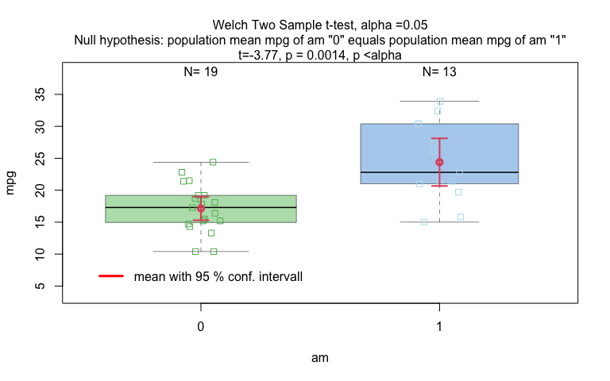

    # t_test_statistics

### Wilcoxon rank sum test

    grades_gender <- data.frame(
      sex = factor(rep(c("girl", "boy"), times = c(21, 23))),
      grade = c(
        19.3, 18.1, 15.2, 18.3, 7.9, 6.2, 19.4, 20.3, 9.3, 11.3,
        18.2, 17.5, 10.2, 20.1, 13.3, 17.2, 15.1, 16.2, 17.0, 16.5, 5.1,
        15.3, 17.1, 14.8, 15.4, 14.4, 7.5, 15.5, 6.0, 17.4, 7.3, 14.3,
        13.5, 8.0, 19.5, 13.4, 17.9, 17.7, 16.4, 15.6, 17.3, 19.9, 4.4, 2.1
      )
    )

    wilcoxon_statistics <- visstat(grades_gender$sex, grades_gender$grade)

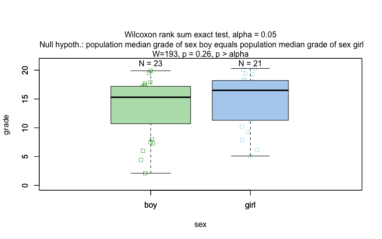

### One-way test

    one_way_npk <- visstat(npk$block,npk$yield)

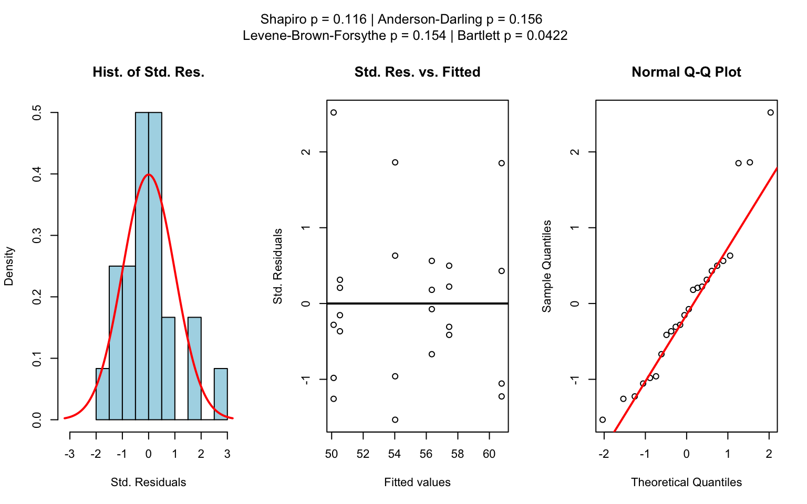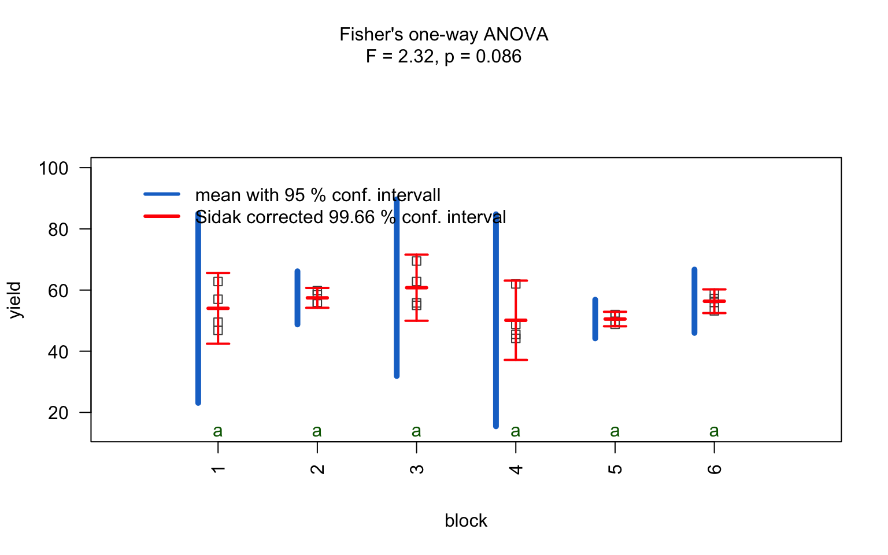

### Kruskal-Wallis test

    visstat(iris$Species, iris$Petal.Width)

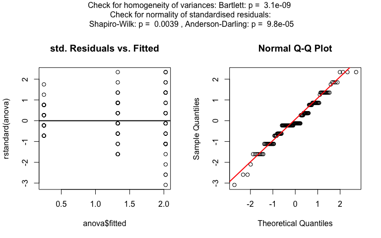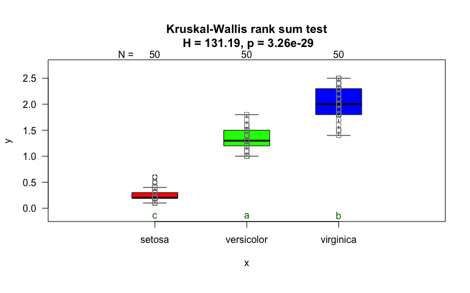
The generated graphs can be saved in all available formats of the
`Cairo` package. Here we save the graphical output of type “pdf” in the
`plotDirectory` `tempdir()`:

    visstat(
    iris$Species,iris$Petal.Width,graphicsoutput = "pdf",plotDirectory = tempdir()
    )

## Numerical response and numerical predictor: Linear Regression

    linreg_cars <- visstat(cars$speed ,cars$dist)

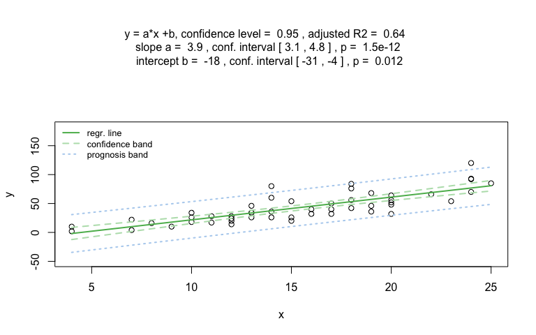

Increasing the confidence level `conf.level` from the default 0.95 to
0.99 leads two wider confidence and prediction bands:

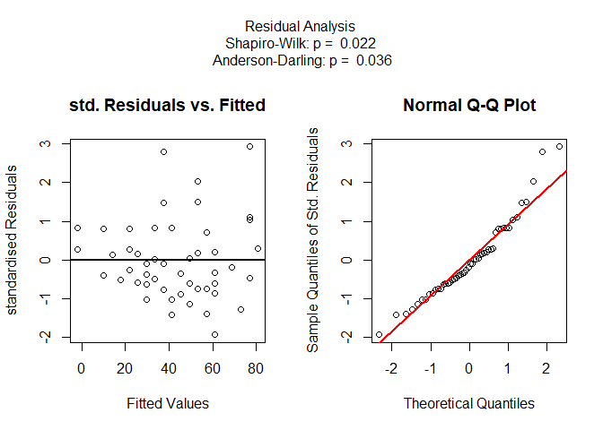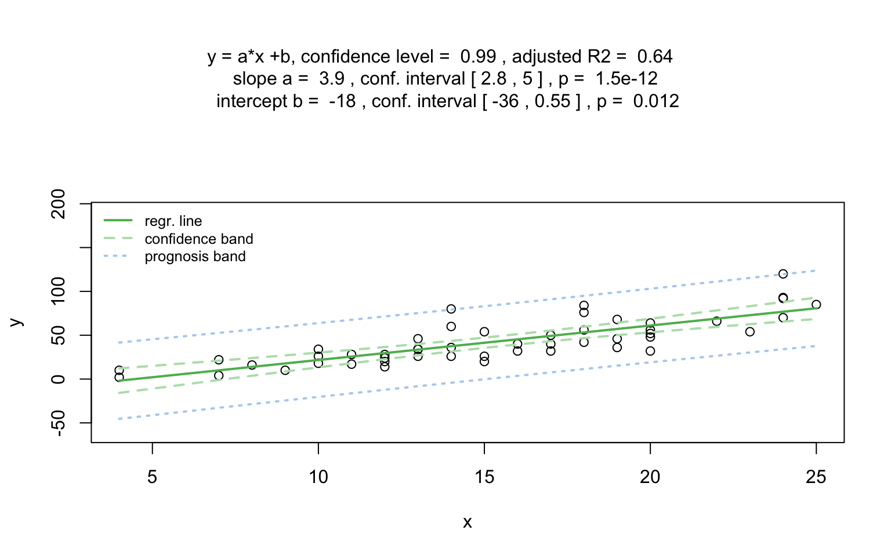

## Both varibles categorical

### Pearson’s Chi-squared test

Count data sets are often presented as multidimensional arrays, so -
called contingency tables, whereas `visstat()` requires a `data.frame`
with a column structure. Arrays can be transformed to this column wise
structure with the helper function `counts_to_cases()`:

    hair_eye_color_df <- counts_to_cases(as.data.frame(HairEyeColor))
    visstat(hair_eye_color_df$Eye, hair_eye_color_df$Hair)

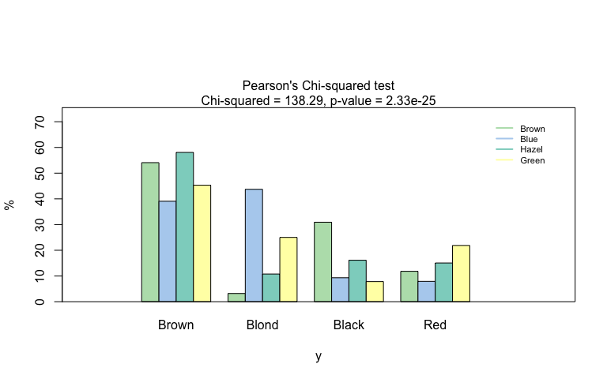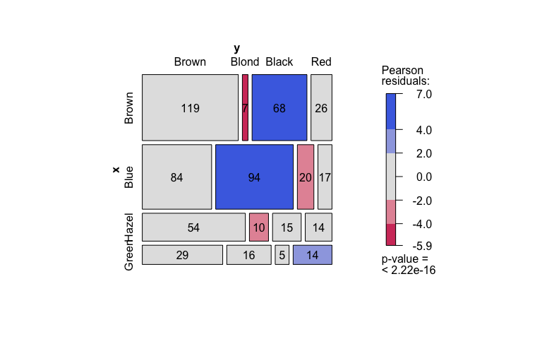

### Fisher’s exact test

    hair_eye_color_male <- HairEyeColor[, , 1]
    # Slice out a 2 by 2 contingency table
    black_brown_hazel_green_male <- hair_eye_color_male[1:2, 3:4]
    # Transform to data frame
    black_brown_hazel_green_male <- counts_to_cases(as.data.frame(black_brown_hazel_green_male))
    # Fisher test
    fisher_stats <- visstat(black_brown_hazel_green_male$Eye,black_brown_hazel_green_male$Hair)

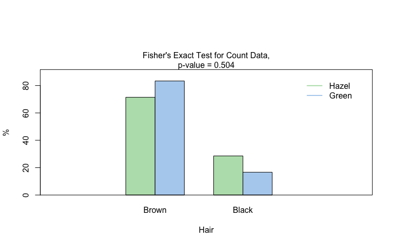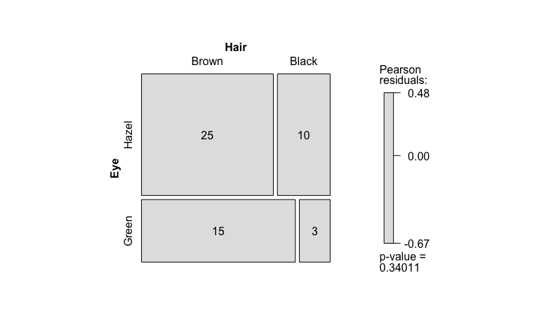

# Decision logic

The choice of statistical tests depends on whether the data of the
selected columns are numeric or categorical, the number of levels in the
categorical variable, and the distribution of the data. The function
prioritizes interpretable visual output and tests that remain valid
under the the following decision logic:

## Numerical response and categorical predictor

When the response is numeric and the predictor is categorical, a
statistical hypothesis test of central tendencies is selected.

- If the categorical predictor has exactly two levels, Welch’s t - test
  (`t.test()`), is applied whenever both groups contain more than 30
  observations, with the validity of the test supported by the
  approximate normality of the sampling distribution of the mean under
  the central limit theorem \[@Rasch:2011vl @Lumley2002dsa\]. For
  smaller samples, group - wise normality is assessed using the
  Shapiro - Wilk test (`shapiro.test()`) at the significance level*α*.
  If both groups are found to be approximately normally distributed
  according to the Shapiro - Wilk test, Welch’s t-test is applied;
  otherwise, the Wilcoxon rank-sum test (`wilcox.test()`) is used.

- For predictors with more than two levels, an ANOVA model (`aov()`) is
  initially fitted. The normality of residuals is evaluated using both
  the Shapiro–Wilk test (`shapiro.test()`) and the Anderson–Darling test
  (`ad.test()`); residuals are considered approximately normal if at
  least one of the two tests yields a result exceeding the significance
  threshold *α*. If this condition is met, Bartlett’s test
  (`bartlett.test()`) is then used to assess homoscedasticity. When
  variances are homogeneous (*p* &gt; *α*), ANOVA is applied with
  Tukey’s HSD (`TukeyHSD()`) for post-hoc comparison. If variances
  differ significantly (*p* ≤ *α*), Welch’s one - way test
  (`oneway.test()`) is used, also followed by Tukey’s HSD. If residuals
  are not normally distributed according to both tests (*p* ≤ *α*), the
  Kruskal-Wallis test (`kruskal.test()`) is selected, followed by
  pairwise Wilcoxon tests (`pairwise.wilcox.test()`). A graphical
  overview of the decision logic used is provided in below figure.

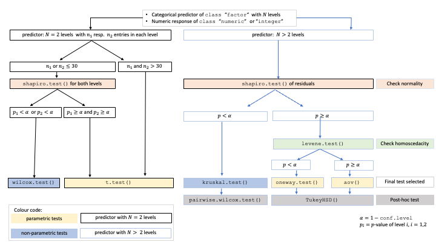

Decision tree used to select the appropriate statistical test for a
categorical predictor and numeric response, based on the number of
factor levels, normality, and homoscedasticity.

## Numerical response and numerical predictor: Linear Regression

When both the response and predictor are numeric, a simple linear
regression model (`lm()`) is fitted and analysed in detail, including
residual diagnostics, formal tests, and the plotting of fitted values
with confidence bands. Note that only one explanatory variable is
allowed, as the function is designed for two-dimensional visualisation.

## Both variables categorical

When both variables are categorical, no direction is assumed (though one
is still referred to as the for consistency). `visstat()` tests the null
hypothesis that both variables are independent using either
`chisq.test()` or `fisher.test()`. The choice of test is based on
Cochran’s rule \[@Cochran\], which advises that
the*χ*2approximation is reliable only if no expected cell
count is zero and no more than 20 percent of cells have expected counts
below 5.

For a more detailed description of the underlying decision logic see

    vignette("visStatistics")

# Limitations

The main purpose of this package is a decision-logic based automatic
visualisation of statistical test results. Therefore, except for the
user-adjustable `conf.level` parameter, all statistical tests are
applied using their default settings from the corresponding base R
functions. As a consequence, paired tests are currently not supported
and `visstat()` does not allow to study interactions terms between the
different levels of an independent variable in an analysis of variance.
Focusing on the graphical representation of tests, only simple linear
regression is implemented, as multiple linear regressions cannot be
visualised.

## Implemented tests

### Numerical response and categorical predictor

#### Main tests

`t.test()`, `wilcox.test()`, `aov()`, `oneway.test()`, `kruskal.test()`

#### Normality assumption check

`shapiro.test()` and `ad.test()`

#### Homoscedasticity assumption check

`bartlett.test()`

#### Post-hoc tests-`TukeyHSD()` (used following `aov()`and `oneway.test()`)

- `pairwise.wilcox.test()` (used following `kruskal.test()`)

### Numerical response and numerical predictor

When both the response and predictor are numerical, a simple linear
regression model is fitted:`lm()`

Note that multiple linear regression models are not implemented, as the
package focuses on the visualisation of data, not model building. \###
Categorical response and categorical predictor

When both variables are categorical, `visstat()` tests the null
hypothesis of independence using one of the following:-`chisq.test()`
(default for larger samples) - `fisher.test()` (used for small expected
cell counts based on Cochran’s rule) <!-- pkgdown::end -->
