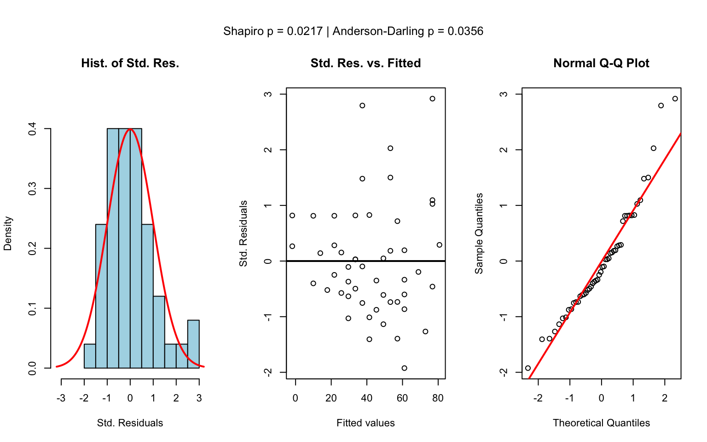

<!-- README.md is automatically generated from README.Rmd. Please only edit this Rmd file! -->
<!-- knitr before every resubmission -->

# visStatistics

Visualization of a statistical hypothesis test selected to be valid under
the data???s type, distribution, sample size, and confidence level

`visStatistics` is an R package for rapid visualization and statistical
analysis of raw data. It automatically selects and applies a hypothesis test
that is valid for evaluating the relationship between a response (`varsample`)
and a feature (`varfactor`) within a `data.frame`.

A minimal function call looks of its main function `visstat()` looks
like:

    visstat(dataframe, varsample = "response", varfactor = "feature")

The input must be a column-based `data.frame`, and `varsample` and
`varfactor` are character strings naming columns of that data frame. 

The function selects a statistical test based on the class of the
response and feature variables, the number of levels in categorical
variables, and assumptions such as normality and homoscedasticity as well as the chosen 'conf.level'.

The automatically generated output figures illustrate the selected
statistical test, display the main test statistics, and include
assumption checks and post hoc comparisons when applicable. The primary
test results are returned as a list object.

This automated workflow is particularly suited for integration into browser-based interfaces or server-side R applications that interact with databases.

For a detailed description of the decision logic see

    vignette("visStatistics")

## Installation of latest stable version from CRAN

1.  Install the package

<!-- -->

    install.packages("visStatistics")

1.  Load the package

<!-- -->

    library(visStatistics)

## Installation of the developing version from GitHub

1.  Install devtools from CRAN if not already installed

<!-- -->

    install.packages("devtools")

1.  Load devtools

<!-- -->

    library(devtools)

1.  Install the `visStatistics` package from GitHub

<!-- -->

    install_github("shhschilling/visStatistics")

1.  Load the package

<!-- -->

    library(visStatistics)

1.  View help

<!-- -->

    ?visstat

## Examples

    library(visStatistics)

### Welch???s t-test

#### InsectSprays data set

    insect_sprays_a_b <- 
      InsectSprays[which(InsectSprays$spray == "A" | InsectSprays$spray == "B"), ]
    insect_sprays_a_b$spray <- factor(insect_sprays_a_b$spray)
    visstat(insect_sprays_a_b, "count", "spray")

#### mtcars data set

    mtcars$am <- as.factor(mtcars$am)
    t_test_statistics <- visstat(mtcars, "mpg", "am")

### Wilcoxon rank sum test

    grades_gender <- data.frame(
      sex = as.factor(c(rep("girl", 21), rep("boy", 23))),
      grade = c(
        19.3, 18.1, 15.2, 18.3, 7.9, 6.2, 19.4,
        20.3, 9.3, 11.3, 18.2, 17.5, 10.2, 20.1, 13.3, 17.2, 15.1, 16.2, 17.0,
        16.5, 5.1, 15.3, 17.1, 14.8, 15.4, 14.4, 7.5, 15.5, 6.0, 17.4,7.3, 14.3, 
        13.5, 8.0, 19.5, 13.4, 17.9, 17.7, 16.4, 15.6, 17.3, 19.9, 4.4, 2.1
      )
    )

    wilcoxon_statistics <- visstat(grades_gender, "grade", "sex")

### ANOVA

    insect_sprays_tr <- InsectSprays
    insect_sprays_tr$count_sqrt <- sqrt(InsectSprays$count)
    visstat(insect_sprays_tr, "count_sqrt", "spray")

### One-way test

    one_way_npk <- visstat(npk, "yield", "block")

### Kruskal-Wallis test

The generated graphs can be saved in all available formats of the
`Cairo` package. Here we save the graphical output of type ???pdf??? in the
`plotDirectory` `tempdir()`:

    visstat(iris, "Petal.Width", "Species", 
            graphicsoutput = "pdf", plotDirectory = tempdir())

### Linear Regression

    linreg_cars <- visstat(cars, "dist", "speed")

Increasing the confidence level `conf.level` from the default 0.95 to
0.99 leads two wider confidence and prediction bands:

### Pearson???s Chi-squared test

Count data sets are often presented as multidimensional arrays,
so-called contingency tables, whereas `visstat()` requires a
`data.frame` with a column structure. Arrays can be transformed to this
column wise structure with the helper function `counts_to_cases()`:

    hair_eye_color_df <- counts_to_cases(as.data.frame(HairEyeColor))
    visstat(hair_eye_color_df, "Hair", "Eye")

### Fisher???s exact test

    hair_eye_color_male <- HairEyeColor[, , 1]
    # Slice out a 2 by 2 contingency table
    black_brown_hazel_green_male <- hair_eye_color_male[1:2, 3:4]
    #Transform to data frame
    black_brown_hazel_green_male <- counts_to_cases(as.data.frame(black_brown_hazel_green_male))
    # Fisher test
    fisher_stats <- visstat(black_brown_hazel_green_male, "Hair", "Eye")

## Implemented tests

Data of class `"numeric"` or `"integer"` are referred to as numerical,
while data of class `"factor"` are referred to as categorical.

### Numerical response ~ categorical feature

When the response is numerical and the feature is categorical, test of
central tendencies are selected:

`t.test()`, `wilcox.test()`, `aov()`, `oneway.test()`,`kruskal.test()`

#### Normality assumption check

`shapiro.test()` and `ad.test()`

#### Homoscedactiy assumption check

`bartlett.test()`

#### Post-hoc tests

- `TukeyHSD()` (for `aov()`and `oneway.test()`)
- `pairwise.wilcox.test()` (for `kruskal.test()`)

The decision below tree summarizes the underlying decision logic for
tests of central tendencies.

    knitr::include_graphics("man/figures/decision_tree.png")

*Decision tree used to select the appropriate statistical test for a
categorical predictor and numerical response, based on the number of
factor levels, normality and homoscedasticity.*

### Numerical response ~ numerical feature

When both the response and feature are numerical, a simple linear
regression model is fitted:

`lm()`

### Categorical response ~ categorical predictor

When both variables are categorical, `visstat()` tests the null
hypothesis of independence using one of the following:

- `chisq.test()` (default for larger samples)
- `fisher.test()` (used for small expected cell counts based on
  Cochran???s rule)
