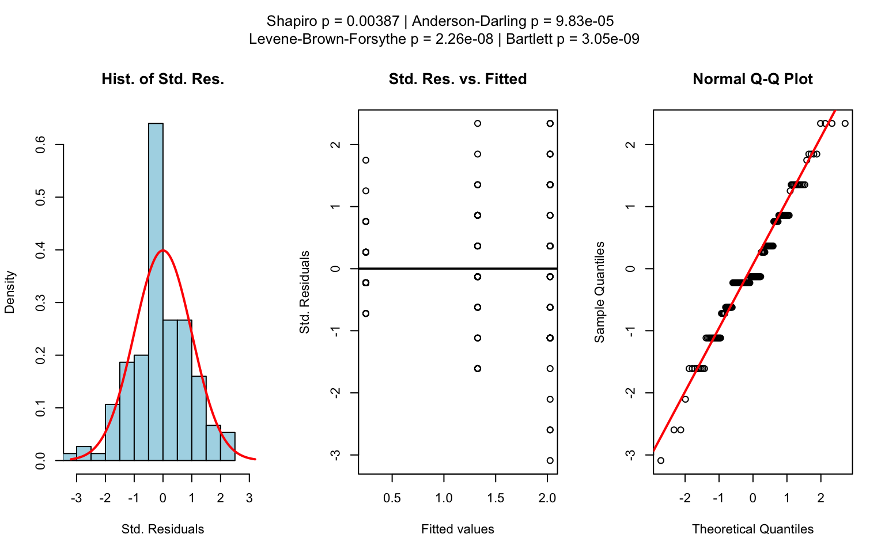
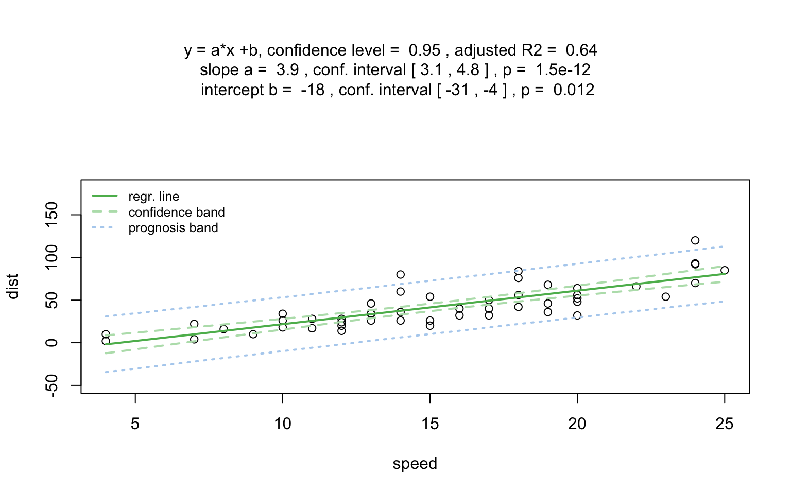

<!-- README.md is automatically generated from README.Rmd. Please only edit this Rmd file! -->
<!-- knitr before every resubmission -->
<!-- pkgdown::start -->

# visStatistics: The right test, visualised

The R package `visStatistics` allows for rapid visualisation and
statistical analysis of raw data. It automatically selects and
visualises the most appropriate statistical hypothesis test between a
response (`varsample`) and a feature (`varfactor`) within a
`data.frame`. The package focuses on visualising the selected test using
appropriate plots - such as box plots, bar charts, regression lines with
confidence bands, mosaic plots, residual plots and Q–Q plots. Each plot
is annotated with relevant test statistics and, where applicable,
assumption checks and post-hoc results. The scripted workflow is
particularly well suited for interactive interfaces, where users access
data only through a graphical front end backed by server-side R
sessions, as well as for quick data exploration, for example, in
statistical consulting contexts.

# Getting Started

A minimal function call looks of its main function `visstat()` looks
like:

    visstat(dataframe, varsample = "response", varfactor = "feature")

The input must be a column - based `data.frame`, and `varsample` and
`varfactor` are character strings naming columns of that data frame.

The function selects a statistical test based on the class of the
response and feature variables, the number of levels in categorical
variables, and conditions such as normality and homoscedasticity.

The automatically generated output figures illustrate the selected
statistical test, display the main test statistics, and include
assumption checks and post hoc comparisons when applicable. The primary
test results are returned as a list object.

# Installation of latest stable version from CRAN

**1.** Install the package

    install.packages("visStatistics")

**2.** Load the package

    library(visStatistics)

# Installation of the development version from GitHub

**1.** Install **devtools** from CRAN if not already installed:

    install.packages("devtools")

**2.** Load the **devtools** package:

    library(devtools)

**3.** Install the `visStatistics` package from GitHub:

    install_github("shhschilling/visStatistics")

**4.** Load the `visStatistics` package:

    library(visStatistics)

**5.** View help for the main function:

    ? visstat

**6.** Study all the details of the package in its vignette:

    vignette("visStatistics")

# Decision logic

Throughout the remainder, data of class `"numeric"` or `"integer"` are
referred as numerical, while data of class `"factor"` are referred to as
categorical. The choice of statistical tests performed by the function
`visstat()` depends on whether the data are numerical or categorical,
the number of levels in the categorical variable, and the distribution
of the data. The function prioritizes interpretable visual output and
tests that remain valid under the the following decision logic:

1.  When the response is numerical and the predictor is categorical, a
    statistical hypothesis test of central tendencies is selected.

- If the categorical predictor has exactly two levels, Welch’s t-test
  (`t.test()`) is applied whenever both groups contain more than 30
  observations, with the validity of the test supported by the
  approximate normality of the sampling distribution of the mean under
  the central limit theorem Lumley et al. (2002). For smaller samples,
  group - wise normality is assessed using the Shapiro - Wilk test
  (`shapiro.test()`) at the significance level *α*. If both groups are
  found to be approximately normally distributed according to the
  Shapiro - Wilk test, Welch’s t-test is applied; otherwise, the
  Wilcoxon rank-sum test (`wilcox.test()`) is used.

- For predictors with more than two levels, a model of Fisher’s one-way
  analysis of variables (ANOVA) (`aov()`) is initially fitted. The
  normality of residuals is evaluated using both the Shapiro-Wilk test
  (`shapiro.test()`) and the Anderson-Darling test (`ad.test()`);
  residuals are considered approximately normal if at least one of the
  two tests yields a result exceeding the significance threshold *α*. If
  this condition is met, Bartlett’s test (`bartlett.test()`) is then
  used to assess homoscedasticity. When variances are homogeneous
  (*p* &gt; *α*), Fisher’s one-way ANOVA (`aov()`) is applied with
  Tukey’s Honestly Significant Differences (HSD) (`TukeyHSD()`) for
  post-hoc comparison. If variances differ significantly (*p* ≤ *α*),
  Welch’s heteroscedastic one-way ANOVA (`oneway.test()`) is used, also
  followed by Tukey’s HSD. If residuals are not normally distributed
  according to both tests (*p* ≤ *α*), the Kruskal-Wallis test
  (`kruskal.test()`) is selected, followed by pairwise Wilcoxon tests
  (`pairwise.wilcox.test()`). A graphical overview of the decision logic
  used is provided in the figure below.

Decision tree used to select the appropriate statistical test for a
categorical predictor and numerical response, based on the number of
factor levels, normality, and homoscedasticity.

1.  When both the response and predictor are numerical, a simple linear
    regression model (`lm()`) is fitted and analysed in detail,
    including residual diagnostics, formal tests, and the plotting of
    fitted values with confidence bands. Note that only one explanatory
    variable is allowed, as the function is designed for two-dimensional
    visualisation.
    r<!-- (3) Categorical response and categoical predictor -->
2.  In the case of two categorical variables, `visstat()` tests the null
    hypothesis that the predictor and response variables are independent
    using either Pearson’s *χ*2-test (`chisq.test()`) or
    Fisher’s exact test (`fisher.test()`). The choice of test is based
    on Cochran’s rule (Cochran 1954), which advises that the
    *χ*2approximation is reliable only if no expected cell
    count is less than 1 and no more than 20 percent of cells have
    expected counts below 5.

Note: Except for the user - adjustable `conf.level` parameter, all
statistical tests are applied using their default settings from the
corresponding base R functions (e.g., `t.test()`). As a consequence,
paired tests are not currently supported. Furthermore, since the main
purpose of this package is to visualize statistical test results, only
simple linear regression is implemented. For a more detailed description
of the underlying decision logic see

    vignette("visStatistics")

# Examples

    library(visStatistics)

In this section, function names in parentheses in the headings indicate
the statistical test selected by the decision logic of `visstat()`.

## Numerical response and categorical feature

When the response is numerical and the feature is categorical, test of
central tendencies are selected.

### Welch’s t-test (`t.test()`)

#### InsectSprays dataset

    insect_sprays_a_b <-
    InsectSprays[which(InsectSprays$spray == "A" |
    InsectSprays$spray == "B"), ]
    insect_sprays_a_b$spray <- factor(insect_sprays_a_b$spray)
    visstat(insect_sprays_a_b, "count", "spray")

#### mtcars dataset

    mtcars$am <- as.factor(mtcars$am)
    t_test_statistics <- visstat(mtcars, "mpg", "am")

    #t_test_statistics

### Wilcoxon rank-sum test (`wilcox.test()`)

    grades_gender <- data.frame(
      sex = factor(rep(c("girl", "boy"), times = c(21, 23))),
      grade = c(
        19.3, 18.1, 15.2, 18.3, 7.9, 6.2, 19.4, 20.3, 9.3, 11.3,
        18.2, 17.5, 10.2, 20.1, 13.3, 17.2, 15.1, 16.2, 17.0, 16.5, 5.1,
        15.3, 17.1, 14.8, 15.4, 14.4, 7.5, 15.5, 6.0, 17.4, 7.3, 14.3,
        13.5, 8.0, 19.5, 13.4, 17.9, 17.7, 16.4, 15.6, 17.3, 19.9, 4.4, 2.1
      )
    )

    wilcoxon_statistics <- visstat(grades_gender, "grade", "sex")

### Fisher’s one-way ANOVA (`aov()`)

    insect_sprays_tr <- InsectSprays
    insect_sprays_tr$count_sqrt <- sqrt(InsectSprays$count)
    visstat(insect_sprays_tr, "count_sqrt", "spray")

### Welch’s heteroscedastic one-way ANOVA (`oneway.test()`)

    one_way_npk <- visstat(npk, "yield", "block")

### Kruskal–Wallis test (`kruskal.test()`)

    visstat(iris, "Petal.Width", "Species")

The generated graphs can be saved in all available formats of the
`Cairo` package. Here we save the graphical output of type “pdf” in the
`plotDirectory` `tempdir()`:

    visstat(
    iris,
    "Petal.Width",
    "Species",
    graphicsoutput = "pdf",
    plotDirectory = tempdir()
    )

## Numerical response and numerical feature:

### Simple linear Regression (`lm()`)

    linreg_cars <- visstat(cars, "dist", "speed")

Increasing the confidence level `conf.level` from the default 0.95 to
0.99 leads two wider confidence and prediction bands:

## Categorical response and categorical feature

### Pearson’s *χ*2-test (`chisq.test()`)

Count datasets are often presented as multidimensional arrays, so -
called contingency tables, whereas `visstat()` requires a `data.frame`
with a column structure. Arrays can be transformed to this column wise
structure with the helper function `counts_to_cases()`:

    hair_eye_color_df <- counts_to_cases(as.data.frame(HairEyeColor))
    visstat(hair_eye_color_df, "Hair", "Eye")

### Fisher’s exact test (`fisher.test()`)

    hair_eye_color_male <- HairEyeColor[, , 1]
    # Slice out a 2 by 2 contingency table
    black_brown_hazel_green_male <- hair_eye_color_male[1:2, 3:4]
    # Transform to data frame
    black_brown_hazel_green_male <- counts_to_cases(as.data.frame(black_brown_hazel_green_male))
    # Fisher test
    fisher_stats <- visstat(black_brown_hazel_green_male, "Hair", "Eye")

## Implemented tests

Note that all test are implemented with their default settings, with the
exception of the user-adjustable `conf.level`.

### Numerical response and categorical feature

#### Main tests

`t.test()`, `wilcox.test()`, `aov()`, `oneway.test()`, `kruskal.test()`

#### Normality assumption check

`shapiro.test()` and `ad.test()`

#### Homoscedasticity assumption check

`bartlett.test()`

#### Post-hoc tests

- `TukeyHSD()` (used following `aov()`and `oneway.test()`)
- `pairwise.wilcox.test()` (used following `kruskal.test()`)

### Numerical response and numerical feature:

Simple linear regression: `lm()`

Note that multiple linear regression models are not implemented, as the
package focuses on the visualisation of data, not model building.

### Categorical response and categorical feature

- `chisq.test()` (default for larger samples)
- `fisher.test()` (used for small expected cell counts based on
  Cochran’s rule (Cochran 1954))

## References

<!-- pkgdown::end -->

Cochran, William G. 1954. “The Combination of Estimates from Different
Experiments.” *Biometrics* 10 (1): 101.
<https://doi.org/10.2307/3001666>.

Lumley, Thomas, Paula Diehr, Scott Emerson, and Lu Chen. 2002. “The
Importance of the Normality Assumption in Large Public Health Data
Sets.” *Annual Review of Public Health* 23: 151–69.
<https://doi.org/10.1146/annurev.publhealth.23.100901.140546>.

Rasch, Dieter, Klaus D. Kubinger, and Karl Moder. 2011. “The Two-Sample
t Test: Pre-Testing Its Assumptions Does Not Pay Off.” *Statistical
Papers* 52 (1): 219–31. <https://doi.org/10.1007/s00362-009-0224-x>.
