# visStatistics: The right test, visualised

## Abstract

`visStatistics` automatically selects and visualises appropriate
statistical tests between two column vectors of class `"numeric"`,
`"integer"`, or `"factor"`. No manual test selection is required: the
function determines the appropriate method from the data types and
distributional properties alone. The choice of test depends on the
`class`, distributional assumptions, and sample size of the vectors.

The main function
[`visstat()`](https://shhschilling.github.io/visStatistics/reference/visstat.md)
visualises the selected test with appropriate graphs (box plots, bar
charts, regression lines with confidence bands, mosaic plots for
Pearson’s $`\chi^2`$ test, residual plots), annotated with the main test
results, including visualisations of the assumption checks and post-hoc
analyses.

This scripted workflow is well suited for browser-based applications,
where users interact only through a web interface, while server-side R
applications handle the data processing.

Other typical use cases include quick visualisations, and guided
statistical test selection, for example in statistical consulting or
educational settings.

## Introduction

Most routine data analyses reduce to a comparatively small set of
inferential frameworks, including group comparisons, contingency-table
analyses, and regression models Sato et al. ([2017](#ref-Sato:2017)).
`visStatistics` selects out of these most commonly used “right test” by
using a reproducible decision framework based on the data’s
distributional assumptions and sample size. It visualises its decision
by, where appropriate, assumption-diagnostic plot and a descriptive plot
with the main test statistics annotated, and returns an R object whose
[`print()`](https://rdrr.io/r/base/print.html) and
[`summary()`](https://rdrr.io/r/base/summary.html) methods expose the
complete test results. The scripted workflow is well suited for
browser-based applications where sensitive data (such as highly
confidential medical records) is stored securely on a server and can not
be directly accessed by users. This approach was already successfully
applied to develop a medical scoring tool ([Bijlenga et al.
2017](#ref-Bijlenga:2017)). When selecting tests for group comparisons,
packages with overlapping scope such as `automatedtests` ([Zeevat
2025](#ref-Zeevat:2025)) and `compareGroups` ([Subirana, Sanz, and Vila
2014](#ref-Subirana:2014)) base their test selection on group‑wise
normality assessments of the response variable. But group-wise testing
inflates the [family-wise type I error rate](#post-hoc-analysis): the
probability of at least one false rejection of normality grows with the
number of compared groups, leading to unnecessary switching to
non-parametric methods even when the linear model assumptions hold
globally. In contrast, `visStatistics` assesses the normality of the
overall model residuals, adhering to the general linear model framework
([Searle 1971](#ref-Searle:1971)).

## Getting started

##### 1. Install the latest development version from GITHUB

``` r
install_github("shhschilling/visStatistics")
```

##### 2. Load the package

``` r
library(visStatistics)
```

##### 3. Minimal function call

The function
[`visstat()`](https://shhschilling.github.io/visStatistics/reference/visstat.md)
accepts input in three ways:

``` r
# Standardised form (recommended):
visstat(x, y)

# Formula interface:
visstat(y ~ x, data = dataframe)

# Backward-compatible form:
visstat(dataframe, "namey", "namex")
```

`x` and `y` must be vectors of class `"numeric"`, `"integer"`, or
`"factor"`.

In the formula interface, `y ~ x` specifies the relationship, where `y`
is the response variable and `x` is the predictor, with both being
column names in `dataframe`.

In the backward-compatible form, `"namex"` and `"namey"` must be
character strings naming columns in `dataframe`, which must themselves
be of class `"numeric"`, `"integer"`, or `"factor"`. Note that in the
backward-compatible form the second argument belongs to the response,
the third to the predictor. This is equivalent to writing:

``` r
visstat(dataframe[["namex"]], dataframe[["namey"]])
```

###### Exemplary function call

``` r
#Standardised form
visstat(npk$block,npk$yield)
```

``` r
# Using formula interface
 visstat(yield~block,data=npk)
```

``` r
#Backward-compatible form
 visstat(npk,"yield","block")
```

## Decision logic

Throughout the remainder, data of class `"numeric"` or `"integer"` are
referred to by their common `mode` `numeric`, while data of class
`"factor"` are referred to as categorical. The significance level
$`\alpha`$, used throughout for hypothesis testing, is defined as
`1 - conf.level`, where `conf.level` is a user-controllable argument
(defaulting to `0.95`).

The choice of statistical tests performed by the function
[`visstat()`](https://shhschilling.github.io/visStatistics/reference/visstat.md)
depends on whether the data are numeric or categorical, the number of
levels in the categorical variable, the distribution of the data, as
well as the user-defined ‘conf.level’. The common mathematical framework
underlying Student’s t-test, Fisher’s ANOVA and simple linear regression
is described in the [Appendix A](#glm).

The function prioritizes interpretable visual output and tests that
remain valid under the following decision logic. The following graph
gives an overview of all implemented tests based on their `class`:


Overview of the implemented statistical tests based on the class of the
variables.

A graphical summary of the decision logic used for numerical responses
and categorical predictors resulting in comparisons of central
tendencies is given in the figure below.


Decision tree used to select the appropriate statistical test for a
categorical predictor and numeric response, based on the sample sizes,
number of factor levels, normality, and homoscedasticity.

### Numeric response and categorical predictor: Comparing central tendencies

When the response `y` is numeric and the predictor `x` is categorical, a
statistical hypothesis test comparing central tendencies is selected. To
check whether the assumptions of a general linear model (see [Appendix
A](#glm)) are fulfilled, a linear model `lm(y ~ x)` is first fitted.

- Normality testing of the residuals: The Shapiro–Wilk test ([Shapiro
  and Wilk 1965](#ref-Shapiro:1965))
  ([`shapiro.test()`](https://rdrr.io/r/stats/shapiro.test.html)) is
  performed on internally studentised residuals computed by
  [`rstandard()`](https://rdrr.io/r/stats/influence.measures.html),
  which scales the raw residuals with an estimate of their standard
  deviation that accounts for the leverage of each observation ([Cook
  and Weisberg 1982](#ref-Cook:1982)). The Shapiro–Wilk (SW) test is the
  most powerful for detecting non-normality across most distributions,
  especially with smaller sample sizes ([Razali and Wah
  2011](#ref-Razali:2011); [Ghasemi and Zahediasl
  2012](#ref-Ghasemi:2012)).

- Non parametric-tests: Only when SW the test rejects normality
  ($`p_{SW} \le \alpha`$), non-parametric tests are selected: the
  Wilcoxon rank-sum test
  ([`wilcox.test()`](https://rdrr.io/r/stats/wilcox.test.html)) for two
  groups, or the Kruskal–Wallis test
  ([`kruskal.test()`](https://rdrr.io/r/stats/kruskal.test.html))
  followed by the Holm adjusted pairwise Wilcoxon tests
  ([`pairwise.wilcox.test()`](https://rdrr.io/r/stats/pairwise.wilcox.test.html))
  for more than two groups.

- Parametric tests: When there is insufficient evidence against
  normality ($`p_{SW} > \alpha`$) or when the sample sizes are large
  (more than 50 observations per group), parametric tests are selected.
  In large samples the central limit theorem ensures approximate
  normality of the sampling distribution of the mean. ([Rasch, Kubinger,
  and Moder 2011](#ref-Rasch:2011); [Lumley et al.
  2002](#ref-Lumley:2002); [Kwak and Kim 2017](#ref-Kwak:2017))

  - Homoscedasticity: The Levene–Brown–Forsythe (L) test (implemented as
    [`levene.test()`](https://shhschilling.github.io/visStatistics/reference/levene.test.md))
    ([Brown and Forsythe 1974](#ref-Brown:1974)) tests for homogeneous
    variances.
    - When homogeneity is not rejected ($`p_L > \alpha`$): For two
      groups, Student’s t-test
      ([`t.test()`](https://rdrr.io/r/stats/t.test.html) with
      `var.equal = TRUE`) is applied; for more than two groups, Fisher’s
      one-way ANOVA ([`aov()`](https://rdrr.io/r/stats/aov.html)) with
      Tukey’s Honestly Significant Differences (HSD)
      ([`TukeyHSD()`](https://rdrr.io/r/stats/TukeyHSD.html)) ([Hochberg
      and Tamhane 1987](#ref-Hochberg:1987)) is applied.

    - When homogeneity is rejected ($`p_L \le \alpha`$): For two groups,
      Welch’s t-test ([`t.test()`](https://rdrr.io/r/stats/t.test.html)
      with `var.equal = FALSE`) is applied; for more than two groups,
      Welch’s heteroscedastic one-way ANOVA
      ([`oneway.test()`](https://rdrr.io/r/stats/oneway.test.html)) with
      Games-Howell post-hoc test
      ([`games.howell()`](https://shhschilling.github.io/visStatistics/reference/games.howell.md))
      ([Games and Howell 1976](#ref-Games:1976)) is applied. Welch’s
      methods outperform their classical counterparts when variances
      differ ([Moser and Stevens 1992](#ref-Moser:1992); [Fagerland and
      Sandvik 2009](#ref-Fagerland:2009); [Delacre, Lakens, and Leys
      2017](#ref-Delacre:2017)).

- Regardless of sample size, assumption diagnostics are always
  displayed. Throughout this vignette, *linear model* refers to the
  classical Gaussian linear model framework ([Searle
  1971](#ref-Searle:1971)) underlying t-tests, ANOVA, and linear
  regression. When normality of residuals is met but homoscedasticity is
  rejected,
  [`visstat()`](https://shhschilling.github.io/visStatistics/reference/visstat.md)
  selects Welch methods and additionally displays group-wise normality
  diagnostics via
  [`vis_group_normality()`](https://shhschilling.github.io/visStatistics/reference/vis_group_normality.md),
  since Welch’s variance estimates are group-specific and the pooled
  [`lm()`](https://rdrr.io/r/stats/lm.html) residuals are no longer the
  appropriate diagnostic under heteroscedasticity. These diagnostic
  plots enable users to visually assess whether assumptions are met and
  manually override the automated p-value-based test selection. The
  decision logic is based entirely on p-values and distributional
  assumptions; it does not assess practical relevance. Users should
  always report and interpret an appropriate effect size measure
  (e.g. Cohen’s $`d`$ for t-tests, $`\omega^2`$ for ANOVA, rank-biserial
  $`r`$ for Wilcoxon and Kruskal–Wallis tests) alongside the test
  result.

### Both variables numeric: Simple linear regression (default) or Spearman rank correlation (`correlation = TRUE`)

#### Simple linear regression (`lm()`)

By default,
[`visstat()`](https://shhschilling.github.io/visStatistics/reference/visstat.md)
always fits a simple linear regression model
([`lm()`](https://rdrr.io/r/stats/lm.html)) for two numeric variables,
regardless of whether the GLM assumptions of normality and
homoscedasticity are met. Assumption diagnostics are always shown,
enabling the user to assess whether the model is appropriate.
Correlation analysis is never triggered automatically; it requires the
explicit flag `correlation = TRUE`. Note that **only one** predictor
variable is allowed, as the function is designed for two-dimensional
visualisation.

In the linear regression branch, homoscedasticity is assessed using the
Breusch–Pagan test
[`bp.test()`](https://shhschilling.github.io/visStatistics/reference/bp.test.md)
(see [Appendix B](#variance)), which evaluates whether the variance of
the raw residuals depends on the predictor variable.

#### Spearman rank correlation (`correlation = TRUE`)

When `correlation = TRUE` is set,
[`visstat()`](https://shhschilling.github.io/visStatistics/reference/visstat.md)
uses Spearman’s $`\rho`$ (`cor.test(..., method = "spearman")`) to
measure the monotone association between the two numeric variables.
Switching to correlation requires an explicit user choice, because the
decision between modelling a directional relationship (regression) and
measuring a monotone association (correlation) cannot be derived from
the data type alone. Spearman correlation operates on the ranks of the
data rather than the original values, making it robust to outliers and
non-normal distributions while detecting monotonic relationships.
Because Spearman’s $`\rho`$ is Pearson’s $`r`$ applied to the ranks, it
yields nearly identical results to Pearson correlation when the data are
bivariate normal (the assumption of Pearson’s inference) but remains
valid without any distributional assumptions. A separate Pearson branch
is therefore not implemented. When regression assumptions are violated,
Spearman rank correlation offers a robust, assumption-free alternative —
at the cost of causal interpretability. For alternatives not implemented
in this package, see [Limitations](#limitations).

### Both variables of class `factor`

#### Comparing proportions (Chi-squared or Fisher’s exact test)

When both variables are categorical (and not ordered), no direction is
assumed; the order of variables in the function call does not affect the
test statistic, but it does influence the graphical output. For
consistency, we continue referring to the variables as *predictor* and
*response*.

[`visstat()`](https://shhschilling.github.io/visStatistics/reference/visstat.md)
tests the null hypothesis that the variables are independent using
either Pearson’s $`\chi^2`$ test
([`chisq.test()`](https://rdrr.io/r/stats/chisq.test.html)) or Fisher’s
exact test
([`fisher.test()`](https://rdrr.io/r/stats/fisher.test.html)), depending
on expected cell counts. The choice of test is based on Cochran’s rule
([Cochran 1954](#ref-Cochran:1954)), which advises that the $`\chi^2`$
approximation is reliable only if no expected cell count is less than 1
and no more than 20 percent of cells have expected counts below 5.

### Response of class `ordered`, predictor of class `factor`

When the response variable is an ordered factor (e.g., Likert scale
ratings) and the predictor is categorical,
[`visstat()`](https://shhschilling.github.io/visStatistics/reference/visstat.md)
converts the ordered response to integer level codes and redirects the
analysis to the non-parametric
[`wilcox.test()`](https://rdrr.io/r/stats/wilcox.test.html) (predictor
with two levels) or
[`kruskal.test()`](https://rdrr.io/r/stats/kruskal.test.html) (predictor
with more than two levels) respectively, as the numeric distances
between ordered categories are not necessarily equal and the data cannot
be assumed to follow a normal distribution.

### Both variables of class `factor` and `ordered`: Wilcoxon/Kruskal-Wallis (default) or Kendall’s $`\tau_b`$ (`correlation = TRUE`)

When `correlation = FALSE` (default) and both variables are ordered
factors, the response is converted to integer level codes and the
analysis follows the standard non-parametric path (Wilcoxon or
Kruskal–Wallis). When the research question concerns a monotone trend
between both ordered variables rather than group differences, the user
should consider switching to `correlation = TRUE`.

#### Kendall rank correlation (`correlation = TRUE`)

When `correlation = TRUE` is set,
[`visstat()`](https://shhschilling.github.io/visStatistics/reference/visstat.md)
converts both ordered factors to integer level codes, which are used
directly as ranks, and tests for a monotone association via Kendall’s
$`\tau_b`$ rank correlation ([Kendall 1945](#ref-Kendall:1945); [Agresti
2010](#ref-Agresti:2010)). Kendall’s $`\tau_b`$ is preferred over
Spearman’s $`\rho`$ for ordinal data with few levels, where ties are
common: $`\tau_b`$ corrects for ties explicitly, while Spearman’s
$`\rho`$ uses only an approximate adjustment Xu et al.
([2013](#ref-Xu:2013)). The visualisation is a jittered rank–rank
scatter that makes the monotone trend visible, annotated with $`\tau_b`$
and the $`p`$-value.

## Assumption diagnostics: `vis_lm_assumptions()`

All tests within the linear model framework (see [Appendix A](#glm))
share the same set of assumptions:

- Linearity: The expected value of the response is a linear function of
  the predictors; assessed by checking for systematic patterns in
  residual plots.

- Error terms are independent, normally distributed with expectation
  value 0 and have constant error variance $`\sigma^2`$

The function
[`vis_lm_assumptions()`](https://shhschilling.github.io/visStatistics/reference/vis_lm_assumptions.md)
provides a unified visual and statistical framework for validating the
linear model assumptions. It fits a linear model using
[`aov()`](https://rdrr.io/r/stats/aov.html) and provides four standard
diagnostic plots:

1.  **Histogram and Normal Density**: Displays the distribution of
    standardised residuals with a red normal density curve overlay to
    visually assess normality.

2.  **Std. Residuals vs. Fitted**: It shows the standardised residuals
    against fitted values with a zero-line to detect non-linearity or
    heteroscedasticity.

3.  **Normal Q-Q Plot**: A theoretical quantile-quantile plot using the
    standardised residuals to identify deviations from the Gaussian
    distribution.

4.  If `correlation = FALSE` (regression mode), the **Standardised
    Residuals vs. Leverage** plot; if `correlation = TRUE` (correlation
    mode), a **Scale-Location** plot.

### Test for normality and homoscedasticity

The diagnostic plots are enhanced by p-values of tests for normality and
homoscedasticity, shown in the title of the plot.

**Normality Assessment**: The function evaluates residual normality
using both the Shapiro–Wilk test
([`shapiro.test()`](https://rdrr.io/r/stats/shapiro.test.html)) and the
Anderson–Darling test (`ad.test()`) ([Gross and Ligges
2015](#ref-Gross:2015)). Anderson–Darling is particularly sensitive to
tail deviations ([Razali and Wah 2011](#ref-Razali:2011); [Yap and Sim
2011](#ref-Yap:2011)).

**Homoscedasticity Assessment**: Variance equality is tested using the
Levene-Brown-Forsythe test
([`levene.test()`](https://shhschilling.github.io/visStatistics/reference/levene.test.md))
([Brown and Forsythe 1974](#ref-Brown:1974)) and Bartlett’s test
([`bartlett.test()`](https://rdrr.io/r/stats/bartlett.test.html)) in the
ANOVA path.

These tests compare the spread of data across different factor levels.

For simple linear regression, the Breusch-Pagan test
([`bp.test()`](https://shhschilling.github.io/visStatistics/reference/bp.test.md))
is implemented.

These three tests have standalone implementations in the package to
avoid dependencies on external packages (see [Appendix B](#variance)).

## Implemented tests with examples

For all implemented tests, this section provides mathematical background
and references. We report the definition of the test statistic, its
distribution under the null hypothesis, and any relevant assumptions.

### Numeric response and categorical predictor: Comparing central tendencies

#### Categorical predictor with two levels: Welch’s t-test and Wilcoxon rank-sum

##### Student’s t-test (`t.test(var.equal = TRUE)`)

When `var.equal = TRUE`, R’s
[`t.test()`](https://rdrr.io/r/stats/t.test.html) reports its `method`
as `"Two Sample t-test"`; this is the same procedure that is commonly
known as Student’s t-test, and
[`visstat()`](https://shhschilling.github.io/visStatistics/reference/visstat.md)
displays the R wording verbatim in the plot title.

The test statistic for Student’s t-test is given by:

``` math
t = \frac{\bar{x}_1 - \bar{x}_2}{s_p \sqrt{\frac{1}{n_1} + \frac{1}{n_2}}},
```

where $`\bar{x}_1`$ and $`\bar{x}_2`$ are the sample means, $`n_1`$ and
$`n_2`$ are the sample sizes, and $`s_p`$ is the pooled standard
deviation:

``` math
s_p = \sqrt{\frac{(n_1 - 1)s_1^2 + (n_2 - 1)s_2^2}{n_1 + n_2 - 2}},
```

where $`s_1^2`$ and $`s_2^2`$ are the sample variances in the two
groups. The test statistic follows a t-distribution with
$`\nu = n_1 + n_2 - 2`$ degrees of freedom.

##### Welch’s t-test (`t.test()`)

Welch’s t-test relaxes the homoscedasticity assumption while maintaining
the requirements for independent observations and normally distributed
residuals. It evaluates the null hypothesis that the means of two groups
are equal without assuming equal variances.

The test statistic is given by ([Welch 1947](#ref-Welch:1947);
[Satterthwaite 1946](#ref-Satterthwaite:1946))

``` math
t = \frac{\bar{x}_1 - \bar{x}_2}{\sqrt{\frac{s_1^2}{n_1} + \frac{s_2^2}{n_2}}},
```

where $`\bar{x}_1`$ and $`\bar{x}_2`$ are the sample means, $`s_1^2`$
and $`s_2^2`$ the sample variances, and $`n_1`$, $`n_2`$ the sample
sizes in the two groups. The statistic follows a *t*-distribution with
degrees of freedom approximated by the Welch-Satterthwaite equation:

``` math
\nu \approx \frac{
\left( \frac{s_1^2}{n_1} + \frac{s_2^2}{n_2} \right)^2
}{
\frac{(s_1^2 / n_1)^2}{n_1 - 1} + \frac{(s_2^2 / n_2)^2}{n_2 - 1}
}.
```

The resulting p-value is computed from the *t*-distribution with $`\nu`$
degrees of freedom.

##### Wilcoxon rank-sum test (`wilcox.test()`)

The two-sample Wilcoxon rank-sum test (also known as the Mann-Whitney
test) is a non-parametric alternative that does not require the response
variable to be approximately normally distributed within each group. It
tests for a difference in location between two independent distributions
([Mann and Whitney 1947](#ref-Mann:1947)). If the two groups have
distributions that are sufficiently similar in shape and scale, the
Wilcoxon rank-sum test can be interpreted as testing whether the medians
of the two populations are equal ([Hollander, Chicken, and Wolfe
2014](#ref-Hollander:2014)).

The two-level factor variable `x` defines two groups, with sample sizes
$`n_1`$ and $`n_2`$. All $`N=n_1 + n_2`$ observations are pooled and
assigned ranks from $`1`$ to $`N`$. Let $`W_1`$ denote the sum of the
ranks assigned to the group $`x_1`$ corresponding to the first level of
`x` containing $`n_1`$ observations:

``` math
W_{1}= \sum_{i=1}^{n_1} R(x_{1,i})
```
,

where $`R(x_{1,i})`$ is the rank of observation $`x_{1,i}`$ in the
pooled sample.

The test statistic $`W`$ returned by
[`wilcox.test()`](https://rdrr.io/r/stats/wilcox.test.html) is then
computed as

``` math
W =U_{1}=W_{1} - \frac{n_1(n_1 + 1)}{2}.
```
It corresponds to the Mann-Whitney ([Mann and Whitney
1947](#ref-Mann:1947)) $`U`$ statistic of the first group.

If both groups contain fewer than 50 observations and the data contain
no ties, the *p*-value is computed exactly. Otherwise, a normal
approximation with continuity correction is used.

The function returns a list containing the results of the applied test
and the summary statistics used to construct the plot.

#### Examples

##### Welch’s t-test

The *Motor Trend Car Road Tests* dataset (`mtcars`) contains 32
observations, where `mpg` denotes miles per (US) gallon, and `am`
represents the transmission type (`0` = automatic, `1` = manual).

``` r
mtcars$am <- as.factor(mtcars$am)
t_test_statistics <- visstat(mtcars$am, mtcars$mpg)
```

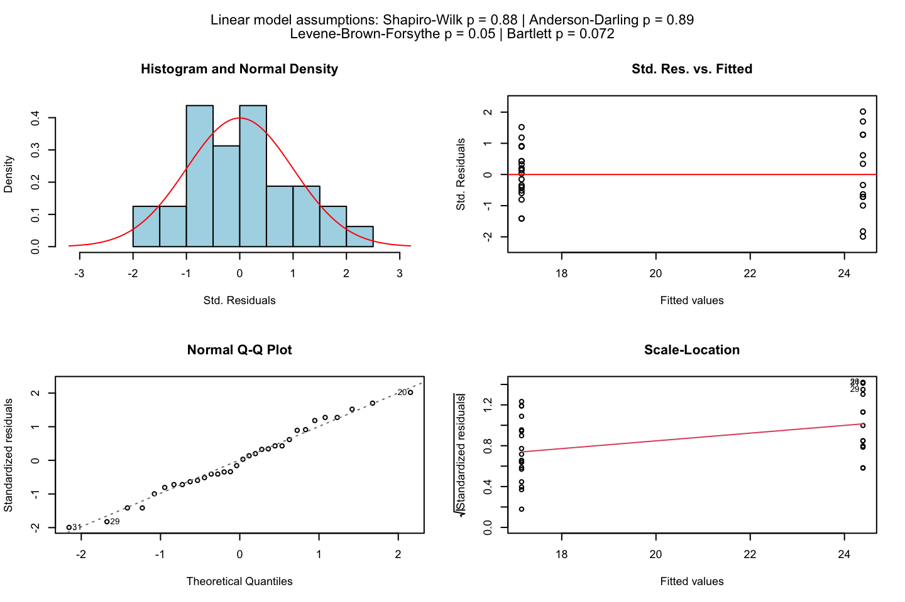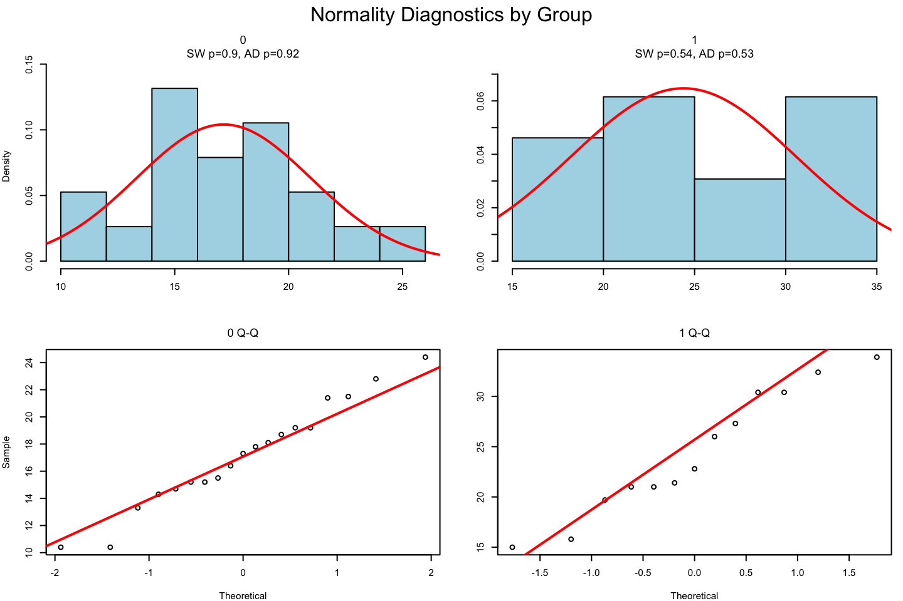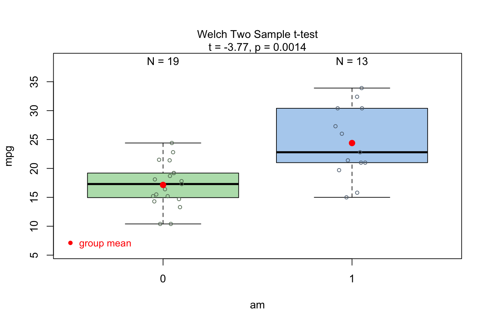

##### Wilcoxon rank sum test

The Wilcoxon rank sum test is exemplified on differences between the
central tendencies of grades of “boys” and “girls” in a class:

``` r
grades_gender <- data.frame(
  sex = as.factor(c(rep("girl", 21), rep("boy", 23))),
  grade = c(
    19.3, 18.1, 15.2, 18.3, 7.9, 6.2, 19.4,
    20.3, 9.3, 11.3, 18.2, 17.5, 10.2, 20.1, 13.3, 17.2, 15.1, 16.2, 17.0,
    16.5, 5.1, 15.3, 17.1, 14.8, 15.4, 14.4, 7.5, 15.5, 6.0, 17.4,
    7.3, 14.3, 13.5, 8.0, 19.5, 13.4, 17.9, 17.7, 16.4, 15.6, 17.3, 19.9, 4.4, 2.1
  )
)

wilcoxon_statistics <- visstat(grades_gender$sex, grades_gender$grade)
```

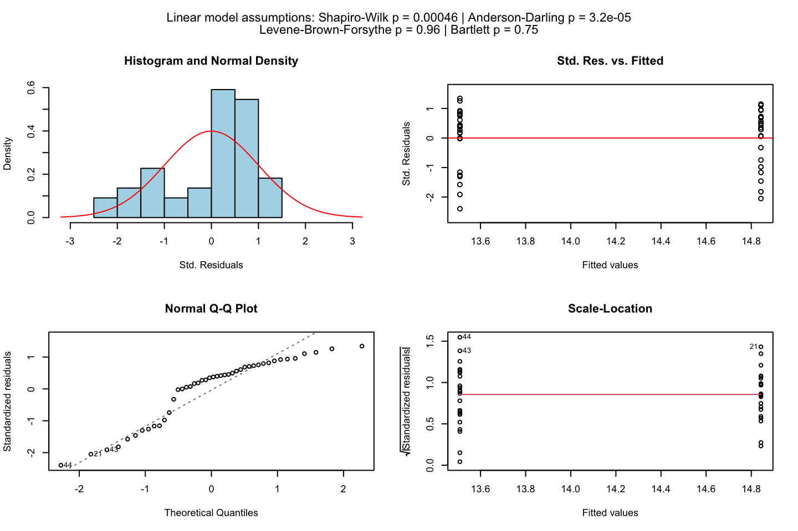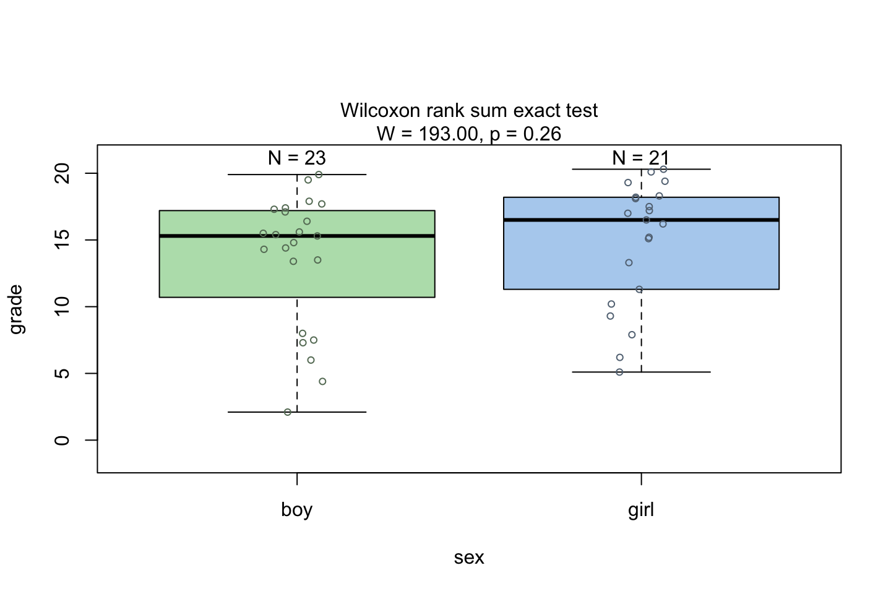

##### Wilcoxon with ordinal response

``` r
set.seed(123)

# Create predictor: Customer segment (2 groups)
segment <- factor(rep(c("Budget", "Premium"), each = 50))

# Create response: Likert scale ratings (1-5)
satisfaction_numeric <- c(
  sample(1:5, 50, replace = TRUE, prob = c(0.15, 0.25, 0.30, 0.20, 0.10)),  # Budget
  sample(1:5, 50, replace = TRUE, prob = c(0.05, 0.10, 0.20, 0.35, 0.30))   # Premium
)

# Create dataframe with ORDERED response
survey_data <- data.frame(
  segment = segment,
  satisfaction = ordered(satisfaction_numeric)  # Declare as ordered
)

# triggers warnings and use Wilcoxon test
wilcox_ordered <- visstat(survey_data, "satisfaction", "segment")
```

    ## Warning: Ordered response detected. Converting to integer level codes for
    ## non-parametric analysis.

### Categorical predictor with more than two levels

#### Fisher’s one-way ANOVA (`aov()`)

Fisher’s one-way ANOVA ([`aov()`](https://rdrr.io/r/stats/aov.html))
tests the null hypothesis that the means of $`k`$ groups are equal.

As a [linear model](#glm), it assumes independent observations, normally
distributed residuals, and **homogeneous** variances across groups. The
test statistic is the ratio of the variance explained by differences
among group means (between-group variance) to the unexplained variance
within groups ([Ronald A. Fisher and Yates 1990](#ref-Fisher:1990))

``` math
F  = \frac{MS_{between}}{MS_{within}}=
\frac{SS_{between}/(k-1)}{SS_{within}/(N-k)} = \frac{\frac{\sum_{i=1}^{k} n_i (\bar{x}_i - \bar{x})^2}{k - 1}}
{\frac{\sum_{i=1}^{k}\sum_{j=1}^{n_i}(x_{ij}-\bar{x}_i)^2}{N - k}}
```

where:

- $`MS_{between}`$ and $`MS_{within}`$ are the mean square between
  groups and mean square within groups, respectively.

- $`SS_{between}`$ = Sum of Squares between groups (variance due to
  group differences)

- $`SS_{within}`$ = Sum of Squares within groups (error variance)

- $`k`$ = number of groups

- $`N`$ = total sample size

$`\bar{x}_i`$ is the mean of group $`i`$, $`\bar{x}`$ is the overall
mean, $`x_{ij}`$ is the observation $`j`$ in group $`i`$, $`n_i`$ is the
sample size in group $`i`$, $`k`$ is the number of groups, and $`N`$ is
the total number of observations.

Under the null hypothesis, this statistic follows an F-distribution with
two parameters for degrees of freedom: $`(k - 1)`$ and $`(N - k)`$:
$`F \sim F(k-1, N-k)`$ The resulting p-value is computed from this
distribution.

#### Welch’s heteroscedastic one-way ANOVA (`oneway.test()`)

When only the assumptions of independent observations and normally
distributed residuals are met, but *homogeneous variances* across groups
*cannot be assumed*, Welch’s heteroscedastic one-way ANOVA
([`oneway.test()`](https://rdrr.io/r/stats/oneway.test.html)) ([Welch
1951](#ref-Welch:1951)) provides an alternative to
[`aov()`](https://rdrr.io/r/stats/aov.html). It compares group means
using weights based on sample sizes and variances. The degrees of
freedom are adjusted using a Satterthwaite-type approximation
([Satterthwaite 1946](#ref-Satterthwaite:1946)), resulting in an
F-statistic with non-integer degrees of freedom. The Welch F-statistic
is calculated as ([Welch 1951](#ref-Welch:1951)):

``` math
F_W = \frac{\sum_{i=1}^{k} w_i (\bar{y}_i - \bar{y}_w)^2 / (k-1)}{1 + \frac{2(k-2)}{k^2-1} \sum_{i=1}^{k} \frac{(1-w_i/w)^2}{n_i-1}}
```

where $`w_i = n_i/s_i^2`$ are the weights (inverse variances),
$`w = \sum_{i=1}^{k} w_i`$,
$`\bar{y}_w = \sum_{i=1}^{k} w_i \bar{y}_i / w`$ is the weighted grand
mean, $`k`$ is the number of groups, $`n_i`$ is the sample size of group
$`i`$, and $`s_i^2`$ is the variance of group $`i`$.

Numerical relationships within the parametric tests defined by the
decision logic above (including the identity $`t^2 = F`$ in the
equal-variance two-group case) are summarised in [Appendix A](#glm).

#### Kruskal–Wallis test (`kruskal.test()`)

When the assumption of normality is not met, the Kruskal–Wallis test
provides a non-parametric alternative. It compares group distributions
based on ranked values and tests the null hypothesis that the groups
come from the same population — specifically, that the distributions
have the same location ([Kruskal and Wallis 1952](#ref-Kruskal:1952)).
If the group distributions are sufficiently similar in shape and scale,
then the Kruskal–Wallis test can be interpreted as testing for equality
of medians across groups ([Hollander, Chicken, and Wolfe
2014](#ref-Hollander:2014)).

The test statistic is defined as:

``` math
H = \frac{12}{N(N+1)} \sum_{i=1}^{k} n_i \left(\bar{R}_i - \bar{R} \right)^2,
```

where $`n_i`$ is the sample size in group $`i`$, $`k`$ is the number of
groups, $`\bar{R}_i`$ is the average rank of group $`i`$, $`N`$ is the
total sample size, and $`\bar{R} = \frac{N+1}{2}`$ is the average of all
ranks. Under the null hypothesis, $`H`$ approximately follows a
$`\chi^2`$ distribution with $`k - 1`$ degrees of freedom.

#### Post-hoc analysis

ANOVA, Welch ANOVA, and Kruskal–Wallis are omnibus tests: a significant
result tells us that *some* group differs, but not which. To identify
the differing pairs we test all

``` math
M = \frac{n \cdot (n - 1)}{2}
```

pairwise comparisons among the $`n`$ factor levels, defining a *family
of tests* ([Abdi 2007](#ref-Abdi:2007)). Without correction, the
family-wise error rate—the probability of at least one false rejection
across the family—grows quickly with $`n`$. Because the three omnibus
tests rest on different assumptions,
[`visstat()`](https://shhschilling.github.io/visStatistics/reference/visstat.md)
pairs each with a different post-hoc procedure and returns the
corresponding adjusted p-values for every pairwise comparison.

##### Following `aov()`: `TukeyHSD()`

When the residuals are normal and variances are homogeneous,
[`visstat()`](https://shhschilling.github.io/visStatistics/reference/visstat.md)
follows [`aov()`](https://rdrr.io/r/stats/aov.html) with Tukey’s
Honestly Significant Differences procedure. TukeyHSD controls the
family-wise error rate via the studentised range distribution, which
exploits the *common* residual variance shared across pairs ([Hochberg
and Tamhane 1987](#ref-Hochberg:1987)).
[`visstat()`](https://shhschilling.github.io/visStatistics/reference/visstat.md)
returns the HSD-adjusted p-values for every pairwise mean comparison.

##### Following `oneway.test()`: `games.howell()`

When the residuals are normal but variances are heterogeneous, the
common-variance assumption of TukeyHSD breaks down.
[`visstat()`](https://shhschilling.github.io/visStatistics/reference/visstat.md)
therefore pairs Welch’s heteroscedastic
[`oneway.test()`](https://rdrr.io/r/stats/oneway.test.html) with the
Games–Howell procedure, which is appropriate under unequal variances and
unequal sample sizes.
[`games.howell()`](https://shhschilling.github.io/visStatistics/reference/games.howell.md)
uses *separate* variance estimates for each pair and Welch-adjusted
degrees of freedom ([Games and Howell 1976](#ref-Games:1976)). The
returned object contains the Games–Howell-adjusted p-values for every
pairwise comparison.

##### Following `kruskal.test()`: `pairwise.wilcox.test()`

When normality is rejected,
[`visstat()`](https://shhschilling.github.io/visStatistics/reference/visstat.md)
follows [`kruskal.test()`](https://rdrr.io/r/stats/kruskal.test.html)
with
[`pairwise.wilcox.test()`](https://rdrr.io/r/stats/pairwise.wilcox.test.html),
which compares each pair of factor levels via the Wilcoxon rank-sum test
on ranks rather than means. The resulting p-values are adjusted for
multiplicity using Holm’s step-down method ([Holm
1979](#ref-Holm:1979)): sorted ascending and tested against thresholds
that loosen with rank.

#### Graphical output

The graphical output for all tests based on a numeric response and a
categorical predictor with more than two levels consists of two panels:
the first focuses on the residual analysis, the second on the actual
test chosen by the decision logic.

The residual panel addresses the assumption of normality, both
graphically and through formal tests. It displays a scatter plot of the
standardised residuals versus the predicted values, as well as a normal
Q–Q plot comparing the sample quantiles to the theoretical quantiles. If
the residuals are normally distributed, no more than $`5\%`$ of the
standardised residuals should exceed approximately $`|2|`$; in the Q–Q
plot the data points should approximately follow the red straight line.

The p-values of the formal tests for normality (Shapiro–Wilk and
Anderson–Darling) as well as the tests for homoscedasticity (Bartlett’s
and Levene Brown–Forsythe) are given in the title.

[`visstat()`](https://shhschilling.github.io/visStatistics/reference/visstat.md)
then illustrates, in the subsequent graph, either the
[`kruskal.test()`](https://rdrr.io/r/stats/kruskal.test.html), the
[`oneway.test()`](https://rdrr.io/r/stats/oneway.test.html), or
[`aov()`](https://rdrr.io/r/stats/aov.html) result (see also Section
“Decision logic”). In all three branches the result is shown as box
plots with the number of observations per level above each box; the
title gives the name of the test that was run and its p-value (and, for
the parametric branches, the corresponding $`F`$ statistic). When the
largest group contains no more than 50 observations, individual data
points are overlaid as a jittered strip chart, making the raw
distribution visible.

In every branch, pairs of groups whose adjusted post-hoc p-value falls
below $`\alpha`$ are marked with *different* green letters below the box
plots; pairs sharing a letter are not significantly different. The
letters are produced by `multcompLetters()` from the `multcompView`
package ([Graves, Piepho, and with help from Sundar Dorai-Raj
2026](#ref-Graves:2026)).

Besides the graphical output,
[`visstat()`](https://shhschilling.github.io/visStatistics/reference/visstat.md)
returns a list containing the relevant test statistics along with the
corresponding post-hoc-adjusted $`p`$-values for all pairwise
comparisons.

#### Examples

##### Fisher’s one-way ANOVA

The `npk` dataset reports the yield of peas (in pounds per block) from
an agricultural experiment conducted on six blocks. In this experiment,
the application of three different fertilisers – nitrogen (N), phosphate
(P), and potassium (K) – was varied systematically. Each block received
either none, one, two, or all three of the fertilisers.

``` r
anova_npk <- visstat(npk$block,npk$yield,conf.level=0.95)
```

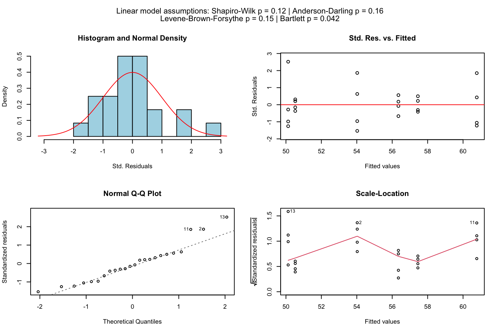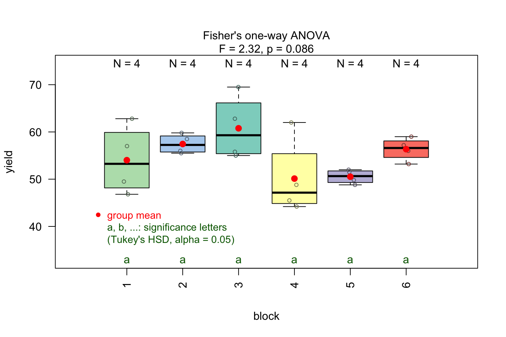

Normality of residuals is supported by graphical diagnostics (histogram,
scatter plot of standardised residuals, Q-Q plot) and formal tests
(Shapiro–Wilk and Anderson- Darling, both with $`p > \alpha`$).
Homogeneity of variances is not supported at the given confidence level
by [`bartlett.test()`](https://rdrr.io/r/stats/bartlett.test.html), but
by
[`levene.test()`](https://shhschilling.github.io/visStatistics/reference/levene.test.md)
($`p > \alpha`$). The decision logic is solely based on
[`levene.test()`](https://shhschilling.github.io/visStatistics/reference/levene.test.md)
and triggers [`aov()`](https://rdrr.io/r/stats/aov.html). Post-hoc
analysis with [`TukeyHSD()`](https://rdrr.io/r/stats/TukeyHSD.html).
Note that the omnibus F-test reports p = 0.086 — not significant at
$`\alpha=0.05`$. Therefore no pairwise differences are expected in the
post-hoc analysis and all groups share the same green letter “a”.

##### Kruskal–Wallis rank sum test

The `iris` dataset contains petal width measurements (in cm) for three
different iris species.

``` r
visstat(iris$Species, iris$Petal.Width)
```

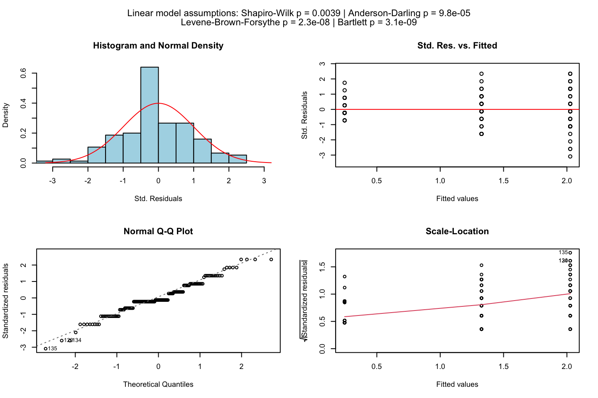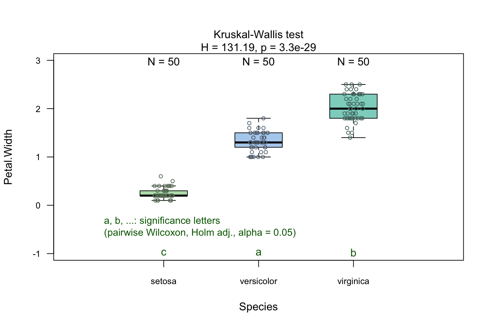

In this example, scatter plots of the standardised residuals and the Q-Q
plot suggest that the residuals are not normally distributed. This is
confirmed by very small p-values from both the Shapiro–Wilk and
Anderson-Darling tests.

Since the Shapiro–Wilk p-value is below $`\alpha`$,
[`visstat()`](https://shhschilling.github.io/visStatistics/reference/visstat.md)
switches to the non-parametric
[`kruskal.test()`](https://rdrr.io/r/stats/kruskal.test.html). Post-hoc
analysis using
[`pairwise.wilcox.test()`](https://rdrr.io/r/stats/pairwise.wilcox.test.html)
shows significant differences in petal width between all three species,
as indicated by distinct group labels (all green letters differ).

##### Kruskal–Wallis with ordinal response

When the response is of class `ordered` and the predictor is a
categorical factor with more than two levels,
[`visstat()`](https://shhschilling.github.io/visStatistics/reference/visstat.md)
issues a warning, converts the ordered response to integer level codes
and routes the analysis to
[`kruskal.test()`](https://rdrr.io/r/stats/kruskal.test.html) followed
by
[`pairwise.wilcox.test()`](https://rdrr.io/r/stats/pairwise.wilcox.test.html).

``` r
set.seed(123)

# Predictor: customer segment (3 groups)
segment <- factor(rep(c("Budget", "Standard", "Premium"), each = 50))

# Response: Likert scale ratings (1-5), with a deliberate trend across segments
comfort_numeric <- c(
  sample(1:5, 50, replace = TRUE, prob = c(0.30, 0.30, 0.20, 0.15, 0.05)),  # Budget
  sample(1:5, 50, replace = TRUE, prob = c(0.10, 0.20, 0.40, 0.20, 0.10)),  # Standard
  sample(1:5, 50, replace = TRUE, prob = c(0.05, 0.10, 0.20, 0.35, 0.30))   # Premium
)

# Dataframe with ORDERED response
survey_data_3 <- data.frame(
  segment = segment,
  comfort = ordered(comfort_numeric)  # Declare as ordered
)

# triggers warning and uses Kruskal-Wallis test
kruskal_ordered <- visstat(survey_data_3, "comfort", "segment")
```

    ## Warning: Ordered response detected. Converting to integer level codes for
    ## non-parametric analysis.

### Both variables numeric

#### Simple linear regression (`lm()`)

The regression plot displays the point estimate of the regression line

``` math
y = b_0 + b_1 \cdot x,
```

where $`y`$ is the response variable, $`x`$ is the predictor variable,
$`b_0`$ is the intercept, and $`b_1`$ is the slope of the regression
line.

##### Residual analysis

[`visstat()`](https://shhschilling.github.io/visStatistics/reference/visstat.md)
checks the normality of the standardised residuals from
[`lm()`](https://rdrr.io/r/stats/lm.html) both with diagnostic plots and
using the Shapiro–Wilk and Anderson-Darling tests. (via
[`vis_lm_assumptions()`](https://shhschilling.github.io/visStatistics/reference/vis_lm_assumptions.md))

Note, that regardless of the result of the residual analysis,
[`visstat()`](https://shhschilling.github.io/visStatistics/reference/visstat.md)
proceeds to perform the regression. The title of the graphical output
indicates the chosen confidence level (`conf.level`), the estimated
regression parameters with their confidence intervals and p-values, and
$`R^2`$. The plot displays the raw data, the fitted regression line, and
both the confidence and prediction bands corresponding to the specified
`conf.level`.

[`visstat()`](https://shhschilling.github.io/visStatistics/reference/visstat.md)
returns a list containing the regression test statistics, the p-values
from the normality tests of the standardised residuals, and the
pointwise estimates of the confidence and prediction bands.

#### Examples

##### `swiss` dataset

The `swiss` dataset records standardised fertility and socioeconomic
indicators for 47 French-speaking Swiss provinces in 1888. We examine
how the share of draftees achieving the highest army examination score
(`Examination`) predicts the fertility measure (`Fertility`).

``` r
linreg_swiss <- visstat(swiss$Examination, swiss$Fertility, conf.level = 0.99)
```

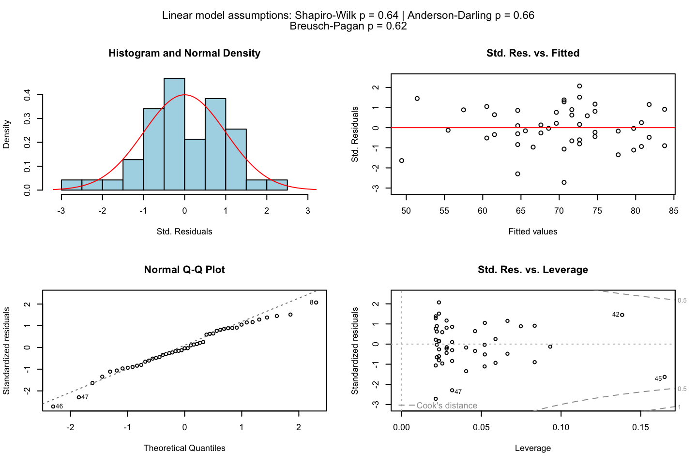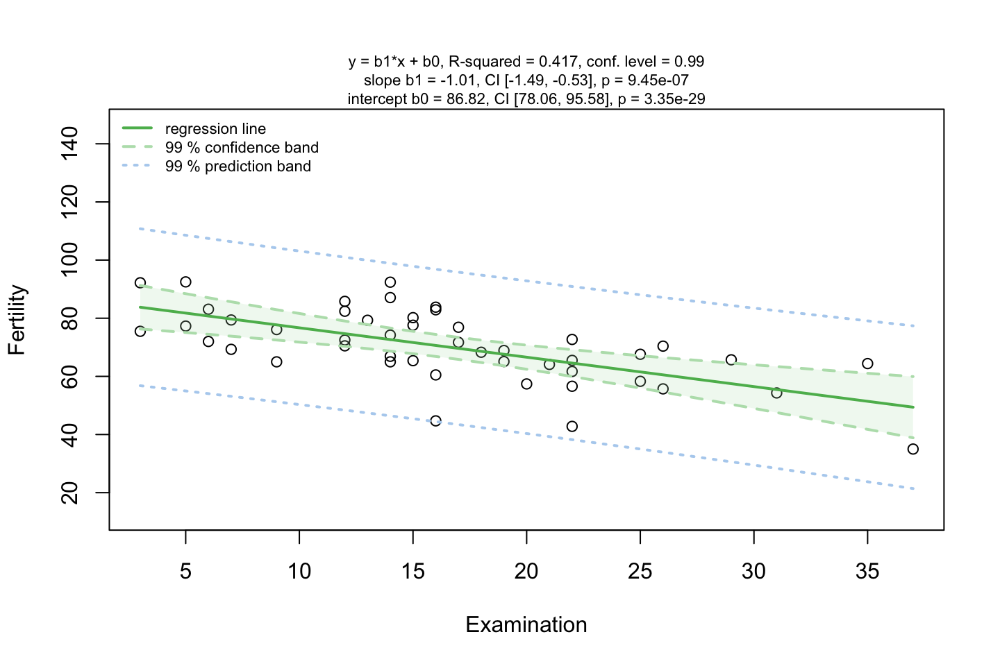

Both normality tests pass ($`p > \alpha`$) and the Breusch–Pagan test
confirms homoscedasticity, validating the linear model.

#### Spearman rank correlation (`cor.test(..., method = "spearman")`)

For two numeric variables with `correlation = TRUE`,
[`visstat()`](https://shhschilling.github.io/visStatistics/reference/visstat.md)
calls `cor.test(x, y, method = "spearman")` to measure the monotonic
association between $`x`$ and $`y`$ using ranks, evaluating linear
dependence on the ranked data rather than on the original scale:

``` math
\rho = r(\operatorname{rank}(x), \operatorname{rank}(y))
```
where $`r(u, v)`$ denotes Pearson’s correlation coefficient:
``` math
r(u,v)
=
\frac{\sum_{i=1}^{n}(u_i-\bar u)(v_i-\bar v)}
{\sqrt{\sum_{i=1}^{n}(u_i-\bar u)^2}\,
 \sqrt{\sum_{i=1}^{n}(v_i-\bar v)^2}}.
```

For inference, `cor.test(..., method = "spearman")` computes an exact
p-value for small samples without ties by evaluating all $`n!`$ rank
permutations. For larger samples or when ties are present, it uses an
approximation to the null distribution of the test statistic. No
distributional assumption on the original data is required.

##### Example

The `airquality` dataset contains daily air quality measurements in New
York, May to September 1973 ([Chambers 2018](#ref-Chambers:2018))

A default call to
[`visstat()`](https://shhschilling.github.io/visStatistics/reference/visstat.md)
fits a simple linear regression model, but triggers the following
warning:

``` r
result_ozone0 <- visstat(airquality$Wind, airquality$Ozone)
```

    ## Warning: Statistical assumptions violated:
    ## Normality of residuals violated (Shapiro-Wilk p = 0.00522 )
    ## Homoscedasticity violated (Breusch-Pagan p = 0.00595 )
    ## Analysis proceeded but interpret results cautiously.

    ## RECOMMENDATION: Consider exploring alternatives outside visstat() such as data transformations, generalised linear models, or robust regression. For an assumption-free, non-causal alternative consider rerunning with correlation = TRUE.

The warning reports violated normality and homoscedasticity and
recommends two paths: rerun with `correlation = TRUE` within
[`visstat()`](https://shhschilling.github.io/visStatistics/reference/visstat.md),
or switch to a model outside it.

Staying within
[`visstat()`](https://shhschilling.github.io/visStatistics/reference/visstat.md),
`correlation = TRUE` gives an assumption-free result at the cost of
causality:

``` r
result_ozone1 <- visstat(airquality$Wind, airquality$Ozone, correlation = TRUE)
```

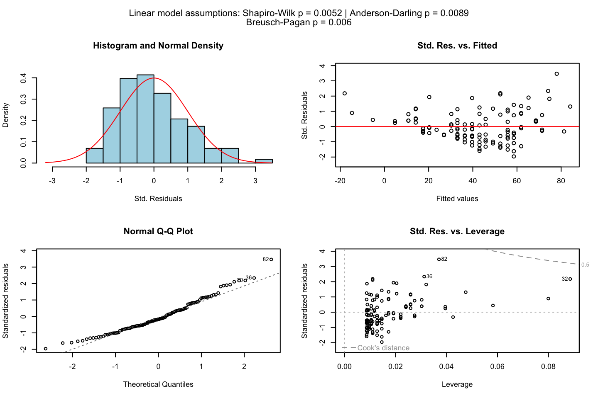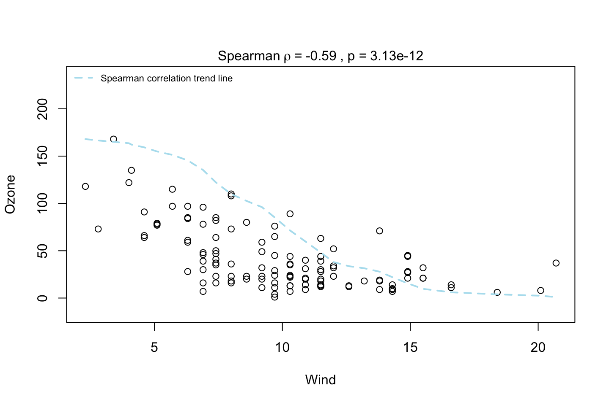

To preserve causality, we follow the second path and fit a Gamma
generalised linear model with log link. The Gamma family is suited here
because Ozone is strictly positive and continuous, and its variance
grows with the mean — the structure detected by the Breusch–Pagan test.
The log link (not the canonical inverse link) is preferred in practice
as it guarantees positive fitted values.

``` r
# Remove zeros to satisfy Gamma requirements
airquality_clean <- subset(airquality, Ozone > 0)
# Gamma model with log mapping
model_gamma <- glm(Ozone ~ Wind, data = airquality_clean, family = Gamma(link = "log"))
summary(model_gamma)
```

    ## 
    ## Call:
    ## glm(formula = Ozone ~ Wind, family = Gamma(link = "log"), data = airquality_clean)
    ## 
    ## Coefficients:
    ##             Estimate Std. Error t value Pr(>|t|)    
    ## (Intercept)   4.8155     0.1730  27.830  < 2e-16 ***
    ## Wind         -0.1196     0.0165  -7.247 5.42e-11 ***
    ## ---
    ## Signif. codes:  0 '***' 0.001 '**' 0.01 '*' 0.05 '.' 0.1 ' ' 1
    ## 
    ## (Dispersion parameter for Gamma family taken to be 0.4002672)
    ## 
    ##     Null deviance: 74.757  on 115  degrees of freedom
    ## Residual deviance: 50.432  on 114  degrees of freedom
    ## AIC: 1040
    ## 
    ## Number of Fisher Scoring iterations: 8

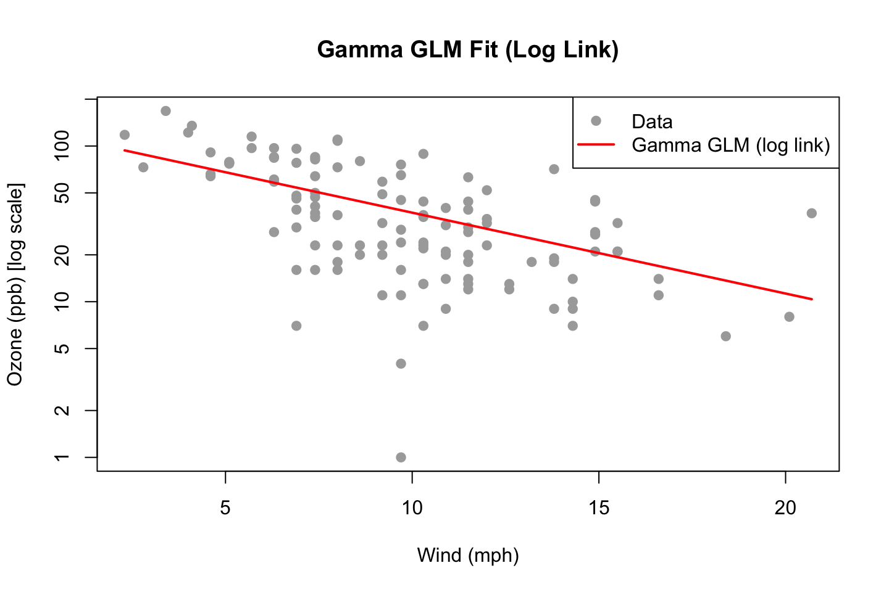

For a well-fitting Gamma generalised linear model, standardised deviance
residuals are asymptotically standard normal; we use Shapiro–Wilk and
Anderson–Darling as approximate checks.

``` r
# Extract standardised  residuals
std_dev_res <- rstandard(model_gamma, type = "deviance")
# Validate using the Shapiro-Wilk normality test
shapiro.test(std_dev_res)
```

    ## 
    ##  Shapiro-Wilk normality test
    ## 
    ## data:  std_dev_res
    ## W = 0.99245, p-value = 0.7817

``` r
# Validate using the Anderson-Darling normality test
nortest::ad.test(std_dev_res)
```

    ## 
    ##  Anderson-Darling normality test
    ## 
    ## data:  std_dev_res
    ## A = 0.198, p-value = 0.8853

### Both variables categorical: Comparing proportions

Observed frequencies are arranged in a contingency table, where rows
index the levels $`i`$ of the response variable and columns index the
levels $`j`$ of the predictor variable.
[`visstat()`](https://shhschilling.github.io/visStatistics/reference/visstat.md)
tests the null hypothesis that the two variables are independent.

#### Pearson’s $`\chi^2`$-test (`chisq.test()`)

Let $`O_{ij}`$ and $`E_{ij}`$ denote the observed and expected
frequencies in row $`i`$ and column $`j`$ of an $`R \times C`$
contingency table. The Pearson residual for each cell is defined as

``` math
r_{ij} = \frac{O_{ij} - E_{ij}}{\sqrt{E_{ij}}}, \quad i = 1, \ldots, R,\quad j = 1, \ldots, C.
```

The test statistic of Pearson’s $`\chi^2`$-test ([Pearson
1900](#ref-Pearson:1900)) is the sum of squared Pearson residuals:

``` math
\chi^2 = \sum_{i=1}^{R} \sum_{j=1}^{C} r_{ij}^2 =
\sum_{i=1}^{R} \sum_{j=1}^{C} \frac{(O_{ij} - E_{ij})^2}{E_{ij}}.
```

The test statistic is compared to the chi-squared distribution with
$`(R - 1)(C - 1)`$ degrees of freedom. The resulting p-value corresponds
to the upper tail probability — that is, the probability of observing a
value greater than or equal to the test statistic under the null
hypothesis.

For general $`R \times C`$ tables,
[`visstat()`](https://shhschilling.github.io/visStatistics/reference/visstat.md)
supplements the bar chart with a mosaic plot ([Meyer, Zeileis, and
Hornik 2006](#ref-Meyer:2006); [Meyer et al. 2024](#ref-Meyer:2024)), in
which the area of each tile is proportional to the observed cell
frequency and tiles are coloured by their Pearson residual $`r_{ij}`$:
blue for positive residuals (observed exceeds expected) and red for
negative ones (observed falls short of expected). This makes the cells
driving the association immediately visible.

#### Pearson’s $`\chi^2`$ test with Yates’ continuity correction

Pearson $`\chi^2`$ statistic in $`2 \times 2`$ contingency tables
(resulting in only one degree of freedom) tends to overestimate the
significance level of the test.

To correct for this, Yates proposed subtracting 0.5 from each absolute
difference between observed and expected counts ([Yates
1934](#ref-Yates:1934)), resulting in a smaller test statistic:
``` math
\chi^2_{\text{Yates}} = \sum_{i=1}^{2} \sum_{j=1}^{2}
\frac{(|O_{ij} - E_{ij}| - 0.5)^2}{E_{ij}}.
```

This reduced test statistic yields a larger p-value, thereby lowering
the risk of a Type I error.

Yates’ continuity correction is applied by default to $`2 \times 2`$
contingency tables with one degree of freedom by the underlying routine
[`chisq.test()`](https://rdrr.io/r/stats/chisq.test.html).

##### Fisher’s exact test (`fisher.test()`)

The $`\chi^2`$ approximation is considered reliable only if no expected
cell count is less than 1 and no more than 20% of cells have expected
counts below 5 ([Cochran 1954](#ref-Cochran:1954)). If this condition is
not met, Fisher’s exact test ([Ronald Aylmer Fisher
1970](#ref-Fisher:1970))
([`fisher.test()`](https://rdrr.io/r/stats/fisher.test.html)) is applied
instead.

The test calculates an exact $`p`$-value by conditioning on the observed
margins of an $`R \times C`$ contingency table. To maintain consistency
with the `y ~ x` (response ~ predictor) framework used throughout
`visStatistics`, the **rows ($`i=1, \dots, R`$) represent the levels of
the response variable $`y`$** and the **columns ($`j=1, \dots, C`$)
represent the levels of the predictor $`x`$**. The row totals are
defined as $`n_{i\cdot} = \sum_{j=1}^C n_{ij}`$ and the column totals as
$`n_{\cdot j} = \sum_{i=1}^R n_{ij}`$, for $`i = 1, \dots, R`$ and
$`j = 1, \dots, C`$.

In the $`2 \times 2`$ case ($`R=2, C=2`$), the table is structured as
follows:

``` math
\begin{array}{c|cc|c}
& x_1 & x_2 & \text{Row sums} \\
\hline
y_1 & n_{11} & n_{12} & n_{1\cdot} \\
y_2 & n_{21} & n_{22} & n_{2\cdot} \\
\hline
\text{Column sums} & n_{\cdot 1} & n_{\cdot 2} & n
\end{array}
```

The exact probability of observing this table under the null hypothesis
of independence, given the fixed margins, is given by the hypergeometric
probability mass function (PMF):

``` math
\mathbb{P}(N \mid n_{1\cdot}, n_{2\cdot}, n_{\cdot 1}, n_{\cdot 2}) = \frac{\binom{n_{1\cdot}}{n_{11}} \binom{n_{2\cdot}}{n_{21}}}{\binom{n}{n_{\cdot 1}}}
```

where $`n = n_{1\cdot} + n_{2\cdot} = n_{\cdot 1} + n_{\cdot 2}`$ is the
total sample size. The $`p`$-value is computed by summing the
probabilities of all tables with the same margins whose probabilities
under the null are less than or equal to that of the observed table.

For general $`R \times C`$ tables,
[`fisher.test()`](https://rdrr.io/r/stats/fisher.test.html) generalises
this approach using the multivariate hypergeometric distribution.

For $`2 \times 2`$ tables,
[`fisher.test()`](https://rdrr.io/r/stats/fisher.test.html) additionally
returns the conditional maximum likelihood estimate of the odds ratio
$`\widehat{\text{OR}}`$. Given the orientation where rows are the
response $`y`$, the odds of observing response level $`y_1`$ (relative
to $`y_2`$) in predictor group $`x_1`$ are $`n_{11}/n_{21}`$, and the
corresponding odds in group $`x_2`$ are $`n_{12}/n_{22}`$. The odds
ratio is thus:

``` math
\widehat{\text{OR}} = \frac{n_{11} / n_{21}}{n_{12} / n_{22}} = \frac{n_{11} \cdot n_{22}}{n_{12} \cdot n_{21}}
```

This estimate and its confidence interval are accessible as `$estimate`
and `$conf.int` in the returned `visstat` object. \### Test choice and
graphical output

If the expected frequencies are sufficiently large - specifically, if at
least 80% of the cells have expected counts greater than 5 and no
expected count is smaller than 1, the function uses Pearson’s
$`{\chi}^2`$-test
([`chisq.test()`](https://rdrr.io/r/stats/chisq.test.html)).

Otherwise, it switches to Fisher’s exact test
([`fisher.test()`](https://rdrr.io/r/stats/fisher.test.html)) ([Cochran
1954](#ref-Cochran:1954)).

For 2-by-2 contingency tables, Yates’ continuity correction ([Yates
1934](#ref-Yates:1934)) is always applied to Pearson’s
$`{\chi}^2`$-test.

The graphical output depends on the selected test:

- **Pearson’s** $`\chi^2`$ test (general $`R \times C`$ tables): a
  grouped column plot showing row percentages with the $`p`$-value in
  the title, followed by a mosaic plot with colour-coded Pearson
  residuals.
- **Pearson’s** $`\chi^2`$ test with Yates’ continuity correction
  ($`2 \times 2`$ tables): a grouped column plot showing row percentages
  with the $`p`$-value in the title.
- **Fisher’s exact test**: a grouped column plot showing absolute counts
  with $`N`$ labels above each bar and the $`p`$-value in the title.

#### Transforming a contingency table to a data frame

The following examples for tests of categorical predictor and response
are all based on the `HairEyeColor` contingency table.

Contingency tables must be converted to the required column-based
`data.frame` using the helper function
[`counts_to_cases()`](https://shhschilling.github.io/visStatistics/reference/counts_to_cases.md).
The function transforms the contingency table `HairEyeColor` into
`data.frame` named `HairEyeColourDataFrame`.

``` r
HairEyeColourDataFrame <- counts_to_cases(as.data.frame(HairEyeColor))
```

#### Examples

In all examples of this section, we will test the null hypothesis that
hair colour (“Hair”) and eye colour (“Eye”) are independent of each
other.

##### Pearson’s $`{\chi}^2`$-test (`chisq.test()`)

``` r
hair_eye_colour_df <- counts_to_cases(as.data.frame(HairEyeColor))
visstat(hair_eye_colour_df$Eye, hair_eye_colour_df$Hair)
```

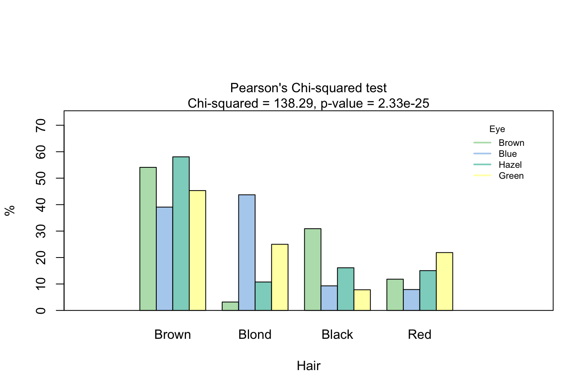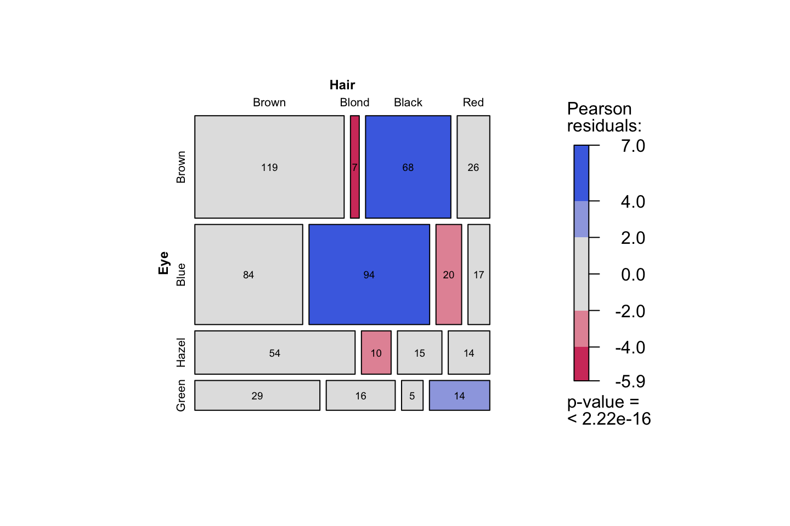

The graphical output shows that the null hypothesis of Pearson’s
$`\chi^2`$ test – namely, that hair colour and eye colour are
independent – must be rejected at the default significance level
$`\alpha=0.05`$ ($`p = 2.33 \cdot 10^{-25} <
\alpha`$). The mosaic plot indicates that the strongest deviations are
due to over-representation of individuals with black hair and brown
eyes, and of those with blond hair and blue eyes. In contrast,
individuals with blond hair and brown eyes are the most
under-represented.

##### Pearson’s $`{\chi}^2`$-test with Yates’ continuity correction

In the following example, we restrict the data to participants with
either black or brown hair and either brown or blue eyes, resulting in a
2-by-2 contingency table.

``` r
hair_black_brown_eyes_brown_blue <- HairEyeColor[1:2, 1:2, ]
# Transform to data frame
hair_black_brown_eyes_brown_blue_df <- counts_to_cases(as.data.frame(hair_black_brown_eyes_brown_blue))
# Chi-squared test with Yates' continuity correction

visstat(hair_black_brown_eyes_brown_blue_df$Eye, hair_black_brown_eyes_brown_blue_df$Hair)
```

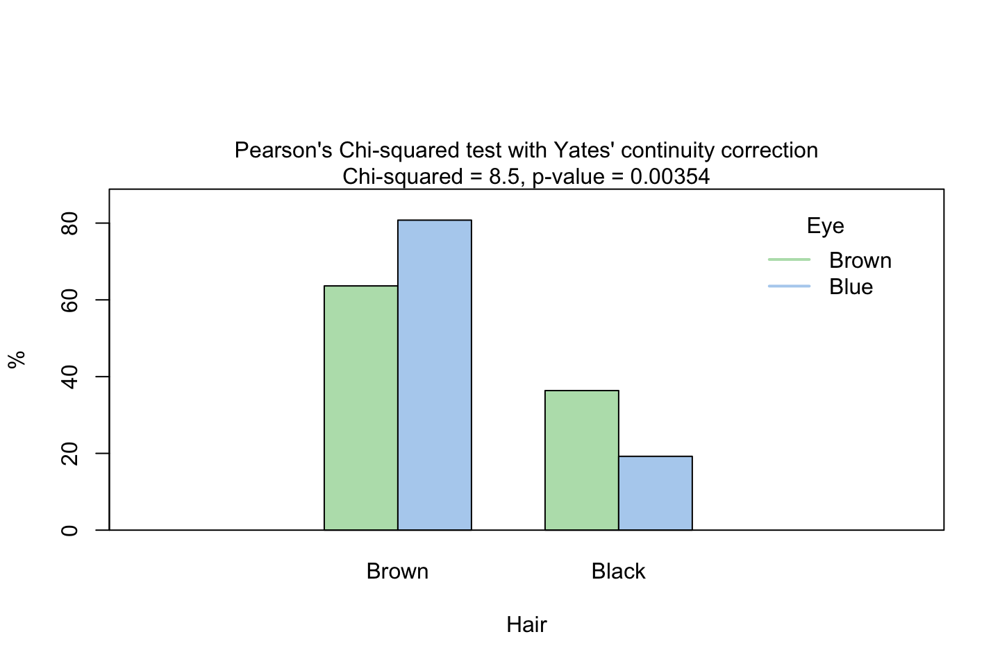

Also in this reduced dataset we reject the null hypothesis of
independence of the hair colours “brown” and “black” from the eye
colours “brown” and “blue”. As a $`2 \times 2`$ table, Yates’ continuity
correction is applied and no mosaic plot is produced. Note that the
Yates-corrected $`p`$-value is slightly higher than the uncorrected
Pearson $`p`$-value, reflecting the more conservative correction.

##### Fisher’s exact test (`fisher.test()`)

Again, we extract a 2-by-2 contingency table from the full dataset, this
time keeping only male participants with black or brown hair and hazel
or green eyes.

Pearson’s $`{\chi}^2`$ test applied to this table would yield an
expected frequency less than 5 in one of the four cells (25% of all
cells), which violates the requirement that at least 80% of the expected
frequencies must be 5 or greater ([Cochran 1954](#ref-Cochran:1954)).

Therefore,
[`visstat()`](https://shhschilling.github.io/visStatistics/reference/visstat.md)
automatically selects Fisher’s exact test instead.

``` r
hair_eye_colour_male <- HairEyeColor[, , 1]
# Slice out a 2 by 2 contingency table
black_brown_hazel_green_male <- hair_eye_colour_male[1:2, 3:4]
# Transform to data frame
black_brown_hazel_green_male <- counts_to_cases(as.data.frame(black_brown_hazel_green_male))
# Fisher test
fisher_stats <- visstat(black_brown_hazel_green_male$Eye, black_brown_hazel_green_male$Hair)
```

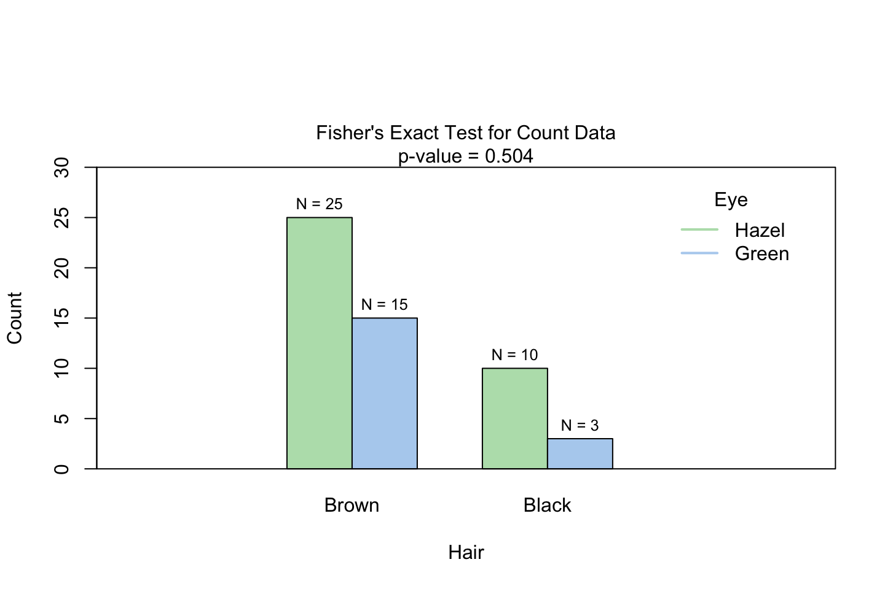

For this $`2 \times 2`$ table, the odds ratio and its 95% confidence
interval are available in the returned object:

``` r
fisher_stats$estimate   # odds ratio
```

    ## odds ratio 
    ##  0.5062015

``` r
fisher_stats$conf.int   # 95% CI
```

    ## [1] 0.07725895 2.40885255
    ## attr(,"conf.level")
    ## [1] 0.95

### Response of class `ordered`, predictor of class `factor`

When the response is an ordered factor,
[`visstat()`](https://shhschilling.github.io/visStatistics/reference/visstat.md)
converts it internally to integer level codes and redirects to the
non-parametric path (see examples in Section [Comparing central
tendencies](#comparing-central-tendencies)).

### Both variables of class `factor` and `ordered`: Wilcoxon/Kruskal-Wallis (default) or Kendall’s $`\tau_b`$ (`correlation = TRUE`)

When both the response and the predictor are ordered factors and
`correlation = TRUE` is set,
[`visstat()`](https://shhschilling.github.io/visStatistics/reference/visstat.md)
tests the null hypothesis of no monotone association via Kendall’s
$`\tau_b`$ rank correlation ([Kendall 1945](#ref-Kendall:1945); [Agresti
2010](#ref-Agresti:2010)). Without `correlation = TRUE`, both-ordered
inputs follow the standard non-parametric path (Wilcoxon or
Kruskal–Wallis).

#### Kendall’s $`\tau_b`$ (`cor.test(..., method = "kendall")`)

For two ordinal variables with $`n`$ joint observations, let $`C`$
denote the number of concordant pairs (those whose ranks agree in both
variables) and $`D`$ the number of discordant pairs. Kendall’s
$`\tau_b`$ is defined as

``` math
\tau_b \;=\; \frac{C - D}
{\sqrt{\left(n_0 - n_1\right)\left(n_0 - n_2\right)}}
```

where $`n_0 = n(n-1)/2`$, $`n_1 = \sum_i t_i(t_i-1)/2`$ summed over
groups of tied ranks in the response, and $`n_2`$ is the analogous
quantity for the predictor. The denominator correction makes $`\tau_b`$
attain $`\pm 1`$ even with ties, which Spearman’s $`\rho`$ does not
([Kendall 1945](#ref-Kendall:1945)). With few ordered levels (e.g.,
five-point Likert items), ties are unavoidable; this is the principal
reason to prefer $`\tau_b`$ over Spearman’s $`\rho`$ in this setting
([Agresti 2010](#ref-Agresti:2010)).

[`visstat()`](https://shhschilling.github.io/visStatistics/reference/visstat.md)
calls
`cor.test(as.numeric(y), as.numeric(x), method = "kendall", exact = FALSE)`
and reports $`\tau_b`$, the test statistic $`z`$, and the two-sided
$`p`$-value.

#### Graphical output

One plot is produced: a jittered rank–rank scatter that visualises the
monotone trend, with points colour-coded by the predictor level and
annotated with $`\tau_b`$ and the $`p`$-value.

#### Example

We construct a hypothetical survey of 150 secondary-school students in
which alcohol consumption frequency and academic performance are each
recorded on a five-point ordinal scale. A negative monotone association
is expected: students who consume alcohol more frequently tend to
achieve lower academic performance.

``` r
set.seed(42)
n <- 150
# Latent scores with deliberate negative monotone association:
# higher alcohol consumption (xs) -> lower academic performance (ys)
xs <- sample(1:5, n, replace = TRUE)
ys <- pmin(5, pmax(1, (6 - xs) + sample(-1:1, n, replace = TRUE)))
likert_levels  <- c("never", "rarely", "sometimes", "often", "always")
likert_levels2 <- c("poor", "fair", "ok", "good", "great")
alcohol     <- ordered(likert_levels[xs],  levels = likert_levels)
performance <- ordered(likert_levels2[ys], levels = likert_levels2)
kendall_result <- visstat(performance, alcohol, correlation = TRUE)
```

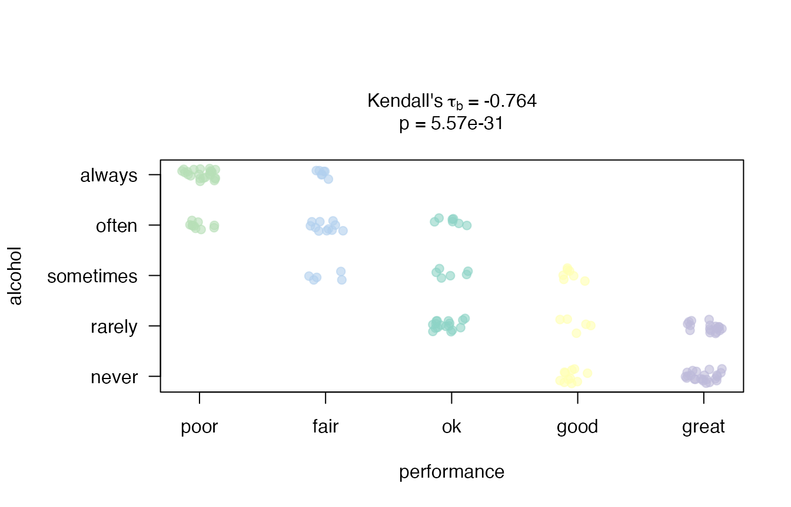

## Saving the graphical output

All generated graphics can be saved in any file format supported by
`Cairo()` ([Urbanek and Horner 2025](#ref-Urbanek:2025)), including
“png”, “jpeg”, “pdf”, “svg”, “ps”, and “tiff” in the user specified
`plotDirectory`.

If the optional argument `plotName` is not given, the naming of the
output follows the pattern `"testname_namey_namex."`, where `"testname"`
specifies the selected test and `"namey"` and `"namex"` are character
strings naming the selected data vectors `y` and `x`, respectively. The
suffix corresponding to the chosen `graphicsoutput` (e.g., `"pdf"`,
`"png"`) is then concatenated to form the complete output file name.

In the following example, we store the graphics in `png` format in the
`plotDirectory` [`tempdir()`](https://rdrr.io/r/base/tempfile.html) with
the default naming convention:

``` r
# Graphical output written to plotDirectory: In this example
# a single bar chart showing absolute counts.
# Output file: chi_squared_or_fisher_Hair_Eye.png
save_fisher = visstat(black_brown_hazel_green_male$Eye, black_brown_hazel_green_male$Hair,
        graphicsoutput = "png", plotDirectory = tempdir())
```

The full file path of the generated graphics are stored as the attribute
`"plot_paths"` on the returned object of class `"visstat"`.

``` r
paths <- attr(save_fisher, "plot_paths")
print(paths)
```

    ## [1] "/var/folders/5c/n85wqnh95l50qbp3s9l0rp_w0000gn/T//Rtmpb6Y1f7/chi_squared_or_fisher_Hair_Eye.png"

Remove the graphical output from `plotDirectory`:

``` r
file.remove(paths)
```

    ## [1] TRUE

When assumptions plots (residual and Q-Q plot) are generated, the
corresponding plot has the prefix `"assumption_"`.

## The `visstat` methods

Objects returned by
[`visstat()`](https://shhschilling.github.io/visStatistics/reference/visstat.md)
are of class `"visstat"` and support the S3 methods
[`print()`](https://rdrr.io/r/base/print.html),
[`summary()`](https://rdrr.io/r/base/summary.html), and
[`plot()`](https://rdrr.io/r/graphics/plot.default.html).

### `print()` and `summary()`

[`print()`](https://rdrr.io/r/base/print.html) displays the test used
and the p-value; [`summary()`](https://rdrr.io/r/base/summary.html)
provides the full contents of the returned object, including assumption
tests and post-hoc comparisons.

``` r
iris_kruskal <- visstat(iris$Species, iris$Petal.Width)
```

``` r
print(iris_kruskal)
```

    ## Object of class 'visstat'
    ## 
    ## Available components:
    ## [1] "Kruskal Wallis rank sum test"                
    ## [2] "post-hoc by pairwise Wilcoxon rank sum test "

``` r
summary(iris_kruskal)
```

    ## Summary of visstat object
    ## 
    ## --- Named components ---
    ## [1] "Kruskal Wallis rank sum test"                
    ## [2] "post-hoc by pairwise Wilcoxon rank sum test "
    ## 
    ## --- Contents ---
    ## 
    ## $Kruskal Wallis rank sum test:
    ## 
    ##  Kruskal-Wallis rank sum test
    ## 
    ## data:  samples by fact
    ## Kruskal-Wallis chi-squared = 131.19, df = 2, p-value < 2.2e-16
    ## 
    ## 
    ## $post-hoc by pairwise Wilcoxon rank sum test :
    ## [[1]]
    ##                      diff lwr upr p adj
    ## versicolor-setosa      NA  NA  NA     0
    ## virginica-setosa       NA  NA  NA     0
    ## virginica-versicolor   NA  NA  NA     0

### `plot()`

When
[`visstat()`](https://shhschilling.github.io/visStatistics/reference/visstat.md)
is called with `graphicsoutput` specified,
[`plot()`](https://rdrr.io/r/graphics/plot.default.html) lists the file
paths of the stored graphics:

``` r
iris_kruskal_stored <- visstat(iris$Species, iris$Petal.Width,
                               graphicsoutput = "pdf",
                               plotName = "iris_kruskal",
                               plotDirectory = tempdir())
plot(iris_kruskal_stored)
```

    ## Plot [1] stored in /var/folders/5c/n85wqnh95l50qbp3s9l0rp_w0000gn/T//Rtmpb6Y1f7/glm_assumptions_iris_kruskal.pdf

    ## Plot [2] stored in /var/folders/5c/n85wqnh95l50qbp3s9l0rp_w0000gn/T//Rtmpb6Y1f7/iris_kruskal.pdf

When
[`visstat()`](https://shhschilling.github.io/visStatistics/reference/visstat.md)
is called without `graphicsoutput` (the default interactive mode), the
generated plots are captured internally. Calling
[`plot()`](https://rdrr.io/r/graphics/plot.default.html) without `which`
lists the available plots; calling
[`plot()`](https://rdrr.io/r/graphics/plot.default.html) with `which`
replays the selected plot in the interactive R session:

``` r
plot(iris_kruskal)
```

    ## Plot [1] captured. Use plot(obj, which = 1) to display.

    ## Plot [2] captured. Use plot(obj, which = 2) to display.

``` r
# Interactive only (not executed during vignette build):
plot(iris_kruskal, which = 2)
```

    ## [1] TRUE TRUE

## Limitations

### Default settings

The main purpose of this package is a decision-logic based automatic
selection visualisation of the “right” statistical test. Therefore,
except for the user-adjustable `conf.level` parameter, all statistical
tests are applied using their default settings from the corresponding
base R functions. As a consequence, paired tests are currently not
supported and
[`visstat()`](https://shhschilling.github.io/visStatistics/reference/visstat.md)
does not allow to study interactions terms between the different levels
of an independent variable in an analysis of variance. Focusing on the
graphical representation of tests, only simple linear regression is
implemented, as multiple linear regressions cannot be visualised. When
regression assumptions are violated, the package offers Spearman rank
correlation (`correlation = TRUE`) as the sole alternative to linear
regression. Alternative methods such as data transformation, generalised
linear models or robust regression are not implemented: each requires
user judgment — about the transformation family, the link function, or
the estimator — that cannot be automated without substantially expanding
the decision tree and increasing the risk of Type I error inflation.

### Test decisions based solely on p-values of statistical tests

No single test maintains optimal Type I error rates and statistical
power across all distributions ([Olejnik and Algina
1987](#ref-Olejnik:1987)), and p-values obtained from these tests may be
unreliable if their assumptions are violated.

Assessing assumptions solely through p-values can lead to both type I
errors (false positives) and type II errors (false negatives). In large
samples, even minor, random deviations from the null hypothesis can
result in statistically significant p-values, leading to type I errors.
Conversely, in small samples, substantial violations of the assumption
may not reach statistical significance, resulting in type II errors
([Kozak and Piepho 2018](#ref-Kozak:2018)).

Moreover, assumption tests provide no information on the nature of
deviations from the expected distribution ([Shatz
2024](#ref-Shatz:2024)). Thus the assessment of normality or
homoscedasticity should never rely solely on p-values but should be
complemented by visual inspection of the diagnostic plots generated by
[`visstat()`](https://shhschilling.github.io/visStatistics/reference/visstat.md).

### Testing normality with the Shapiro–Wilk normality test

Normality tests behave poorly at both ends of the sample-size range:
with small samples they fail to detect non-normality, and with large
samples they flag negligible departures from normality as significant
([Ghasemi and Zahediasl 2012](#ref-Ghasemi:2012); [Fagerland
2012](#ref-Fagerland:2012); [Franc 2025](#ref-Franc:2025)).

This package uses $`n > 50`$ per group as a rule of thumb threshold to
omit normality testing, assuming parametric tests of central tendencies
to become robust to non-normality at larger sample sizes based on the
central limit theorem. The threshold is necessarily arbitrary;
simulation studies show that the convergence rate depends on the
skewness and kurtosis of the underlying distribution, with moderately
skewed distributions requiring roughly 40–50 observations for adequate
convergence of the sampling distribution of the mean ([Fagerland
2012](#ref-Fagerland:2012)). Simulation studies suggest that
Shapiro–Wilk has the highest power among normality tests in small to
moderate ($`n = 10`$ to 100) sample sizes ([Razali and Wah
2011](#ref-Razali:2011)).

This package uses therefore the Shapiro-Wilk test to select between
parametric (ANOVA/Welch’s t-test) and non-parametric
(Kruskal-Wallis/Wilcoxon) methods for groups smaller than 50.

### Visualisation based solely on base R

The package depends only on base R graphics with no `ggplot2` ([Wickham
2016](#ref-Wickham:2016)) dependency keeping the transitive dependency
footprint minimal. For more polished, annotated plots of chosen
statistical test, we refer to packages as `ggstatsplot` ([Patil
2021](#ref-Patil:2021)) or `ggpubr` ([Kassambara
2026](#ref-Kassambara:2026)).

### Combining tests inflates the overall Type I error rate

Combining tests for normality and homoscedasticity using simple majority
voting inflates the overall Type I error rate.

Therefore, automated test selection based solely on p-values cannot
replace the visual inspection of sample distributions provided by
[`visstat()`](https://shhschilling.github.io/visStatistics/reference/visstat.md).
Based on the provided diagnostic plots, it may be necessary to override
the automated choice of test in individual cases.

### Limited number of implemented tests

While one of R’s greatest strengths is the sheer volume of statistical
methods available, our automated test selection pipeline deliberately
restricts its scope to the most frequently used tests, particularly
those relevant in a medical context Chicco, Sichenze, and Jurman
([2025](#ref-Chicco:2025)). Incorporating a wider array of methods (such
as regression models with a categorical response) would require
additional preliminary assumption checks, which in turn exacerbates the
risk of overall Type I error inflation. Furthermore, expanding the
pipeline would result in a highly complex decision tree, rendering the
underlying statistical logic increasingly opaque to the user.

### Bootstrapping as modern alternative to hypothesis testing

Bootstrapping methods ([Wilcox 2021](#ref-Wilcox:2021)) make minimal
distributional assumptions and can provide confidence intervals for
nearly any statistic. However, bootstrapping is computationally
intensive, often requiring thousands of resamples, and may perform
poorly with very small sample sizes.

The computational intensity of bootstrap runs counter to the purpose of
the `visStatistics` package, which is designed to offer a rapid overview
of the data, laying the groundwork for deeper analysis in subsequent
steps.

## Appendix A: The general linear model

The general linear model ([Searle 1971](#ref-Searle:1971)) provides a
unified mathematical framework underlying Student’s t-test, Fisher’s
ANOVA, and simple linear regression.

Let $`n`$ denote the number of observations and $`k-1`$ the number of
predictors. The model for observation $`i,\;i = 1, \ldots, n`$ is:

``` math
Y_i = \beta_0 + \beta_1 x_{i1} + \cdots + \beta_{k-1} x_{ik-1} + \varepsilon_i, \quad \varepsilon_i \sim N(0, \sigma^2)
```

where $`Y_i`$ is the response for observation $`i`$, $`x_{ij}`$ is the
value of predictor $`j`$ for observation $`i`$,
$`\beta_0, \beta_1, \ldots, \beta_{k-1}`$ are the $`k`$ parameters, and
$`\varepsilon_i`$ are independently distributed error terms with
constant variance $`\sigma^2`$.

### Student’s t-test as a linear model

Student’s t-test tests the null hypothesis that the means of two
(unpaired) groups are equal. We create one indicator binary variable
$`x_{i1}`$, where $`x_{i1} = 0`$ for observations in group 1 and
$`x_{i1} = 1`$ for observations in group 2. Taking expectations for each
group:

- Group 1 ($`x_{i1} = 0`$): $`E[Y_i | x_{i1} = 0] = \beta_0 = \mu_1`$
- Group 2 ($`x_{i1} = 1`$):
  $`E[Y_i | x_{i1} = 1] = \beta_0 + \beta_1 = \mu_2`$

Therefore, $`\beta_1 = \mu_2 - \mu_1`$ represents the difference between
group means. Testing $`H_0: \beta_1 = 0`$ is mathematically equivalent
to testing $`H_0: \mu_1 = \mu_2`$ in Student’s t-test.

### Fisher’s ANOVA as a linear model

Fisher’s one-way ANOVA tests the null hypothesis that the means of $`k`$
groups are equal.

It can be formulated within the linear model framework using $`k-1`$
indicator variables $`x_{i1}, x_{i2}, \ldots, x_{ik-1}`$ for each
observation $`i`$ to represent group membership. The indicator variable
coding is defined as follows:

- Group 1 (reference): $`x_{i1} = x_{i2} = \cdots = x_{ik-1} = 0`$ for
  all observations i in group 1
- Group 2: $`x_{i1} = 1`$ and $`x_{i2} = \cdots = x_{ik-1} = 0`$ for all
  observations i in group 2  
- Group 3: $`x_{i2} = 1`$ and
  $`x_{i1} = x_{i3} = \cdots = x_{ik-1} = 0`$ for all observations i in
  group 3
- …
- Group k: $`x_{ik-1} = 1`$ and $`x_{i1} = \cdots = x_{i,k-2} = 0`$ for
  all observations i in group k

Taking expectations for each group:

- Group 1:
  $`E[Y_i | x_{i1} = x_{i2}=\cdots = x_{ik-1} = 0] = \beta_0 = \mu_1`$
- Group 2: $`E[Y_i | x_{i1} = 1] = \beta_0 + \beta_1 = \mu_2`$
- Group 3: $`E[Y_i | x_{i2} = 1] = \beta_0 + \beta_2 = \mu_3`$
- …
- Group k: $`E[Y_i | x_{ik-1} = 1] = \beta_0 + \beta_{k-1} = \mu_{k}`$

Testing $`H_0: \beta_1 = \beta_2 = \cdots = \beta_{k-1} = 0`$ is
mathematically equivalent to testing
$`H_0: \mu_1 = \mu_2 = \cdots = \mu_{k}`$ in Fisher’s ANOVA.

#### Relations between tests

The two-sample case sits inside both the t-test and the ANOVA
frameworks, so several pairs of tests are numerically related.

**Welch’s t-test → Student’s t-test.** When the assumption of equal
variances holds ($`s_1^2 = s_2^2 = s^2`$) and sample sizes are equal
($`n_1 = n_2 = n`$), Welch’s t-test reduces to Student’s t-test with
$`2n - 2`$ degrees of freedom. This exact equivalence does not extend to
the multi-group case:

**Welch’s one-way ANOVA → Fisher’s one-way ANOVA.** Even under equal
variances ($`s_1^2 = \cdots = s_k^2`$) and equal sample sizes
($`n_1 = \cdots = n_k`$), the Welch test statistic is not algebraically
identical to the classical ANOVA $`F`$-statistic. Nevertheless, under
these conditions the Welch statistic converges to the classical
$`F`$-statistic, and any numerical differences become negligible in
practice ([Welch 1951](#ref-Welch:1951)).

**t-tests as special cases of ANOVA.** t-tests are special cases of
ANOVA for the comparison of two groups. The squared $`t`$-statistic
equals the corresponding $`F`$-statistic:

$`t^2 = F`$.

For the comparison of two groups, Student’s t-test,
`t.test(var.equal = TRUE)` and
[`aov()`](https://rdrr.io/r/stats/aov.html) yield identical p-values, as
do Welch’s t-test `t.test(var.equal = FALSE)` and
[`oneway.test()`](https://rdrr.io/r/stats/oneway.test.html). In this
case
[`visstat()`](https://shhschilling.github.io/visStatistics/reference/visstat.md)
reports the t-statistic, as it provides sign information (indicating
which group has the larger mean).

### Simple linear regression as a linear model

Simple linear regression corresponds to one continuous predictor
$`x_{i1}`$ for observation $`i`$. Testing $`H_0: \beta_1 = 0`$ examines
whether there is a linear relationship between the predictor and the
response.

## Appendix B: Tests for homoscedasticity

The package uses both the Shapiro-Wilk test as well ass the
Anderson-Darling test to check the normality of the studentised
residuals $`r_i^* = e_i / (s\sqrt{1-h_{ii}})`$, where $`e_i`$ are the
raw residuals, $`s^2`$ is the residual mean square, and $`h_{ii}`$ is
the leverage of observation $`i`$([Cook and Weisberg
1982](#ref-Cook:1982)).

#### Shapiro–Wilk test `shapiro.test()`

The Shapiro–Wilk test ([Shapiro and Wilk 1965](#ref-Shapiro:1965))
evaluates whether a sample $`x_1,\ldots,x_n`$ comes from a normal
distribution. Let $`x_{(1)}\le \cdots \le x_{(n)}`$ be its order
statistics. Introduce a reference sample $`Y_1,\ldots,Y_n`$ of
independent standard normal random variables, i.e. $`Y_i \sim N(0,1)`$
for all $`i`$, and let $`Y_{(1)}\le \cdots \le Y_{(n)}`$ be their order
statistics used to construct the Shapiro–Wilk weights.

Define
``` math
m_i = E\!\left(Y_{(i)}\right), \quad i=1,\ldots,n,
```

``` math
v_{ij} = \operatorname{Cov}\!\left(Y_{(i)},Y_{(j)}\right),
\quad i,j=1,\ldots,n,
```

``` math
\mathbf{m}=(m_1,\ldots,m_n)^\top,\qquad
\mathbf{V}=(v_{ij})_{i,j=1}^n.
```

Thus, $`\mathbf{m}`$ contains the expected positions of the
standard-normal order statistics, and $`\mathbf{V}`$ describes their
covariance structure. Let $`\mathbf{a}=(a_1,\ldots,a_n)^\top`$ be the
resulting vector of normalised weights for the ordered observed sample
values

``` math
\mathbf{a}
=\frac{\mathbf{V}^{-1}\mathbf{m}}
{\sqrt{\left(\mathbf{m}^\top \mathbf{V}^{-1}\mathbf{V}^{-1}\mathbf{m}\right)}}.
```
Then the Shapiro–Wilk statistic is
``` math
W=\frac{\left(\sum_{i=1}^{n} a_i x_{(i)}\right)^2}
{\sum_{i=1}^{n} (x_i-\bar{x})^2}.
```

$`W`$ takes values in $`(0, 1]`$; values close to 1 indicate normality.
Simulation studies show that the Shapiro–Wilk test has the highest power
among normality tests for small to moderate sample sizes ($`n = 10`$ to
$`100`$) ([Razali and Wah 2011](#ref-Razali:2011)). It drives the
parametric/non-parametric branching decision in
[`visstat()`](https://shhschilling.github.io/visStatistics/reference/visstat.md);
for groups with more than 50 observations normality is assumed by the
central limit theorem ([Lumley et al. 2002](#ref-Lumley:2002); [Rasch,
Kubinger, and Moder 2011](#ref-Rasch:2011)).

The implementation uses
[`shapiro.test()`](https://rdrr.io/r/stats/shapiro.test.html) from ([R
Core Team 2026](#ref-R:2026)).

#### Anderson–Darling test `ad.test()`

The Anderson–Darling test ([**Anderson:1952?**](#ref-Anderson:1952)) is
particularly sensitive to deviations in the tails of the distribution
([Razali and Wah 2011](#ref-Razali:2011); [Yap and Sim
2011](#ref-Yap:2011)). Let
$`z_i = (x_{(i)} - \bar{x})/s,\; i=1,2,\ldots,n`$ be the standardised
order statistics of $`x_i`$ and $`\Phi`$ the standard normal cumulattive
densitiy function. The test statistic is

``` math
A^2 = -n - \frac{1}{n}\sum_{i=1}^{n}(2i-1)
        \left[\ln\Phi(z_i) + \ln\!\left(1 - \Phi(z_{n+1-i})\right)\right].
```

The implementation uses `ad.test()` from ([Gross and Ligges
2015](#ref-Gross:2015)). Albeit the Anderson–Darling result is shown in
all assumption plots, it does **not** drive the branching decision; only
Shapiro–Wilk does.

## Appendix C: Tests for homoscedasticity

### The Levene–Brown–Forsythe test `levene.test()`

The Levene–Brown–Forsythe test improves upon Levene’s original test
([Levene 1960](#ref-Levene:1960)) by using the median instead of the
mean to centre the data.

This makes it more robust to skewed data or data with outliers providing
more reliable results in many practical situations ([Allingham and
Rayner 2012](#ref-Allingham:2012)).

[`levene.test()`](https://shhschilling.github.io/visStatistics/reference/levene.test.md)
mimics the default behaviour of `leveneTest()` in the `car` package
([Fox and Weisberg 2019](#ref-Fox:2019)).

The Levene–Brown–Forsythe test evaluates the null hypothesis that all
groups have equal variances by testing whether the absolute deviations
from group medians are equal across groups.

For each observation $`y_{ij}`$ in group $`i`$, it computes the absolute
deviation from the group median:

``` math
z_{ij} = |y_{ij} - \tilde{y_i}|,
```

where $`\tilde{y_i}`$ is the median of group $`i`$.

The test statistic is the F-statistic from a one-way ANOVA on the
$`z_{ij}`$ values:

``` math
F = \frac{\frac{\sum_{i=1}^{k} n_i (\bar{z}_i - \bar{z})^2}{k-1}}{\frac{\sum_{i=1}^{k} \sum_{j=1}^{n_i} (z_{ij} - \bar{z}_i)^2}{N-k}} = \frac{(N-k) \sum_{i=1}^{k} n_i (\bar{z}_i - \bar{z})^2}{(k-1) \sum_{i=1}^{k} \sum_{j=1}^{n_i} (z_{ij} - \bar{z}_i)^2}
```

where $`k`$ is the number of groups, $`N`$ is the total sample size,
$`n_i`$ is the sample size of group $`i`$, $`\bar{z}_i`$ is the mean of
absolute deviations from the median in group $`i`$, and $`\bar{z}`$ is
the overall mean of all absolute deviations.

Under the null hypothesis of equal variances, the test statistic follows
an F-distribution: $`F \sim F(k-1, N-k)`$.

### Bartlett’s test `bartlett.test()`

Additionally, homoscedasticity is assessed via Bartlett’s test
([Bartlett 1937](#ref-Bartlett:1937))
([`bartlett.test()`](https://rdrr.io/r/stats/bartlett.test.html)), which
has more power than the Brown–Forsythe version of Levene’s test ([Brown
and Forsythe 1974](#ref-Brown:1974)) when the normality assumption is
met ([Allingham and Rayner 2012](#ref-Allingham:2012)).

Bartlett’s test evaluates whether sample variances are equal across
$`k`$ normally distributed groups.

The test statistic is

``` math
K^2 = \frac{(N - k) \ln s_p^2 - \sum_{i=1}^k (n_i - 1) \ln s_i^2}{
   1 + \frac{1}{3(k - 1)} \left( \sum_{i=1}^k \frac{1}{n_i - 1}
- \frac{1}{N - k} \right)},
```
where $`s_i^2`$ is the sample variance of group $`i`$, and $`s_p^2`$ is
the pooled variance:

``` math
s_p^2 = \frac{1}{N - k} \sum_{i=1}^k (n_i - 1) s_i^2.
```

Under the null hypothesis that all group variances are equal and the
data are normally distributed, the test statistic approximately follows
a $`\chi^2`$-distribution with $`k - 1`$ degrees of freedom ([Bartlett
1937](#ref-Bartlett:1937)).

### Breusch-Pagan test `bp.test()`

For simple linear regression, group-based variance tests are not
applicable. The Breusch–Pagan test ([Breusch and Pagan
1979](#ref-Breusch:1979)) assesses whether the variance of the residuals
from the regression model depends on the predictor values. Let $`e_i`$
be the residuals from the fitted regression model and let
$`\hat{\sigma}^2 = n^{-1}\sum_{i=1}^n e_i^2`$. The auxiliary regression
models $`e_i^2 / \hat{\sigma}^2`$ as a function of the predictors. Let
$`R^2_\text{aux}`$ denote the coefficient of determination from this
auxiliary regression. Crucially, while a high $`R^2`$ is typically a
sign of a strong model, here it indicates a failure of the
constant-variance assumption: a higher $`R^2_\text{aux}`$ means the
error variance follows a systematic, non-random pattern. The
Breusch–Pagan statistic is then calculated as:
``` math
BP = n R^2_\text{aux},
```

which is compared asymptotically to a $`\chi^2`$ distribution with
degrees of freedom equal to the number of predictors in the auxiliary
regression.

## Bibliography

Abdi, Hervé. 2007. “The Bonferonni and Šidák Corrections for Multiple
Comparisons.” Edited by Neil J. Salkind. *Encyclopedia of Measurement
and Statistics*.

Agresti, Alan. 2010. *Analysis of Ordinal Categorical Data*. 1st ed.
Wiley Series in Probability and Statistics. Wiley.
<https://doi.org/10.1002/9780470594001>.

Allingham, David, and J. C. W. Rayner. 2012. “Testing Equality of
Variances for Multiple Univariate Normal Populations.” *Journal of
Statistical Theory and Practice* 6 (3): 524–35.
<https://doi.org/10.1080/15598608.2012.695703>.

Bartlett, M. S. 1937. “Properties of Sufficiency and Statistical Tests.”
*Proceedings of the Royal Society of London. Series A, Mathematical and
Physical Sciences* 160 (901): 268–82.
<https://doi.org/10.1098/rspa.1937.0109>.

Bijlenga, Philippe, Renato Gondar, Sabine Schilling, Sandrine Morel,
Sven Hirsch, Johanna Cuony, Marco-Vincenzo Corniola, Fabienne Perren,
Daniel Rüfenacht, and Karl Schaller. 2017. “PHASES Score for the
Management of Intracranial Aneurysm: A Cross-Sectional Population-Based
Retrospective Study.” *Stroke* 48 (8): 2105–12.
<https://doi.org/10.1161/STROKEAHA.117.017391>.

Breusch, T. S., and A. R. Pagan. 1979. “A Simple Test for
Heteroscedasticity and Random Coefficient Variation.” *Econometrica* 47
(5): 1287–94. <https://doi.org/10.2307/1911963>.

Brown, Morton B., and Alan B. Forsythe. 1974. “Robust Tests for the
Equality of Variances.” *Journal of the American Statistical
Association* 69 (346): 364–67.
<https://doi.org/10.1080/01621459.1974.10482955>.

Chambers, J. M. 2018. *Graphical Methods for Data Analysis*. Boca Raton:
Chapman and Hall/CRC. <https://doi.org/10.1201/9781351072304>.

Chicco, Davide, Andrea Sichenze, and Giuseppe Jurman. 2025. “A Simple
Guide to the Use of Student’s t-Test, Mann-Whitney U Test, Chi-squared
Test, and Kruskal-Wallis Test in Biostatistics.” *BioData Mining* 18
(1): 56. <https://doi.org/10.1186/s13040-025-00465-6>.

Cochran, William G. 1954. “The Combination of Estimates from Different
Experiments.” *Biometrics* 10 (1): 101.
<https://doi.org/10.2307/3001666>.

Cook, R. Dennis, and Sanford Weisberg. 1982. *Residuals and Influence in
Regression*. New York: Chapman and Hall.

Delacre, Marie, Daniël Lakens, and Christophe Leys. 2017. “Why
Psychologists Should by Default Use Welch’s t-Test Instead of Student’s
t-Test.” *International Review of Social Psychology* 30 (1): 92–101.
<https://doi.org/10.5334/irsp.82>.

Fagerland, Morten W. 2012. “T-Tests, Non-Parametric Tests, and Large
Studies—a Paradox of Statistical Practice?” *BMC Medical Research
Methodology* 12 (1): 78. <https://doi.org/10.1186/1471-2288-12-78>.

Fagerland, Morten W., and Leiv Sandvik. 2009. “Performance of Five
Two-Sample Location Tests for Skewed Distributions with Unequal
Variances.” *Contemporary Clinical Trials* 30 (5): 490–96.
<https://doi.org/10.1016/j.cct.2009.06.007>.

Fisher, Ronald A., and F Yates. 1990. *Statistical Methods, Experimental
Design, and Scientific Inference: A Re-issue of Statistical Methods for
Research Workers, the Design of Experiments and Statistical Methods and
Scientific Inference*. Edited by J H Bennett. Oxford University
PressOxford. <https://doi.org/10.1093/oso/9780198522294.001.0001>.

Fisher, Ronald Aylmer. 1970. *Statistical Methods for Research Workers*.
14th ed., revised and enlarged. Edinburgh: Oliver and Boyd.

Fox, John, and Sanford Weisberg. 2019. *An R Companion to Applied
Regression*. 3rd ed. Thousand Oaks CA: Sage.

Franc, Jeffrey Michael. 2025. “The Misuse of Normality Tests as
Gatekeepers for Research in Prehospital and Disaster Medicine.”
*Prehospital and Disaster Medicine* 40 (5): 241–42.
<https://doi.org/10.1017/S1049023X25101465>.

Games, Paul A., and John F. Howell. 1976. “Pairwise Multiple Comparison
Procedures with Unequal N’s and/or Variances: A Monte Carlo Study.”
*Journal of Educational Statistics* 1 (2): 113–25.
<https://doi.org/10.2307/1164979>.

Ghasemi, Asghar, and Saleh Zahediasl. 2012. “Normality Tests for
Statistical Analysis: A Guide for Non-Statisticians.” *International
Journal of Endocrinology and Metabolism* 10 (2): 486–89.
<https://doi.org/10.5812/ijem.3505>.

Graves, Spencer, Hans-Peter Piepho, and Luciano Selzer with help from
Sundar Dorai-Raj. 2026. *multcompView: Visualizations of Paired
Comparisons*. Manual.
<https://doi.org/10.32614/CRAN.package.multcompView>.

Gross, Juergen, and Uwe Ligges. 2015. *Nortest: Tests for Normality*.
Manual. <https://doi.org/10.32614/CRAN.package.nortest>.

Hayat, Matthew J., Amanda Powell, Tessa Johnson, and Betsy L. Cadwell.
2017. “Statistical Methods Used in the Public Health Literature and
Implications for Training of Public Health Professionals.” *PLOS ONE* 12
(6): e0179032. <https://doi.org/10.1371/journal.pone.0179032>.

Hochberg, Yosef, and Ajit C. Tamhane. 1987. *Multiple Comparison
Procedures*. 1st ed. Wiley Series in Probability and Statistics. Wiley.
<https://doi.org/10.1002/9780470316672>.

Hollander, Myles, Eric Chicken, and Douglas A. Wolfe. 2014.
*Nonparametric Statistical Methods*. Third edition. Wiley Series in
Probability and Statistics. Hoboken, New Jersey: John Wiley & Sons, Inc.

Holm, Sture. 1979. “A Simple Sequentially Rejective Multiple Test
Procedure.” *Scandinavian Journal of Statistics* 6 (2): 65–70.
<https://www.jstor.org/stable/4615733>.

Kassambara, Alboukadel. 2026. *Ggpubr: ’Ggplot2’ Based Publication Ready
Plots*. Manual. <https://doi.org/10.32614/CRAN.package.ggpubr>.

Kendall, M. G. 1945. “The Treatment of Ties in Ranking Problems.”
*Biometrika* 33 (3): 239–51. <https://doi.org/10.2307/2332303>.

Kozak, M., and H.-P. Piepho. 2018. “What’s Normal Anyway? Residual Plots
Are More Telling Than Significance Tests When Checking ANOVA
Assumptions.” *Journal of Agronomy and Crop Science* 204 (1): 86–98.
<https://doi.org/10.1111/jac.12220>.

Kruskal, William H., and W. Allen Wallis. 1952. “Use of Ranks in
One-Criterion Variance Analysis.” *Journal of the American Statistical
Association* 47 (260): 583–621. <https://doi.org/10.2307/2280779>.

Kwak, Sang Gyu, and Jong Hae Kim. 2017. “Central Limit Theorem: The
Cornerstone of Modern Statistics.” *Korean Journal of Anesthesiology* 70
(2): 144–56. <https://doi.org/10.4097/kjae.2017.70.2.144>.

Levene, Howard. 1960. “Robust Tests for Equality of Variances.” In
*Contributions to Probability and Statistics: Essays in Honor of Harold
Hotelling*, edited by Ingram Olkin, 278–92. Stanford, CA: Stanford
University Press.

Lumley, Thomas, Paula Diehr, Scott Emerson, and Lu Chen. 2002. “The
Importance of the Normality Assumption in Large Public Health Data
Sets.” *Annual Review of Public Health* 23 (1): 151–69.
<https://doi.org/10.1146/annurev.publhealth.23.100901.140546>.

Mann, Henry B., and Donald R. Whitney. 1947. “On a Test of Whether One
of Two Random Variables Is Stochastically Larger Than the Other.” *The
Annals of Mathematical Statistics* 18 (1): 50–60.
<https://doi.org/10.1214/aoms/1177730491>.

Meyer, David, Achim Zeileis, and Kurt Hornik. 2006. “The Strucplot
Framework: Visualizing Multi-Way Contingency Tables with Vcd.” *Journal
of Statistical Software* 17 (3): 1–48.
<https://doi.org/10.18637/jss.v017.i03>.

Meyer, David, Achim Zeileis, Kurt Hornik, and Michael Friendly. 2024.
*vcd: Visualizing Categorical Data*. Manual.
<https://doi.org/10.32614/CRAN.package.vcd>.

Moser, B K, and G. R. Stevens. 1992. “Homogeneity of Variance in the
Two-Sample Means Test.” *The American Statistician*, February, 19–21.
<https://doi.org/10.1080/00031305.1992.10475839>.

Olejnik, Stephen F., and James Algina. 1987. “Type I Error Rates and
Power Estimates of Selected Parametric and Nonparametric Tests of
Scale.” *Journal of Educational Statistics* 12 (1): 45.
<https://doi.org/10.2307/1164627>.

Patil, Indrajeet. 2021. “Visualizations with Statistical Details: The
’Ggstatsplot’ Approach.” *Journal of Open Source Software* 6 (61): 3167.
<https://doi.org/10.21105/joss.03167>.

Pearson, Karl. 1900. “On the Criterion That a Given System of Deviations
from the Probable in the Case of a Correlated System of Variables Is
Such That It Can Be Reasonably Supposed to Have Arisen from Random
Sampling.” *The London, Edinburgh, and Dublin Philosophical Magazine and
Journal of Science* 50 (302): 157–75.
<https://doi.org/10.1080/14786440009463897>.

R Core Team. 2026. *R: A Language and Environment for Statistical
Computing*. Manual. Vienna, Austria: R Foundation for Statistical
Computing. <https://doi.org/10.32614/R.manuals>.

Rasch, Dieter, Klaus D. Kubinger, and Karl Moder. 2011. “The Two-Sample
t Test: Pre-Testing Its Assumptions Does Not Pay Off.” *Statistical
Papers* 52 (1): 219–31. <https://doi.org/10.1007/s00362-009-0224-x>.

Razali, Nornadiah Mohd, and Yap Bee Wah. 2011. “Power Comparisons of
Shapiro-Wilk, Kolmogorov-Smirnov, Lilliefors and Anderson-Darling
Tests.” *Journal of Statistical Modeling and Analytics* 2 (1): 21–33.

Sato, Yasunori, Masahiko Gosho, Kengo Nagashima, Sho Takahashi, James H.
Ware, and Nan M. Laird. 2017. “Statistical Methods in the ijournal/i
&#X2014; an Update.” *New England Journal of Medicine* 376 (11):
1086–87. <https://doi.org/10.1056/NEJMc1616211>.

Satterthwaite, F. E. 1946. “An Approximate Distribution of Estimates of
Variance Components.” *Biometrics Bulletin* 2 (6): 110–14.
<https://doi.org/10.2307/3002019>.

Searle, Shayle R. 1971. *Linear Models*. John Wiley & Sons.

Shapiro, S. S., and M. B. Wilk. 1965. “An Analysis of Variance Test for
Normality (Complete Samples).” *Biometrika* 52 (3-4): 591–611.
<https://doi.org/10.1093/biomet/52.3-4.591>.

Shatz, Itamar. 2024. “Assumption-Checking Rather Than (Just) Testing:
The Importance of Visualization and Effect Size in Statistical
Diagnostics.” *Behavior Research Methods* 56 (2): 826–45.
<https://doi.org/10.3758/s13428-023-02072-x>.

Strasak, Alexander M., Qamruz Zaman, Gerhard Marinell, Karl P. Pfeiffer,
and Hanno Ulmer. 2007. “The Use of Statistics in Medical Research: A
Comparison of "The New England Journal of Medicine" and "Nature
Medicine".” *The American Statistician* 61 (1): 47–55.
<https://www.jstor.org/stable/27643837>.

Subirana, Isaac, Héctor Sanz, and Joan Vila. 2014. “Building Bivariate
Tables: The compareGroups Package for R.” *Journal of Statistical
Software* 57 (12): 1–16.

Urbanek, Simon, and Jeffrey Horner. 2025. *Cairo: R Graphics Device
Using Cairo Graphics Library for Creating High-Quality Bitmap (PNG,
JPEG, TIFF), Vector (PDF, SVG, PostScript) and Display (X11 and Win32)
Output*. Manual. <https://doi.org/10.32614/CRAN.package.Cairo>.

Welch, B. L. 1947. “The Generalization of ‘Student’s’ Problem When
Several Different Population Variances Are Involved.” *Biometrika* 34
(1–2): 28–35. <https://doi.org/10.1093/biomet/34.1-2.28>.

———. 1951. “On the Comparison of Several Mean Values: An Alternative
Approach.” *Biometrika* 38 (3/4): 330–36.
<https://doi.org/10.2307/2332579>.

Wickham, Hadley. 2016. *Ggplot2: Elegant Graphics for Data Analysis*.
Springer-Verlag New York.

Wilcox, Rand R. 2021. *Introduction to Robust Estimation and Hypothesis
Testing*.

Xu, Weichao, Yunhe Hou, Y. S. Hung, and Yuexian Zou. 2013. “A
Comparative Analysis of Spearman’s Rho and Kendall’s Tau in Normal and
Contaminated Normal Models.” *Signal Processing* 93 (1): 261–76.
<https://doi.org/10.1016/j.sigpro.2012.08.005>.

Yap, B. W., and C. H. Sim. 2011. “Comparisons of Various Types of
Normality Tests.” *Journal of Statistical Computation and Simulation* 81
(12): 2141–55. <https://doi.org/10.1080/00949655.2010.520163>.

Yates, F. 1934. “Contingency Tables Involving Small Numbers and the
$`\chi`$2 Test.” *Journal of the Royal Statistical Society Series B:
Statistical Methodology* 1 (2): 217–35.
<https://doi.org/10.2307/2983604>.

Zeevat, Wouter. 2025. *Automatedtests: Automating Choosing Statistical
Tests*. Manual. <https://doi.org/10.32614/CRAN.package.automatedtests>.
