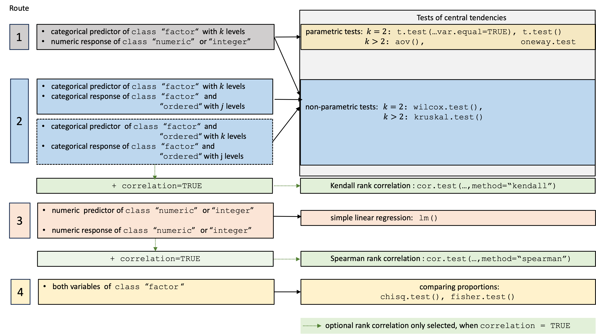

# visStatistics: The right test, visualised.

# Purpose

`visStatistics` is an R package for automated statistical test selection
and visualisation. It selects appropriate hypothesis tests for pairs of
variables (integer, numeric, or factor), runs the analysis, and produces
annotated, publication-ready plots.

The package was originally developed for researchers who could not
directly access sensitive data but needed to perform visualisations and
statistical analyses of selected groups via a web interface connected to
a protected database — a setting that required a fully automated
workflow. The same automation makes it useful in time-constrained
contexts such as statistical consulting, where it reduces effort spent
on test selection and leaves more room for interpretation. The package
covers most hypothesis tests taught in undergraduate statistics.

# Installation of latest stable version from CRAN

#### 1. Install the package

``` r

install.packages("visStatistics")
```

#### 2. Load the package

``` r

library(visStatistics)
```

# Installation of the development version from GitHub

#### 1.Install `devtools` from CRAN if not already installed:

``` r

install.packages("devtools")
```

#### 2. Load the `devtools` package:

``` r

library(devtools)
```

#### 3. Install the `visStatistics` package from GitHub:

``` r

pak::pak("shhschilling/visStatistics")
```

#### 4. Load the `visStatistics` package:

``` r

library(visStatistics)
```

#### 5. View help for the main function:

``` r

? visstat
```

#### 6. Study all the details in the packages’ vignette:

``` r

vignette("visStatistics")
```

# Getting Started

The function
[`visstat()`](https://shhschilling.github.io/visStatistics/reference/visstat.md)
accepts input in three ways:

``` r

# Standardised form:
visstat(x, y)

# Formula interface: 
visstat(y ~ x, data = df) 


# Backward-compatible form:
visstat(dataframe, "namey", "namex")
```

In the standardised form, `x` and `y` must be vectors of class
`"numeric"`, `"integer"`, or `"factor"`.

In the formula interface, the formula `y ~ x` specifies the response `y`
and predictor `x` variables, and `data` is a data frame containing these
variables.

In the backward-compatible form, `"namex"` and `"namey"` must be
character strings naming columns in a `data.frame` named `dataframe`.
These column must be of class `"numeric"`, `"integer"`, or `"factor"`.
This is equivalent to writing:

``` r

visstat(dataframe[["namex"]], dataframe[["namey"]])
```

To simplify the notation, throughout the remainder, data of class
`numeric` or `integer` are both referred to by their common `mode`
**`numeric`**, while data of class `factor` are referred to as
**`categorical`**.

The interpretation of `x` and `y` depends on their classes:

- If one is numeric and the other is a factor, the numeric must be
  passed as response `y` and the factor as predictor `x`. This supports
  tests for central tendencies.

- If both are numeric, a simple linear regression model is fitted with
  `y` as the response and `x` as the predictor.

- If both are factors (and not both ordered), a test of association is
  performed (Chi-squared or Fisher’s exact). The test is symmetric, but
  the plot layout depends on which variable is supplied as `x`.

- If both are factors and `y` is additionally of class `ordered`, a non
  parametric test is performed: a Wilcoxon test in the case of two
  factor levels in `x`, a Kruskal-Wallis-Test for more than two factor
  levels in `x`.

- If **both** `x` and `y` are of class `ordered`, the order of the
  levels carries information that Chi-squared / Fisher would discard.
  [`visstat()`](https://shhschilling.github.io/visStatistics/reference/visstat.md)
  instead tests for a monotone association via Kendall’s $`\tau_b`$
  (`cor.test(..., method = "kendall")`) and visualises the relationship
  with a jittered rank–rank scatter plus a mosaic plot.

# Decision logic

The choice of statistical tests depends on whether the data of the
selected columns are numeric or categorical, the number of levels in the
categorical variable, and the distribution of the data.  
For a detailed description of the underlying decision logic, please
refer to the package vignette:

``` r

vignette("visStatistics")
```

Below figure gives a graphical overview of the main tests implemented.



Overview of the implemented statistical tests based on the class of the
variables.

A graphical summary of the decision logic used for categorial predictors
and numerical responses resulting in tests of central tendencies is
given in below figure:


Comparing central tendencies: Decision tree used to select the
appropriate statistical test for a categorical predictor and numeric
response, based on the number of factor levels, normality, and
homoscedasticity.

# Examples

``` r

library(visStatistics)
```

## Numerical response and categorical predictor

When the response is numerical and the predictor is categorical, test of
central tendencies are selected.

### Welch two sample t-test

#### mtcars data set

``` r

 mtcars$am <- as.factor(mtcars$am)
 t_test_statistics <- visstat(mtcars$am, mtcars$mpg)
```


### Wilcoxon rank sum test

``` r

grades_gender <- data.frame(
  sex = factor(rep(c("girl", "boy"), times = c(21, 23))),
  grade = c(
    19.3, 18.1, 15.2, 18.3, 7.9, 6.2, 19.4, 20.3, 9.3, 11.3,
    18.2, 17.5, 10.2, 20.1, 13.3, 17.2, 15.1, 16.2, 17.0, 16.5, 5.1,
    15.3, 17.1, 14.8, 15.4, 14.4, 7.5, 15.5, 6.0, 17.4, 7.3, 14.3,
    13.5, 8.0, 19.5, 13.4, 17.9, 17.7, 16.4, 15.6, 17.3, 19.9, 4.4, 2.1
  )
)

wilcoxon_statistics <- visstat(grades_gender$sex, grades_gender$grade)
```


### Fisher’s one way ANOVA

``` r

fisher_one_way_npk <- visstat(npk$block,npk$yield)
```


### Kruskal-Wallis test

``` r

kruskal_iris=visstat(iris$Species, iris$Petal.Width)
```


## Ordered response and categorical predictor:

A response variable of classes `ordered` and `factor` is internally
transformed to a `numeric` response and Wilcoxon test is performed for a
predictor with two classes, otherwise a Kruskal-Wallis-Test.

### Wilcoxon with ordinal response

``` r

set.seed(123)

# Create predictor: Customer segment (2 groups)
segment <- factor(rep(c("Budget", "Premium"), each = 50))

# Create response: Likert scale ratings (1-5)
satisfaction_numeric <- c(
  sample(1:5, 50, replace = TRUE, prob = c(0.15, 0.25, 0.30, 0.20, 0.10)),  # Budget
  sample(1:5, 50, replace = TRUE, prob = c(0.05, 0.10, 0.20, 0.35, 0.30))   # Premium
)

# Create dataframe with ORDERED response
survey_data <- data.frame(
  segment = segment,
  satisfaction = ordered(satisfaction_numeric)  # Declare as ordered
)

# triggers warnings and use Wilcoxon test
result <- visstat(survey_data$segment,survey_data$satisfaction)
```


### Kruskal-Wallis test

``` r

set.seed(123)

# Create predictor: Service class (3 groups)
service_class <- factor(rep(c("Economy", "Business", "First"), each = 50))

# Create response: Likert scale ratings (1-5)
comfort_numeric <- c(
  sample(1:5, 50, replace = TRUE, prob = c(0.35, 0.30, 0.20, 0.10, 0.05)),  # Economy
  sample(1:5, 50, replace = TRUE, prob = c(0.10, 0.20, 0.35, 0.25, 0.10)),  # Business
  sample(1:5, 50, replace = TRUE, prob = c(0.05, 0.10, 0.20, 0.30, 0.35))   # First
)

# Create dataframe with ordered response
flight_data <- data.frame(
  service_class = service_class,
  comfort = ordered(comfort_numeric)  # Declare as ordered
)

# triggers warning and uses Kruskal-Wallis test
result <- visstat(flight_data$service_class, flight_data$comfort)
```


## Numerical response and numerical predictor: Linear Regression

``` r

vis_women <- visstat(women$height, women$weight,conf.level=0.99)
```


### Pearson’s Chi-squared test

Count data sets are often presented as multidimensional arrays, so -
called contingency tables, whereas
[`visstat()`](https://shhschilling.github.io/visStatistics/reference/visstat.md)
requires a `data.frame` with a column structure. Arrays can be
transformed to this column wise structure with the helper function
[`counts_to_cases()`](https://shhschilling.github.io/visStatistics/reference/counts_to_cases.md):

``` r

hair_eye_color_df <- counts_to_cases(as.data.frame(HairEyeColor))
visstat(hair_eye_color_df$Eye, hair_eye_color_df$Hair)
```


### Fisher’s exact test

``` r

hair_eye_color_male <- HairEyeColor[, , 1]
# Slice out a 2 by 2 contingency table
black_brown_hazel_green_male <- hair_eye_color_male[1:2, 3:4]
# Transform to data frame
black_brown_hazel_green_male <- counts_to_cases(as.data.frame(black_brown_hazel_green_male))
# Fisher test
fisher_stats <- visstat(black_brown_hazel_green_male$Eye,black_brown_hazel_green_male$Hair)
```


## Both variables ordered: Rank correlation

When both predictor and response are of class `ordered`,
[`visstat()`](https://shhschilling.github.io/visStatistics/reference/visstat.md)
tests for a monotone association via Kendall’s $`\tau_b`$ and produces a
jittered rank–rank scatter together with a mosaic plot.

``` r

set.seed(1)
n <- 120
xs <- sample(1:5, n, replace = TRUE)
ys <- pmin(5, pmax(1, xs + sample(-1:1, n, replace = TRUE)))
likert_levels <- c("strongly disagree", "disagree", "neutral",
                   "agree", "strongly agree")
attitude  <- ordered(likert_levels[xs], levels = likert_levels)
intention <- ordered(likert_levels[ys], levels = likert_levels)
kendall_result <- visstat(intention, attitude)
```


# Saving the graphical output

All generated graphics can be saved in any file format supported by
`Cairo()`, including “png”, “jpeg”, “pdf”, “svg”, “ps”, and “tiff” in
the user specified `plotDirectory`.

If the optional argument `plotName` is not given, the naming of the
output follows the pattern `"testname_namey_namex."`, where `"testname"`
specifies the selected test or visualisation and `"namey"` and `"namex"`
are character strings naming the selected data vectors `y` and `x`,
respectively. The suffix corresponding to the chosen `graphicsoutput`
(e.g., `"pdf"`, `"png"`) is then concatenated to form the complete
output file name.

In the following example, we store the graphics in `png` format in the
`plotDirectory` [`tempdir()`](https://rdrr.io/r/base/tempfile.html) with
the default naming convention:

``` r

#Graphical output written to plotDirectory: In this example 
# a bar chart to visualise the Chi-squared test and mosaic plot showing
# Pearson's residuals named 
#chi_squared_or_fisher_Hair_Eye.png and mosaic_complete_Hair_Eye.png resp. 
save_fisher <- visstat(black_brown_hazel_green_male, "Hair", "Eye",
        graphicsoutput = "png", plotDirectory = tempdir())
```

The full file path of the generated graphics are stored as the attribute
`"plot_paths"` on the returned object of class `"visstat"`.

``` r

paths <- attr(save_fisher, "plot_paths")
print(paths)
#> [1] "/var/folders/5c/n85wqnh95l50qbp3s9l0rp_w0000gn/T//RtmptoHBnl/chi_squared_or_fisher_Hair_Eye.png"
```

Remove the graphical output from `plotDirectory`:

``` r

file.remove(paths)
#> [1] TRUE
```
