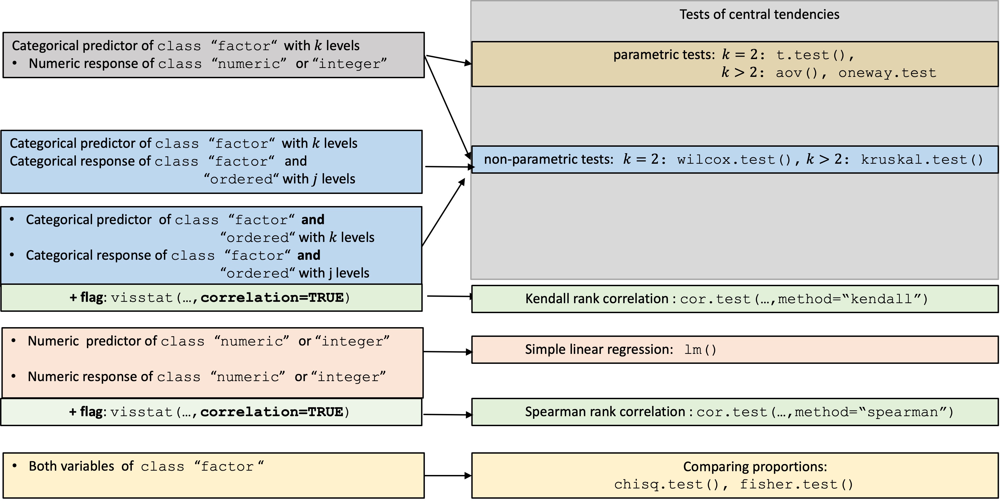
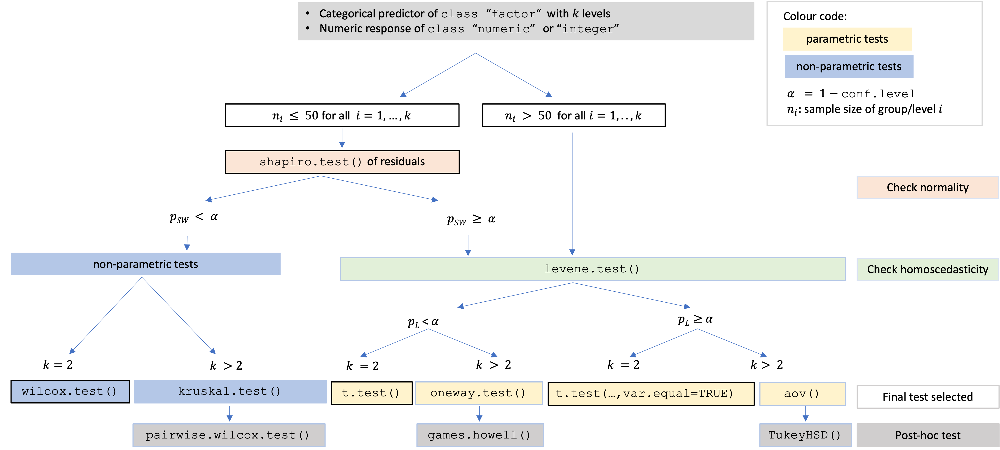

```{r setup, include=FALSE}
library(visStatistics)
knitr::opts_knit$set(root.dir = normalizePath(dirname(knitr::current_input(dir = TRUE))))
knitr::opts_chunk$set(
  fig.width  = 7,
  fig.height = 4.5,
  out.width  = "100%",
  echo = TRUE
)
example_alpha <- 0.05

make_visstat_panel <- function(result, file, labels = c("A", "B")) {
  if (!requireNamespace("png", quietly = TRUE)) {
    stop("The png package is required to build panel figures.")
  }
  paths <- attr(result, "plot_paths")
  if (length(paths) < 2) {
    stop("Expected at least two saved plot files.")
  }
  img_a <- png::readPNG(paths[1])
  img_b <- png::readPNG(paths[2])
  png(file, width = 1800, height = 700, res = 120)
  on.exit(dev.off())
  par(mar = c(0, 0, 0, 0))
  plot.new()
  plot.window(xlim = c(0, 1), ylim = c(0, 1), xaxs = "i", yaxs = "i")
  rasterImage(as.raster(img_a), 0, 0, 0.495, 0.94)
  rasterImage(as.raster(img_b), 0.505, 0, 1, 0.94)
  text(0.2475, 0.975, labels[1], font = 2, cex = 1.8)
  text(0.7525, 0.975, labels[2], font = 2, cex = 1.8)
  invisible(file)
}
```

# Introduction

In the frequentist tradition, most routine data analyses reduce to a comparatively small set of
inferential frameworks, including group comparisons, regression models and contingency-table
analyses [@Hayat:2017; @Sato:2017; @Brodeur:2020]; their correct use depends on assumptions that are often checked informally or not at all. `visStatistics` targets this gap by making routine frequentist test selection explicit, assumption-aware, visual, and reproducible.
Rather than requiring users to choose the test function first,
`visstat()` starts from two variables and routes common two-variable
settings through a fixed decision workflow. It selects a test from the
variable classes, distributional assumptions, sample size, and expected
cell counts; displays the diagnostics that led to the selected route;
and returns an R object whose `print()` and `summary()` methods expose
the complete test results, including the reported effect size. The
scripted workflow is well suited for browser-based applications where
sensitive data (such as highly confidential medical records) are stored
securely on a server and cannot be directly accessed by users. This
approach was already successfully applied to develop a medical scoring
tool [@Bijlenga:2017].

For group comparisons, packages with related scope include `compareGroups`
[@Subirana:2014], `boxTest` [@Sau:2025], `autotestR` [@Garcia:2026],
and `automatedtests` [@Zeevat:2025]. `compareGroups` is primarily
designed for bivariate descriptive tables and reports, not diagnostic
plots and test visualisations. `boxTest` covers only the two-group
numeric-response case. `autotestR` provides automated recommendations
for t-tests, ANOVA, correlation, and contingency-table analyses.
`automatedtests` provides the broadest routing among these packages,
including one-sample, paired, repeated-measures, regression, correlation,
and contingency-table cases.

For mean-based tests in the general linear-model framework, the normality
assumption concerns the model errors, not the marginal response
distribution. None of these packages bases routing on pooled standardised
residuals from the common linear model: `autotestR` and `boxTest` test
the response separately within groups, whereas `automatedtests` and
`compareGroups` test the ungrouped numeric response.

Among the reviewed automated test-selection packages, `visStatistics` is
thus the only one that bases the central-tendency route on explicit
residual diagnostics from the common linear model rather than on marginal
or groupwise normality checks. The package is deliberately limited to
common two-variable settings in which the route can be visualised and
audited: pretesting where applied, residual-based diagnostics for the
linear-model branch, the selected test, full test statistics, effect
size, result plots, and post-hoc comparisons where required.

# Package overview

\CRANpkg{visStatistics} is available on CRAN as the latest stable
release. This article refers to the latest development state in the
GitHub repository (https://github.com/shhschilling/visStatistics),
which may include minor changes between CRAN submissions. Its main
function `visstat()` can be called in two equivalent forms:

``` r
# Recommended form:
visstat(x, y)

# Formula interface:
visstat(y ~ x, data = dataframe)
```

where `x` and `y` are vectors of class `"numeric"`, `"integer"`, or
`"factor"`. 
The visstat parameter `conf.level` defaults to 0.95, equivalent to a default signifcance level of $\alpha=1-$`conf.level.

The function returns an object of class `"visstat"` with
`print()`, `summary()`, and `plot()` methods. The returned object also
contains an `effect_size` field with the estimate and the effect-size
method. These estimates are calculated by the exported `effect_size()`
function; for detailed documentation, see the package vignette.
From this single entry point, the package automatically selects among
the implemented tests: `t.test()`, `wilcox.test()`, `aov()`,
`oneway.test()`, `kruskal.test()`, `chisq.test()`, `fisher.test()`,
`lm()`, or `cor.test()`.

# Decision logic
The decision logic of `visstat()` summarised in Figure \@ref(fig:overview) is driven by the class of its input vectors:


```{r overview, echo=FALSE, fig.cap="Overview of all implemented tests selected based on input class.", fig.alt="Flowchart showing all implemented statistical tests organised by the class of the input vectors."}

```
Numeric responses with categorical predictors enter the central-tendency
branch. Ordered categorical responses with categorical predictors follow
the non-parametric Wilcoxon or Kruskal--Wallis route; when both variables
are ordered and `correlation = TRUE`, Kendall rank correlation is used.
Two numeric variables enter simple linear regression unless
`correlation = TRUE`, which switches to Spearman rank correlation. Two
unordered factors enter the proportion-comparison branch.
Technical details for the package-implemented functions `levene.test()`,
`bp.test()`, and `games.howell()` are provided in the package vignette
(`vignette("visStatistics", package = "visStatistics")`).
Unless stated otherwise, R function names refer to functions from the `stats`
package distributed with R [@R:2026].


##  Test selection based on the assumptions of the general linear model framework

Student's t-test, Fisher's ANOVA, and simple linear regression all belong to the general linear model framework ([see Appendix A](#glm)) and
thus share a common set of assumptions: the expected value of the
response is a linear function of the predictors, the error terms are
independent and normally distributed with expectation 0, and the error
variance is constant at $\sigma^2$. Therefore the test selection for
[tests of central tendencies](#numeric-categoric) is steered by checking
that the internally studentised residuals
$r_i^* = e_i / (s\sqrt{1-h_{ii}})$, where $e_i$ are the raw residuals,
$s^2$ is the residual mean square, and $h_{ii}$ is the leverage of
observation $i$ [@Cook:1982], are normally distributed and homoscedastic.


## Numeric response and categorical predictor: comparing central tendencies {#numeric-categoric}

Figure \@ref(fig:decision-tree) expands the central-tendency branch.

```{r decision-tree, echo=FALSE, fig.cap="Decision tree for tests on central tendencies. If all groups contain more than 50 observations, the formal residual normality test is bypassed and variance homogeneity is assessed directly. Otherwise, Shapiro--Wilk on standardised residuals determines whether the route remains mean-based or switches to rank-based tests; the Levene test then selects equal-variance or Welch-type procedures.", fig.alt="Decision tree selecting among Welch t-test, Student t-test, Wilcoxon, Fisher ANOVA, Welch ANOVA, and Kruskal-Wallis tests based on the all-groups n > 50 rule, the Shapiro-Wilk test on standardised residuals, and the Levene test for variance homogeneity."}

```


The first split checks group size. When all groups contain more than 50
observations, the normality of the sampling distribution of the group
means can be assumed by the central limit theorem [@Lumley:2002;
@Rasch:2011], and the residual normality test is bypassed to avoid
rejecting negligible deviations in large samples [@Ghasemi:2012;
@Fagerland:2012; @Shatz:2024]. Otherwise, a linear model `lm(y ~ x)`
(see [Appendix A](#glm)) is fitted for the routing decision, and
the Shapiro--Wilk (SW) normality test is applied to internally
studentised residuals from `rstandard()`.

If normality is rejected ($p_\text{SW} \le \alpha$), non-parametric
tests are selected: `wilcox.test()` for two groups, or
`kruskal.test()` followed by Holm-adjusted
`pairwise.wilcox.test()` for more than two groups.

If normality is not rejected, variance homogeneity is assessed with
Levene's test using the Brown--Forsythe median-centred modification
(`levene.test()`; [@Brown:1974]). For brevity,
we refer to this Brown--Forsythe Levene-type procedure as the Levene
test below. For homoscedastic data,
`t.test(var.equal = TRUE)` is applied for two groups, or Fisher's
`aov()` with `TukeyHSD()` for more than two groups. For
heteroscedastic data, Welch's `t.test()` is applied for two groups, or
Welch's `oneway.test()` with `games.howell()` [@Games:1976] for
more than two groups.


## Both variables numeric: regression or Spearman rank correlation

When both predictor and response are numerical, `visstat()` fits and
displays a simple linear regression. The returned object contains the
regression statistics, residual-normality tests, pointwise confidence
and prediction bands, and the effect size $R^2$.

When `correlation = TRUE` is set explicitly,
Spearman's $\rho$ is computed via `cor.test(..., method = "spearman")`.
Because the choice between modelling a directional relationship and
measuring a monotone association cannot be automated from data types
alone, Spearman correlation is never triggered automatically.
Spearman's $\rho$ is Pearson's correlation applied to ranks and provides
the explicit rank-based alternative when a monotone association is the target.

## Graphical output in the linear-model branches {.unnumbered}

For the central-tendency branch and the simple-regression branch,
`visstat()` first displays the linear-model assumption diagnostics
generated by `vis_lm_assumptions()`. The function fits `lm(y ~ x)` and
plots internally studentised residuals from `rstandard()`.

The diagnostic panel contains a histogram with normal-density overlay,
standardised residuals versus fitted values, a normal Q--Q plot, and a
fourth plot depending on the branch: a scale-location plot for grouped
central-tendency analyses and a standardised residuals-versus-leverage
plot for simple regression. The panel title reports the corresponding
normality and variance checks with their R function names:
`shapiro.test()`, `ad.test()`, `levene.test()`, `bartlett.test()`, or
`bp.test()`.

Note that only Shapiro--Wilk and the Brown--Forsythe Levene-type test
enter the central-tendency routing decision. In simple regression, the
displayed assumption checks do not trigger an automatic model
replacement.

The second plot shows the selected analysis. For central-tendency tests,
this is a box plot annotated with the selected test result and, where
applicable, post-hoc significant-letter labels. For simple regression,
it is a scatter plot with the fitted line and pointwise confidence and
prediction bands.

ANOVA, Welch ANOVA, and Kruskal--Wallis are omnibus tests: a significant
result tells us that *some* group differs, but not which. To identify
the differing pairs, `visstat()` tests all pairwise comparisons among
the factor levels. The matching post-hoc procedures are `TukeyHSD()`
after `aov()`, `games.howell()` after `oneway.test()`, and
`pairwise.wilcox.test(p.adjust.method = "holm")` after
`kruskal.test()`. Pairs whose adjusted post-hoc $p$-value falls below
$\alpha$ are marked with different green significant-letter labels below
the box plots; pairs sharing a letter are not significantly different.

## Both variables categorical: comparing proportions

Observed frequencies are arranged in a contingency table, where rows
index the levels of the response and columns index the levels of the
predictor. `visstat()` tests independence using Pearson's $\chi^2$ test
(`chisq.test()`) or Fisher's exact test (`fisher.test()`), depending on
expected cell counts following Cochran's rule [@Cochran:1954]: the
$\chi^2$ approximation is used if no expected cell count is less than 1
and no more than 20% of cells have expected counts below 5. Yates'
continuity correction is applied by default to $2 \times
2$ tables. The graphical output depends on the selected test. General
$R \times C$ Pearson $\chi^2$ tests show a grouped column plot of row
percentages with the $p$-value in the title, followed by a mosaic plot
from \CRANpkg{vcd} [@Meyer:2006; @Meyer:2024] with tiles coloured by
Pearson residuals. Yates-corrected $2 \times 2$ $\chi^2$ tests show the
grouped column plot only, because the corrected statistic is not
decomposed into cell-level residuals. Fisher's exact test shows
absolute counts with count labels above each bar and the $p$-value in the
title.

## Ordered factors

When the response is an ordered factor, `visstat()` converts it to
integer level codes and follows the non-parametric path. When both
variables are ordered and `correlation = TRUE`, Kendall's $\tau_b$
is computed instead, as it corrects for
ties explicitly --- unavoidable with few ordinal levels [@Xu:2013].

# Examples

The following examples illustrate selected branches of the decision tree, whereas the package
vignette (`vignette("visStatistics", package = "visStatistics")`)
shows examples for all implemented branchings. All examples use datasets distributed with R.


## Numeric response and categorical predictor

### Fisher's one-way ANOVA with Tukey HSD post-hoc comparisons

The `PlantGrowth` dataset records yields (as measured by dried weight of plants) for a control
group and two treatment groups. With control and treatment groups as predictor and
plant weight as response, the diagnostics and selected analysis are shown
in Figure \@ref(fig:anova-example), panels A and B.
Shapiro--Wilk does not reject normality of the
pooled residuals and `levene.test()` does not reject homoscedasticity,
so `visstat()` applies Fisher's one-way ANOVA followed by Tukey HSD
post-hoc comparisons. The omnibus F-test is significant at
$\alpha = `r example_alpha`$, and the Tukey HSD post-hoc comparison finds no significant difference between the control group and either treatment, but the difference between `trt1` and `trt2` is significant.

```{r anova-example, echo=FALSE, fig.cap=paste0("Fisher's one-way ANOVA applied to the \\texttt{PlantGrowth} dataset (\\texttt{group} vs.\\ \\texttt{weight}). A: Assumption diagnostics. B: Box plots of plant weight by treatment group; Tukey HSD post-hoc comparisons are shown as significant-letter labels ($\\alpha = ", example_alpha, "$)."), out.width="100%"}
anova_plantgrowth_panel <- visstat(
  PlantGrowth$group,
  PlantGrowth$weight,
  graphicsoutput = "png",
  plotName = "anova_example",
  plotDirectory = tempdir()
)
anova_panel_file <- file.path(tempdir(), "anova_example_panel.png")
make_visstat_panel(anova_plantgrowth_panel, anova_panel_file)
knitr::include_graphics(anova_panel_file)
```

### Welch's heteroscedastic one-way ANOVA with Games--Howell post-hoc comparisons

In the `iris` dataset, using `Species` as predictor and `Sepal.Length`
as response, Shapiro--Wilk does not reject normality of the standardised
residuals (Figure \@ref(fig:welch-anova-example), panel A), whereas the Levene test rejects
homoscedasticity. `visstat()` therefore selects Welch's heteroscedastic
one-way ANOVA (`oneway.test()`) and applies Games--Howell post-hoc
comparisons (Figure \@ref(fig:welch-anova-example), panel B).

```{r welch-anova-example, echo=FALSE, fig.cap=paste0("Welch's heteroscedastic one-way ANOVA applied to the \\texttt{iris} dataset (\\texttt{Species} vs.\\ \\texttt{Sepal.Length}). A: Assumption diagnostics. B: Box plots with Games--Howell post-hoc comparisons shown as significant-letter labels ($\\alpha = ", example_alpha, "$)."), out.width="100%"}
welch_anova_iris_panel <- visstat(
  iris$Species,
  iris$Sepal.Length,
  graphicsoutput = "png",
  plotName = "welch_anova_example",
  plotDirectory = tempdir()
)
welch_anova_panel_file <- file.path(tempdir(), "welch_anova_example_panel.png")
make_visstat_panel(welch_anova_iris_panel, welch_anova_panel_file)
knitr::include_graphics(welch_anova_panel_file)
```

### Kruskal-Wallis rank sum test with pairwise Wilcoxon post-hoc comparisons

For the same dataset, `Petal.Width` by `Species` follows a different
route. The standardised residuals show clear departures from normality,
and both normality tests return very small $p$-values
(Figure \@ref(fig:kruskal-example), panel A). Since
Shapiro--Wilk falls below $\alpha$, `visstat()` switches to
`kruskal.test()` followed by Holm-adjusted `pairwise.wilcox.test()`. All
three species differ significantly in petal width, as indicated by
distinct significant-letter labels (Figure \@ref(fig:kruskal-example),
panel B).

```{r kruskal-example, echo=FALSE, fig.cap=paste0("Kruskal-Wallis test applied to the \\texttt{iris} dataset (\\texttt{Species} vs.\\ \\texttt{Petal.Width}). A: Assumption diagnostics with Shapiro--Wilk rejected. B: Box plots with Holm-adjusted pairwise Wilcoxon post-hoc comparisons shown as significant-letter labels ($\\alpha = ", example_alpha, "$)."), out.width="100%"}
kruskal_iris_panel <- visstat(
  iris$Species,
  iris$Petal.Width,
  graphicsoutput = "png",
  plotName = "kruskal_example",
  plotDirectory = tempdir()
)
kruskal_panel_file <- file.path(tempdir(), "kruskal_example_panel.png")
make_visstat_panel(kruskal_iris_panel, kruskal_panel_file)
knitr::include_graphics(kruskal_panel_file)
```

## Both variables numeric

### Simple linear regression with assumption warnings

The `airquality` ozone example shows the limits of the automated
approach when the default linear model is not an adequate final model.
`visstat()` identifies assumption violations and points to analyses
outside the automated decision tree. A default
`visstat()` call for ozone concentration (`Ozone`) as a function of wind
speed (`Wind`) fits the simple linear model
(Figure \@ref(fig:ozone-lm-triage), panels A and B).

```{r ozone-lm-triage, echo=FALSE, fig.cap="Default simple linear regression for \\texttt{Ozone} by \\texttt{Wind} in the \\texttt{airquality} dataset. A: Assumption diagnostics flag non-normal standardised residuals and heteroscedasticity. B: Fitted regression line with confidence and prediction bands.", out.width="100%"}
ozone_lm_panel <- visstat(
  airquality$Wind,
  airquality$Ozone,
  graphicsoutput = "png",
  plotName = "ozone_lm_triage",
  plotDirectory = tempdir()
)
ozone_lm_panel_file <- file.path(tempdir(), "ozone_lm_triage_panel.png")
make_visstat_panel(ozone_lm_panel, ozone_lm_panel_file)
knitr::include_graphics(ozone_lm_panel_file)
```

The diagnostic output in Figure \@ref(fig:ozone-lm-triage), panel A,
flags non-normal standardised residuals and
heteroscedasticity. The printed
recommendation suggests two possible next steps: first, rerunning the
analysis with `correlation = TRUE` for an assumption-free, non-causal
Spearman analysis within `visstat()`; second, exploring alternatives
outside `visstat()`, such as data transformations, generalised linear
models, or robust regression.

### Spearman rank correlation

Correlation analysis is never triggered automatically; it requires the
explicit flag `correlation = TRUE`, because the choice between modelling
a directional relationship and measuring a monotone association cannot
be derived from the variable classes alone. For the ozone example,
staying within `visstat()` gives the Spearman analysis in
Figure \@ref(fig:spearman-example).

```{r spearman-example, fig.cap="Spearman rank correlation of \\texttt{Wind} and \\texttt{Ozone} from the \\texttt{airquality} dataset (\\texttt{correlation = TRUE}). Scatter plot on the original scale with a rank-based trend line, annotated with $\\rho$ and the $p$-value.", out.width="48%", fig.height=4.5, fig.show="hold"}
spearman_air <- visstat(airquality$Wind, airquality$Ozone, correlation = TRUE)
```

### Model exploration outside `visstat()`

For the `airquality` data, a Gamma generalised linear modelwith log link is one plausible
follow-up, because `Ozone` vs. `Wind` is positive, continuous, and shows
variance increasing with the mean.
This step is deliberately outside `visstat()`: the package flags the
problem and offers the rank-correlation route, but it does not choose
among alternative model families.

## Both variables categorical

### Pearson's $\chi^2$ test

With `Eye` and `Hair` from `HairEyeColor`, all expected cell counts
exceed the Cochran thresholds [@Cochran:1954], so the $\chi^2$
approximation is used. The contingency table is converted with
`counts_to_cases()` before calling `visstat()`. For this $4 \times 4$
table, `visstat()` returns
both a grouped bar chart of row percentages (Figure
\@ref(fig:chisq-example), panel A) and a mosaic plot with tiles giving
the count per cell coloured by Pearson residuals (Figure
\@ref(fig:chisq-example), panel B). The mosaic plot shows which cells drive
the association: blue tiles indicate observed counts above expectation
and red tiles indicate observed counts below expectation.

```{r chisq-example, echo=FALSE, fig.cap="Pearson's $\\chi^2$ test applied to the \\texttt{HairEyeColor} dataset. A: Grouped bar chart of eye colour by hair colour. B: Mosaic plot with tiles coloured by Pearson residuals (blue: over-represented, red: under-represented).", out.width="100%"}
hair_eye_df <- counts_to_cases(as.data.frame(HairEyeColor))
chisq_panel <- visstat(
  hair_eye_df$Eye,
  hair_eye_df$Hair,
  graphicsoutput = "png",
  plotName = "chisq_example",
  plotDirectory = tempdir()
)
chisq_panel_file <- file.path(tempdir(), "chisq_example_panel.png")
make_visstat_panel(chisq_panel, chisq_panel_file)
knitr::include_graphics(chisq_panel_file)
```


# Discussion {#discussion}

The design of `visStatistics` prioritises transparent, reproducible
routing for common two-variable analyses [@Strasak:2007; @Sato:2017; @Chicco:2025]
over broad model coverage.

This scope keeps the decision tree inspectable and the graphical output
consistent, but it also leaves several modelling choices (e.g. paired tests, interaction terms, multiple linear regression) outside the
automated workflow. While one of R's greatest
strengths is the sheer volume of statistical methods available,
incorporating a wider array of methods would require additional
preliminary assumption checks, which in turn would exacerbate the risk of
overall Type I error inflation. Furthermore, expanding the pipeline
would result in a highly complex decision tree, rendering the underlying
statistical logic increasingly opaque to the user.

`visStatistics` instead focuses on the *vis*ualisation of the chosen test and,
where applicable, its post-hoc and assumption tests.

# Limitations of p-value driven decison logic 

For tests of central tendency, p-values from assumption tests are used as routing criteria, subject to the large sample-size safeguards for normality testing described below.


However, no single assumption test maintains optimal
Type I error rates and statistical power across all distributions
[@Olejnik:1987], and p-values obtained from these tests may be
unreliable if their assumptions are violated.

In large samples, even minor, random deviations from the null hypothesis
can result in statistically significant p-values, leading to type I
errors. Conversely, in small samples, substantial violations of the
assumption may not reach statistical significance, resulting in type II
errors [@Kozak:2018].

Moreover, assumption tests provide no information on the nature of
deviations from the expected distribution [@Shatz:2024]. Thus the
assessment of normality or homoscedasticity should never rely solely on
p-values but should be complemented by visual inspection of the
diagnostic plots generated by `visstat()`.

This limitation extends to combinations of assumption tests. Combining
tests for normality and homoscedasticity using simple majority voting
inflates the overall Type I error rate. Therefore, automated test
selection based solely on p-values cannot replace the visual inspection
of sample distributions provided by `visstat()`. Based on the provided
diagnostic plots, it may be necessary to override the automated choice
of test in individual cases.

`visstat()` also reports an `effect_size` field for each selected test.
This estimate should be interpreted alongside the \(p\)-value, but it
does not replace subject-matter judgment about practical relevance
[@Shatz:2024].

The limitation of p-value-based routing is particularly relevant for
normality testing.
Normality tests behave poorly at both ends of the sample-size range:
with small samples they fail to detect non-normality, and with large
samples they flag negligible departures from normality as significant
[@Ghasemi:2012; @Fagerland:2012; @Franc:2025].

This raises the practical question of what should count as a "larger"
sample in the decision tree. The answer depends on the shape of the
underlying distribution, especially skewness and tail weight
[@Lumley:2002]. Simulation studies suggest that moderately skewed
distributions require roughly 40--50 observations for adequate
convergence of the sampling distribution of the mean [@Fagerland:2012].


Based on this range, for  sample sizes above 50, residual normality p-values are still
reported, but no longer determine automated routing, to avoid inflated
type I errors caused by the excessive sensitivity of normality tests in
larger samples.


For
smaller samples, a Shapiro--Wilk test on the is used to route between mean-based and
rank-based methods, as simulation studies suggest that it has the
highest power among normality tests in small to moderate ($n = 10$ to
100) sample sizes [@Razali:2011].

In the regression branch, violated assumptions are flagged in the output.
When this occurs, the package offers Spearman rank correlation
(`correlation = TRUE`) as a non-causal alternative to linear regression.
Further alternative methods such as data transformation,
generalised linear models or robust regression are not implemented:
each requires user judgment -- about the transformation family, the link
function, or the estimator -- that cannot be automated without
substantially expanding the decision tree and increasing the risk of
Type I error inflation.

Bootstrapping represents another possible alternative to assumption-guided
routing. Bootstrapping, as implemented for example in the R package `boot`
[@boot:2025; @Davison:1997], can provide confidence intervals for a wide range of
statistics. However, bootstrapping is computationally intensive, often
requiring thousands of resamples, and may perform poorly with very small
sample sizes. The computational intensity of bootstrap runs counter to
the purpose of the `visStatistics` package, which is designed to offer a
rapid overview of the data, laying the groundwork for deeper analysis in
subsequent steps.

At the graphical level, this design is also kept deliberately
low-dependency. The package uses base R graphics and avoids a `ggplot2`
[@Wickham:2016] dependency, keeping the transitive dependency footprint
minimal. For more polished, annotated plots of chosen statistical tests,
we refer to packages such as `ggstatsplot` [@Patil:2021] or `ggpubr`
[@Kassambara:2026].

Taken together, these scope decisions define `visStatistics` as a rapid,
inspectable first-line workflow for routine two-variable inference rather
than a replacement for model-specific statistical analysis.

# Conclusion

`visStatistics` is useful where test selection should be reproducible,
visible, and easy to audit. Its value is not that it removes the user's statistical
judgement, but that it exposes the assumptions, routing decisions, effect
sizes, and plots that should inform that judgement. The package therefore
serves as a first-line workflow for routine two-variable analyses, while
leaving model-specific extensions to subsequent analysis.

# Appendix A: The general linear model {#glm .unnumbered}

The general linear model provides a unified framework underlying Student's t-test, Fisher's ANOVA, and simple linear regression [@Thompson:2015].

Let $N$ denote the number of observations and $k-1$ the number of predictors.
The general linear model for observation $i,\;i = 1, \ldots, N$ is:

$$Y_i = \beta_0 + \beta_1 x_{i1} + \cdots + \beta_{k-1} x_{i,k-1} + \varepsilon_i, \quad \varepsilon_i \sim \mathcal{N}(0, \sigma^2)$$

where $Y_i$ is the response for observation $i$, $x_{ij}$ is the value of predictor $j$ for observation $i$, $\beta_0, \beta_1, \ldots, \beta_{k-1}$ are the $k$ parameters. In the general linear model the error terms  $\varepsilon_i$ are independent and normally distributed  with expectation value 0 and constant variance $\sigma^2$.

**Student's t-test** uses one binary indicator variable $x_{i1}$;
testing $H_0: \beta_1 = 0$ is equivalent to testing
$H_0: \mu_1 = \mu_2$.

**Fisher's ANOVA** uses $k-1$ indicator variables for $k$ groups;
testing $H_0: \beta_1 = \cdots = \beta_{k-1} = 0$ is equivalent to
testing equality of all group means.

<!-- In the two-sample case, the squared test statistic of Student's t-test -->
<!-- equals the Fisher ANOVA test statistic, $t^2 = F$, -->
<!-- resulting in identical -->
<!-- $p$-values for `t.test(var.equal = TRUE)` and `aov()`. -->

**Simple linear regression** uses one continuous predictor; 
$H_0: \beta_1 = 0$ examines whether a linear relationship exists.


