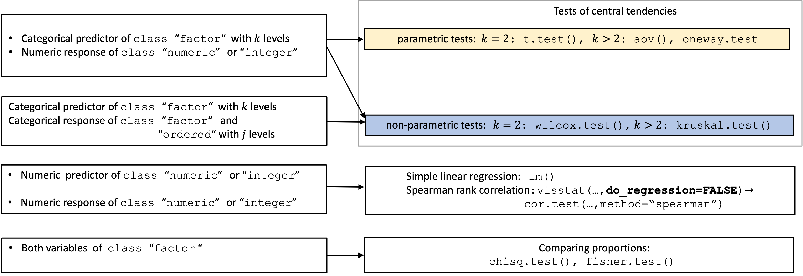

```{r setup, include=FALSE}
library(visStatistics)
knitr::opts_knit$set(root.dir = normalizePath(dirname(knitr::current_input(dir = TRUE))))
knitr::opts_chunk$set(
  fig.width  = 7,
  fig.height = 4.5,
  out.width  = "100%",
  echo = TRUE
)
example_alpha <- 0.05
```

```{=html}
<style>
body {
  max-width: 1200px;
}

div.figure img[width="48%"] {
  box-sizing: border-box;
  margin-left: 0;
  margin-right: 0;
}

p.caption,
figcaption {
  text-align: left;
  font-size: 0.9em;
  font-style: italic;
  line-height: 1.35;
}

table a {
  color: #0645ad;
  text-decoration: underline;
  text-underline-offset: 2px;
}
</style>
```

# Abstract

`visStatistics` provides a workflow for routine two-variable frequentist inference in R.
Given two vectors, `visstat()` first dispatches by variable classes, factor levels, sample sizes, expected cell counts, and explicit user options.

Its main assumption-driven branch concerns tests of central tendency for a numeric response grouped by a factor.
There, sample size and residual diagnostics from a fitted linear model choose between rank-based and mean-based tests and, within the latter, between equal-variance and Welch-type variants.

The output is deliberately visual: diagnostic plots are shown together with assumption-test p-values, the selected test, effect size, and post-hoc results where applicable.
This shifts attention from ad-hoc test selection to visual diagnostic assessment and statistical interpretation.

The automated workflow of `visStatistics` is particularly suited for server-side R applications, where users select variables through a web interface and receive a complete visual statistical analysis.
It also supports time-constrained work such as statistical consulting, where less time spent on test selection leaves more room for interpretation.

 


# Introduction

In the frequentist tradition, most routine data analyses reduce to a comparatively small set of inferential frameworks, including group comparisons, regression models and contingency-table analyses [@Fritz:2012, @Hayat:2017; @Sato:2017; @Brodeur:2020]; their correct use depends on assumptions that are often checked informally or not at all.
`visStatistics` targets this gap by making routine frequentist test selection explicit, assumption-aware, visual, and reproducible.
Rather than requiring users to choose the test function first, `visstat()` starts from two variables and routes common two-variable settings through a fixed decision workflow.
It selects a test from the variable classes, distributional assumptions, sample size, and expected cell counts; displays the diagnostics that led to the selected route; and returns an R object whose `print()` and `summary()` methods expose the complete test results, including the reported effect size.
The scripted workflow is well suited for browser-based applications where sensitive data (such as highly confidential medical records) are stored securely on a server and cannot be directly accessed by users.
This approach was already successfully applied to develop a medical scoring tool [@Bijlenga:2017].

For group comparisons, packages with related scope include `compareGroups` [@Subirana:2014], `boxTest` [@Sau:2025], `autotestR` [@Garcia:2026], and `automatedtests` [@Zeevat:2025].
`compareGroups` is primarily designed for bivariate descriptive tables and reports.
`boxTest` covers only the two-group numeric-response case.
`autotestR` provides automated recommendations for t-tests, ANOVA, correlation, and contingency-table analyses.
`automatedtests` provides the broadest routing among these packages, including one-sample, paired, repeated-measures, regression, correlation, and contingency-table cases.

For tests within the  general linear-model framework
like Student's t-test or  Fisher's ANOVA and linear regression,
the normality assumption concerns the model residual errors (each observation minus its predicted value), not the raw data; the belief that the raw data must be normal is a widespread myth [@Kery:2003].
Yet none of these packages checks normality on the residuals of the fitted linear model.
Instead,  `autotestR` and `boxTest` test the response separately within groups, whereas `automatedtests` and `compareGroups` test the response variable as a whole, ignoring the grouping.

Among the reviewed automated test-selection packages, `visStatistics` is thus the only one that bases the central-tendency route on explicit residual diagnostics from the common linear model rather than on marginal or groupwise normality checks.
The package is deliberately limited to common two-variable settings in which the route can be visualised and audited: pretesting where applied, residual-based diagnostics for the linear-model branch, the selected test, full test statistics, effect size, result plots, and post-hoc comparisons where required.


# Purpose of the vignette

The purpose  of this vignette is two-fold: On the one hand it explains  the
decision logic of `visstat()` (Section \@ref(sec:decision)) and illustrates it
on examples for each branch of the decision logic (Section \@ref(sec:examples)).
On the other side it serves as a text-book like reference of all implemented
tests, correlations and effect-sizes (Appendices \@ref(sec:tests)--\@ref(sec:effect-size)),
so that the user easily understands the output without having to consult the
code or  literature.

# Package overview

`visStatistics` [@Schilling:2026] is available on [CRAN](https://CRAN.R-project.org/package=visStatistics) as the latest stable release.
This article refers to the latest development state in the [GitHub repository](https://github.com/shhschilling/visStatistics), which may include minor changes between CRAN submissions.

Given two input vectors `x` and `y` of class `"numeric"`, `"integer"`, or `"factor"`, its main function `visstat()` can be called in two equivalent forms:

``` r
# Recommended form:
visstat(x, y)

# Formula interface:
visstat(y ~ x, data = dataframe)
```

An exemplary function call is

```{r npk, fig.show='hide', results='hide'}
#Standardised form
visstat(npk$block,npk$yield)
```

From this single entry point, the package automatically selects among the implemented hypothesis tests,

`t.test()`, `wilcox.test()`, `aov()`, `oneway.test()`, `kruskal.test()`, `chisq.test()`, `fisher.test()`, `lm()`.

The underlying selection algorithm is detailed in Section \@ref(sec:decision).
The function returns an object of class `"visstat"` with `print()`, `summary()`, and `plot()` methods described in Section \@ref(sec:visstat-methods).

Among the returned components, `visstat()` reports the p-value of the selected test and an `effect_size` field (Section \@ref(sec:p-values-effect-sizes)).

Unless stated otherwise, R function names for selected tests refer to functions from the `stats` package distributed with R [@R:2026].

To reduce dependencies on other packages, `visStatistics` implements `levene.test()` for the variance gate in grouped mean-based tests (Eq. \@ref(eq:levene-f)), `bp.test()` for regression diagnostics (Eq. \@ref(eq:breusch-pagan-bp)), and `games.howell()` for Welch-ANOVA post-hoc comparisons (Eq. \@ref(eq:games-howell-t)).

Definitions of all implemented test statistics, rank-correlation coefficients, and effect sizes are given in Appendices \@ref(sec:tests)--\@ref(sec:rank-correlations).

# Decision logic {#sec:decision}

The decision logic of `visstat()` is layered: The general branching, summarised in Figure \@ref(fig:overview), is driven by the `class` and number of factor levels of its input vectors.

Only for a numeric response with a categorical predictor, the selection among tests of central tendency further depends on group-specific sample size and residual diagnostics from a fitted linear model (Section \@ref(sec:route-1)).

## Top-level routing by input class {#sec:top-level}

<!-- The main branching logic consists of four routes summarised in the overview figure @ref(fig:overview). -->

<!-- - Route 1. Numeric responses with categorical predictors enter the central-tendency branch detailed in Section @ref(sec:route-1). -->

<!-- - Route 2. Ordered categorical responses with categorical predictors follow the non-parametric Wilcoxon or Kruskal--Wallis route; when both variables are ordered and `correlation = TRUE`, Kendall rank correlation is used (Section @ref(sec:route-2)). -->

<!-- - Route 3. Two numeric variables enter simple linear regression unless `correlation = TRUE`, which switches to Spearman rank correlation (Section @ref(sec:route-3)). -->

<!-- - Route 4. Two unordered factors enter the proportion-comparison branch (Section @ref(sec:route-4)). -->

The main branching logic consists of four default routes summarised in Figure \@ref(fig:overview).

- Route 1. Numeric responses with categorical predictors enter the central-tendency branch detailed in Section \@ref(sec:route-1).
- Route 2. Ordered categorical responses with categorical predictors follow the non-parametric Wilcoxon or Kruskal--Wallis route (Section \@ref(sec:route-2)).
- Route 3. Two numeric variables enter simple linear regression (Section \@ref(sec:route-3)).
- Route 4. Two unordered factors enter the proportion-comparison branch (Section \@ref(sec:route-4)).

Rank-correlation analyses are optional user-requested alternatives for ordered--ordered and numeric--numeric inputs.
They are reached only when `correlation = TRUE` is set explicitly.

```{r overview, echo=FALSE, fig.cap="Overview of all implemented tests selected based on input class.", fig.alt="Flowchart showing all implemented statistical tests organised by the class of the input vectors."}

```

## General linear model framework {#sec:glm}

Student's t-test, Fisher's ANOVA (both belonging to Route 1) and simple linear regression (in Route 3) are special cases of the general linear model framework [@Thompson:2015] and share the same model assumptions: the expected value of the response is a linear function of the predictors, the error terms are mutually independent and normally distributed with expectation 0, and the error variance is constant.

Residuals are the empirical realisations of these error terms.
To check whether the residuals fulfil the linear model assumptions, `visstat()` both *vis*ualises (see Section \@ref(sec:graphical)) and formally assesses the normality and homoscedasticity of the residuals by assumption tests (see Section \@ref(sec:assumption-tests)) for tests belonging to Route 1 and Route 3.
Note that only in Route 1, $p$-values derived from these assumption tests influence the test selection (Section \@ref(sec:route-1)).

Below, Section \@ref(sec:math-glm) formally defines the general linear model framework in the context of the implemented tests.

### Model definition {#sec:math-glm}

In the general linear model, a response $Y$ is modelled as a linear combination of $k-1$ predictors $x_j$.
The general linear model for observation $i,\;i = 1, \ldots, N$ is then

\begin{equation}
(\#eq:glm)
Y_i = \beta_0 + \beta_1 x_{i1} + \cdots +
      \beta_{k-1} x_{i,k-1} + \varepsilon_i,
\end{equation}

where $Y_i$ is the response for observation $i$, $x_{ij}$ is the value of predictor $j$ for observation $i$, $\beta_0, \beta_1, \ldots, \beta_{k-1}$ are the $k$ parameters, and $\varepsilon_i$ is the model error term.
The model error terms $\varepsilon_i$ are assumed to be independent and normally distributed with expectation 0 and constant variance $\sigma^2$, in short $$\varepsilon_i \sim \mathscr{N}(0, \sigma^2),
\quad\mathrm{mutually\; independent} $$

The variance $\sigma^2$ represents the variation of the data on the regression, $Var(Y_i)=$Var(\varepsilon_i)=\sigma^2$, as both the (unknown) model parameters and predictors are not random.


From Eq. 
\@ref(eq:glm), the special cases used by `visstat()` follow from the predictor structure:

**Student's t-test** uses one binary indicator variable $x_{i1}$, with $x_{i1}=0$ for group 1 and $x_{i1}=1$ for group 2.
Let $\mu_1$ and $\mu_2$ denote the expected values in the two population groups.
For the expected values of the response, we then obtain $$E(Y_i \mid x_{i1}=0)=\mu_1=\beta_0$$ for group 1 and $$E(Y_i \mid x_{i1}=1)=\mu_2=\beta_0+\beta_1$$ for group 2.
Testing $H_0: \beta_1 = 0$ is therefore equivalent to testing $H_0: \mu_1 = \mu_2$.

**Fisher's ANOVA** generalises this coding to $k-1$ binary indicator variables for $k$ groups; testing $H_0: \beta_1 = \cdots = \beta_{k-1} = 0$ is equivalent to testing equality of all group means.

**Simple linear regression** uses one continuous predictor; $H_0: \beta_1 = 0$ examines whether a linear relationship exists.

#### Residuals
The model error terms $\varepsilon_i$ in Eq. 
\@ref(eq:glm) are not observed.
Their observable counterparts are the residuals.
After fitting the data with the corresponding linear model, the raw residual is

\begin{equation}
e_i = y_i - \hat{y}_i,
(\#eq:raw-residual)
\end{equation}

where $y_i$ is the observed value and $\hat{y}_i$ the fitted value for observation $i$; 

\begin{equation}
\hat{y}_i = b_0 + b_1 x_{i1} + \cdots +
      b_{k-1} x_{i,k-1}
\end{equation}
 with the estimated values $b_0, b_1, \ldots, b_{k-1}$ for the unknown model parameters $\beta_0, \beta_1, \ldots, \beta_{k-1}$.


The magnitude of the raw residuals depends on the unknown model error variance $\sigma^2$, 
which gets estimated by the square of the standard error 
$SE_\text{res}^2 = \frac{\sum_{i=1}^{N} e_i^2}{N-k}$.
Dividing the raw residuals by the standard error 
we obtain the z-residual
 
\begin{equation}
z_i = \frac{e_i}{SE_\text{res}}, 
(\#eq:z-residual)
\end{equation}

which facilitates model comparison across different scales of the raw data.

##### Standardised residuals

The residual standard error $SE_\text{res}$ is a *global* estimate for the unknown $\sigma$, but not an estimate for the variance of the *individual* residual $\operatorname{Var}(e_i)$. It can be shown [@Cook:1982, p. 14; @Schutzenmeister:2012, p. 145] that

\begin{equation}
\operatorname{Var}(e_i)=\sigma^2(1-h_{ii}),
(\#eq:var-leverage)
\end{equation}

where the leverage $h_{ii}$ of observation $i$ is the $i$-th diagonal element of the $N \times N$ hat matrix 
$\mathbf{H}$ 
[@Schutzenmeister:2012, p. 144], which maps the observed values onto the fitted values. $h_{ii}$ measures how strongly observation $i$'s own observed value $y_i$ influences its fitted value $\hat y_i$.

<!-- $\hat{\mathbf{y}} = \mathbf{H}\mathbf{y}$, and measures how strongly the predictor values of observation $i$ influence its own fitted value. Let $\mathbf{X}$ be the $N \times k$ design matrix whose $i$-th row is $\mathbf{x}_i^{\top} = (1, x_{i1}, \ldots, x_{i,k-1})$. Then -->

<!-- \begin{equation} -->
<!-- \mathbf{H} = \mathbf{X}(\mathbf{X}^{\top}\mathbf{X})^{-1}\mathbf{X}^{\top}, -->
<!-- \qquad -->
<!-- h_{ii} = \mathbf{x}_i^{\top}(\mathbf{X}^{\top}\mathbf{X})^{-1}\mathbf{x}_i. -->
<!-- (\#eq:leverage) -->
<!-- \end{equation} -->


Equation \@ref(eq:var-leverage) shows that the raw residuals carry an unequal, leverage-dependent variance even when the errors are homoscedastic: observations with higher leverage have a smaller individual residual variance. Internally studentised ("standardised") residuals correct for this artefact. Dividing $e_i$ by its estimated individual standard error gives

\begin{equation}
r_i =\frac{e_i}{\sqrt{ SE_\text{res}^2\,(1-h_{ii})}}=
\frac{z_i}{\sqrt{1-h_{ii}}}.
(\#eq:standardised)
\end{equation}


### General linear model assumption tests {#sec:assumption-tests}


**Normality tests** The normality of the standardised residuals is formally assessed using both the Shapiro--Wilk test [@Shapiro:1965; @Royston:1982; @Royston:1995] (`shapiro.test()`; Eq. 
\@ref(eq:shapiro-w)) and the Anderson--Darling test [@Anderson:1952] (`ad.test()`; Eq. 
\@ref(eq:anderson-a2)).
These tests offer complementary strengths: Anderson-Darling is highly sensitive to tail deviations in larger samples [@Razali:2011; @Yap:2011],
while Shapiro-Wilk generally exhibits greater power across non-normal distributions in small samples. Therefore in  smaller samples, the Shapiro--Wilk test is  used as normality gate in the automated test selection (Section \@ref(sec:route-1)).

<!-- When sample sizes are large, the Central Limit Theorem suggests that mild to moderate violations of the normality assumption have minimal impact on Type I error rates,  [@Blanca:2017]. The automatic test selection therefore does not further depend on the results of normality assumption testing, albeit the corresponding p-values area always displayd in the diagnostic panels (Section \@ref(sec:graphical)) and reported.   -->


<!-- In a balanced one-way design the standardised and z-residuals differ only by a constant and the tests are unaffected; where the leverages $h_i$ differ across observations -- most notably in simple linear regression -- the correction in Eq. \@ref(eq:standardised) matters. -->


**Homoscedasticity tests** For grouped central-tendency analyses, variance homogeneity of standardised residuals  [@Cook:1982; @Kozak:2018] is assessed using the package-implemented mean-centred Levene test [@Levene:1960] (`levene.test()`; Eq. 
\@ref(eq:levene-f)) and Bartlett's test [@Bartlett:1937] (`bartlett.test()`; Eq. 
\@ref(eq:bartlett-k2)).
Bartlett's test has greater power when normality holds, but the Levene
test is more robust to departures from normality [@Allingham:2012].
Therefore, Levene's test is used as the variance gate in the automated
workflow.

For simple linear regression, group-based variance tests are not applicable.
There, `visStatistics` uses its package implementation `bp.test()` of the Breusch--Pagan test  [@Breusch:1979] (Eq. \@ref(eq:breusch-pagan-bp)) on raw residuals [@Kozak:2018; @Schutzenmeister:2012]. 


### Visualisation of the assumptions of the general linear model {#sec:graphical}

Since algorithmic logic based on p-values of assumption tests cannot replace expert visual judgment,
`visstat()` *vis*ualises the assumptions of the underlying linear model for the selection of tests of central tendency (Route 1) and for simple linear regression (`correlation = FALSE`) (Route 3).


<!-- #### Layout of the diagnostic panel {.unnumbered} -->


For numeric responses with categorical predictors (Route 1), the diagnostic panel displays the residual histogram, the normal Q--Q plot, and the absolute standardised residuals $|r_i|$ (Eq. \@ref(eq:standardised)) by group.
The last panel shows whether residual spread is comparable across factor levels, the pattern assessed formally by the Levene (Eq. \@ref(eq:levene-f)) and Bartlett (Eq. \@ref(eq:bartlett-k2)) variance checks.

For Route 3 (simple linear regression), the diagnostic panel displays the residual histogram with normal density overlay, the normal Q--Q plot, both computed from standardised residuals, and z-scaled residuals versus fitted values.

<!-- (Eq. \@ref(eq:leverage-simple-regression) with Cook's distance contours computed on the same z-residual scale (see Section \@ref(sec:cooks-distance)). -->


<!-- #outer tile  -->
The first row of the outer tile of the diagnostic plot reports p-values of residual-normality checks with the Shapiro--Wilk test and Anderson--Darling tests.
The second row reports p-values of variance checks: Levene and Bartlett for grouped central-tendency analyses, or Breusch--Pagan for simple regression.

Note that among the displayed assumption tests, only the Shapiro--Wilk and Levene test results enter automated routing, and only in the central-tendency branch (see Section \@ref(sec:route-1)).
Anderson--Darling, Bartlett, and Breusch--Pagan are diagnostic output only.

<!-- Because the displayed z-residuals are a constant rescaling of the raw residuals fed to the assumption tests, the visual evidence and the displayed p-values in the outer titles refer to the same residual object. -->

The Route 1 and Route 3 diagnostic-panel designs are illustrated in the examples in Figures \@ref(fig:welch-anova-example), left, and \@ref(fig:regression-example), left.

<!-- `levene.test()` and `bp.test()` have standalone implementations in the package to avoid dependencies on external packages (see Section @ref(sec:homo)). -->

## Route-specific decision rules {#sec:route-rules}

The general branching is driven by input class and factor levels (Section \@ref(sec:top-level)).
Within the selected route, additional rules determine the selected test and output; these route-specific rules are detailed below.

### Route 1: Numeric response, categorical predictor {#sec:route-1}

A numeric response with a categorical predictor with $k$ "levels" (in the following "groups") asks whether the response differs between groups.
<!-- In the central-tendency branch, the diagnostic panel (see --> <!-- @ref(sec:graphical)) is always generated as first visual output. -->

Figure \@ref(fig:decision-tree) expands the routing logic for tests of central tendencies.

```{r decision-tree, echo=FALSE, fig.cap="Decision tree for tests of central tendency. If all group-specific sample sizes are greater than 50, the formal residual normality test is bypassed and variance homogeneity is assessed directly. Otherwise, Shapiro--Wilk on model residuals determines whether the route remains mean-based or switches to rank-based tests; the Levene test then selects equal-variance or Welch-type procedures.", fig.alt="Decision tree selecting among Welch t-test, Student t-test, Wilcoxon, Fisher ANOVA, Welch ANOVA, and Kruskal-Wallis tests based on the all-groups n_i > 50 rule, the Shapiro-Wilk test on model residuals, and the Levene test for variance homogeneity."}

```

The first split checks group size: 

When all group-specific sample sizes are greater than 50, the sampling distribution of the group means is treated as sufficiently close to normal by the central limit theorem [@Lumley:2002]. In this case, the test selection is independent of the residual-normality p-values, albeit the corresponding p-values are still reported and displayed in the diagnostic panels (Section \@ref(sec:graphical)).

 <!-- In this casel, formal testing of residual normality of the general linear model does not steer test selection to avoid type I errors caused by negligible deviations from normality in large samples [@Ghasemi:2012; @Fagerland:2012; @Shatz:2024],  albeit the corresponding p-values area still displayd in the diagnostic panels (Section \@ref(sec:graphical)) and reported.  -->
This avoids switching to rank-based tests because of negligible residual-normality deviations in large samples [@Ghasemi:2012; @Fagerland:2012; @Shatz:2024].

For smaller samples, a linear model of Eq.
\@ref(eq:glm) is fitted between the numeric response and the categorical predictor, and the model residuals of Eq.
\@ref(eq:raw-residual) are extracted.

The Shapiro--Wilk (SW) normality test is then applied as the residual-normality gate, because simulation studies report high power for small to moderate sample sizes [@Razali:2011].

If the SW-test rejects residual normality ($p_\text{SW} \le \alpha$), non-parametric tests are selected: `wilcox.test()` (Eq. \@ref(eq:wilcoxon-w)) for two groups, or `kruskal.test()` (Eq. \@ref(eq:kruskal-h)) followed by Holm-adjusted `pairwise.wilcox.test()` for more than two groups.

If residual normality is not rejected or assumed for large sample sizes (central limit theorem), variance homogeneity is assessed with the mean-centred Levene test (L) [@Levene:1960] (Eq. \@ref(eq:levene-f)).

For homoscedastic data ($p_\text{L} > \alpha$), `t.test(var.equal = TRUE)` (Eq. \@ref(eq:student-t)) is applied for two groups, or Fisher's `aov()` (Eq. \@ref(eq:fisher-f)) for more than two groups.
For heteroscedastic data ($p_\text{L} \le \alpha$), Welch's `t.test()` (Eq. \@ref(eq:welch-t)) is applied for two groups, or Welch's `oneway.test()` (Eq. \@ref(eq:welch-f)) for more than two groups.

A type I error of the Levene test merely routes homoscedastic data to Welch's t-test or Welch's one-way ANOVA, which lose only negligible power when variances are in fact equal; some authors therefore recommend them as the default [@Rasch:2011; @Delacre:2019].


#### Post-hoc tests {.unnumbered}

ANOVA, Welch ANOVA, and Kruskal--Wallis are omnibus tests: a significant test result tells us that *some* group differs, but not which.

To identify the differing pairs, `visstat()` tests all pairwise comparisons among the factor levels, defining a family of tests.
Because the three omnibus tests rest on different assumptions, each branch uses a matching post-hoc procedure:

- `TukeyHSD()` (Eq. \@ref(eq:tukey-hsd-q)) after `aov()` controls the family-wise error rate through the studentised range distribution under a common-variance assumption.

- `games.howell()` (Eq. \@ref(eq:games-howell-t)) after `oneway.test()` uses separate variance estimates and Welch-adjusted degrees of freedom for each pair, making it the appropriate post-hoc procedure for the heteroscedastic Welch branch.

- `pairwise.wilcox.test(p.adjust.method = "holm")` after `kruskal.test()` uses Holm's step-down adjustment for the pairwise Wilcoxon tests in the Kruskal--Wallis branch.

The graphical results panel of these omnibus tests consists of box plots (see examples in Section \@ref(sec:examples-route1)) enriched with significance letters to visualise the post-hoc analysis: Pairs whose adjusted post-hoc $p$-value falls below $\alpha$ are marked with different green significance letters below the box plots; pairs sharing a letter are not significantly different.

### Route 2: Ordered response {#sec:route-2}

An ordered categorical response with a categorical predictor or ordered categorical predictor is treated as a rank-based group comparison.
The ordered response is converted to integer level codes and analysed with the Wilcoxon rank-sum test for two groups or the Kruskal--Wallis test for more than two groups.

### Route 3: Numeric response, numeric predictor {#sec:route-3}

Two numeric variables ask whether a numeric response changes with a numeric predictor.
By default, `visstat()` fits a simple linear regression (Eq. \@ref(eq:simple-regression-fit)).
and the diagnostic panel described in Section \@ref(sec:graphical) is displayed.
If general linear model assumptions are violated, the corresponding p-values trigger warnings and recommendations, but no automatic model replacement.
The regression output is shown in Section \@ref(sec:lin-reg).

### Route 4: Two unordered factors {#sec:route-4}

Two unordered factors ask whether two categorical variables are independent.
`visstat()` uses Pearson's $\chi^2$ test or Fisher's exact test, depending on expected cell counts following Cochran's rule [@Cochran:1954]: the $\chi^2$ approximation is used if no expected cell count is less than 1 and no more than 20% of cells have expected counts below 5.
Yates' continuity correction is applied by default to $2 \times 2$ tables when the $\chi^2$ approximation is used.

### Optional rank-correlation mode {#sec:rank-correlation-mode}

The four routes above describe the default, automatic test selection behaviour.
For ordered--ordered and numeric--numeric input vectors, the user can instead request a rank-correlation analysis by setting `correlation = TRUE`.

Both optional analyses test monotone association and are computed by `cor.test()`: Kendall's $\tau_b$ (Eq. \@ref(eq:kendall-tau-b)) with `method = "kendall", exact = FALSE` for two ordered variables, and Spearman's $\rho$ (Eq. \@ref(eq:spearman-rho)) with `method = "spearman"` for two numeric variables.
Kendall's $\tau_b$ corrects for ties present with few ordered levels [@Agresti:2010; @Xu:2013].

Note that for numeric--numeric input, Pearson correlation is not implemented as a separate optional mode as in simple linear regression with an intercept, the two-sided test of zero slope and the two-sided Pearson correlation test return the same $p$-value.

<!-- Spearman's $\rho$ therefore -->

<!-- provides the rank-based alternative to the default regression path. -->

## Reported p-values and effect sizes {#sec:p-values-effect-sizes}

The selected test output includes the p-value for the corresponding null hypothesis.
As a complementary output component, the `effect_size` field reports the effect-size name, numeric estimate, and method description.

The exported package function `effect_size()` computes these estimates; implemented formulae are given in Appendix \@ref(sec:effect-size).

The p-value quantifies evidence against the null hypothesis, whereas the effect-size estimate describes the magnitude of the selected comparison, association, or model fit on the scale defined in Appendix \@ref(sec:effect-size) [@Fritz:2012; @Levine:2002].

# The `visstat` methods {#sec:visstat-methods}

Objects returned by `visstat()` are of class `"visstat"` and support the S3 methods `print()`, `summary()`, and `plot()`.
Each is demonstrated on a worked object in Section \@ref(sec:anova-plantgrowth).

- `print()` lists the returned components.
- `summary()` prints the full returned object, including assumption tests, post-hoc comparisons, confidence level, and `effect_size` where available.
- `plot()` lists the available plots by default; with `which`, it either replays a captured plot (in an interactve R session) or reports the selected saved file path.

<!-- ## Interactive mode -->

<!-- When `visstat()` is called without a `graphicsoutput` defined (the default interactive mode), the generated plots are captured internally. -->
<!-- Calling `plot()` without `which` lists all available plots; calling it with `which` replays the selected plot in the interactive R session: -->

<!-- ```{r visstat-methods-plot-replay, eval=FALSE} -->
<!-- # Interactive only (not executed during vignette build): -->
<!-- plot(result, which = 2) -->
<!-- ``` -->

## Saved graphics

When `visstat()` is called with `graphicsoutput` specified, `plot()` lists the generated file paths instead.
All generated graphics can be saved in any file format supported by `Cairo()` [@Urbanek:2025], including "png", "jpeg", "pdf", "svg", "ps", and "tiff".
If `plotName` is provided, the main result plot uses this name.
The assumption-diagnostic plot adds the prefix `"glm_assumptions_"`.
If `plotName` is not provided, file names are generated from the selected plot type and the input variable names.


<!-- The number of plots returned by `visstat()` depends on the input types and the outcome of assumption checks. -->

<!-- Central-tendency examples and simple linear regression produce an assumption-diagnostic panel followed by the result panel. -->

<!-- Most example datasets are distributed with R; synthetic data are used where no suitable base R example is available. -->


# Usage and Examples {#sec:examples}

The examples follow the routes outlined in Section \@ref(sec:top-level) and are chosen to trigger every branch.

Within the group-comparison routes, examples are ordered such that the two-group case is followed by its generalisation to more than two groups: Student's t-test by Fisher's one-way ANOVA, Welch's t-test by Welch's one-way ANOVA, and Wilcoxon rank-sum by Kruskal--Wallis.

Where needed, the example descriptions add interpretive details on the graphical output, such as significance letters, regression bands, or mosaic plots.

## Route 1: Numeric response, categorical predictor {#sec:examples-route1}

### Student's t-test and Fisher's one-way ANOVA

#### Student's t-test {#sec:student-ttest}

The `ToothGrowth` dataset records odontoblast length in 60 guinea pigs given vitamin C by orange juice (`OJ`) or ascorbic acid (`VC`).
With delivery method as predictor and length as response, the assumption-diagnostic panel shows no residual-normality or variance-homogeneity violation.
`visstat()` therefore selects Student's t-test, and the result panel shows the two-group box plot with the selected test result.

```{r student-ttest-example, fig.cap="Student's t-test applied to the `ToothGrowth` dataset (`len` vs.\\ `supp`). Assumption diagnostics (Shapiro--Wilk does not reject residual normality; Levene does not reject residual variance homogeneity) select the equal-variance mean-based path, followed by box plots with the Student t-test result.", out.width="48%", fig.height=4.5, fig.show="hold", results='hide'}
student_ttest <- visstat(ToothGrowth$supp, ToothGrowth$len)
```

#### Fisher's one-way ANOVA with Tukey HSD post-hoc comparisons with methods demonstration {#sec:anova-plantgrowth}

The `PlantGrowth` dataset records yields (as measured by dried weight of plants) for a control group and two treatment groups.
This dataset serves a double purpose: it demonstrates both a branching result and the `visstat()` S3 methods `print()`, `summary()`, and `plot()` (Section \@ref(sec:visstat-methods)).

```{r anova-example, results='hide', fig.show='hide'}
anova_plantgrowth <- visstat(PlantGrowth$group, PlantGrowth$weight)
```

<!-- ##### Worked `visstat` methods on the ANOVA result{.unnumbered} -->


In this branch `visstat()` generates two figures: the assumption-diagnostic panel (`which = 1`) and the result panel with box plots and post-hoc significance letters (`which = 2`).
Calling `plot()` without `which` first lists both available plots:

```{r anova-plot-list}
plot(anova_plantgrowth)
```

`which = 1` replays the assumption-diagnostic panel.
With control and treatment groups as predictor and plant weight as response, Shapiro--Wilk does not reject normality of the model residuals and `levene.test()` does not reject homoscedasticity, so `visstat()` takes the equal-variance mean-based path:

```{r anova-plot-assumptions, fig.cap="Assumption-diagnostic panel for the `PlantGrowth` Fisher's one-way ANOVA (`weight` vs.\\ `group`).", out.width="48%", fig.height=4.5}
plot(anova_plantgrowth, which = 1)
```

`which = 2` replays the result panel:

```{r anova-plot-result, fig.cap=paste0("Result panel for the `PlantGrowth` Fisher's one-way ANOVA: box plots with Tukey HSD significance letters ($\\alpha = ", example_alpha, "$)."), out.width="48%", fig.height=4.5}
plot(anova_plantgrowth, which = 2)
```

The omnibus F-test is significant at $\alpha = `r example_alpha`$, and the Tukey HSD post-hoc comparison finds no significant difference between the control group and either treatment, but the difference between `trt1` and `trt2` is significant.

To save the graphics, call `visstat()` with `graphicsoutput`; the file paths are returned in the `"plot_paths"` attribute.
Here, `plotName` is set explicitly so that the output names are stable.

```{r anova-save-graphics}
anova_plantgrowth_stored <- visstat(
  PlantGrowth$group,
  PlantGrowth$weight,
  graphicsoutput = "png",
  plotName = "anova_plantgrowth",
  plotDirectory = tempdir()
)
paths <- attr(anova_plantgrowth_stored, "plot_paths")
print(basename(paths))
```


`print()` lists the returned components:

```{r anova-print}
print(anova_plantgrowth)
```

`summary()` prints the full object, including assumption tests, post-hoc comparisons, and effect size.

```{r anova-summary, eval=knitr::is_html_output(), echo=knitr::is_html_output()}
summary(anova_plantgrowth)
```


```{r cleanup-anova-paths, echo=FALSE, results='hide'}
file.remove(paths)

```

### Welch's t-test and Welch's one-way ANOVA

#### Welch's t-test

The *Motor Trend Car Road Tests* dataset (`mtcars`) contains 32 observations, where `mpg` denotes miles per (US) gallon and `am` represents the transmission type (`0` = automatic, `1` = manual).
With binary factor `am` and continuous response `mpg`, the assumption-diagnostic panel shows that Shapiro--Wilk does not reject normality of the model residuals, while the Levene test detects heteroscedasticity.
The routing therefore leads to Welch's t-test rather than Student's t-test, and the result panel shows the corresponding two-group comparison.

```{r ttest-example, fig.cap="Welch's t-test applied to the `mtcars` dataset (`mpg` vs.\\ `am`). Assumption diagnostics (Shapiro--Wilk does not reject residual normality; Levene rejects residual variance homogeneity) select the unequal-variance mean-based path, followed by box plots with the Welch t-test result.", out.width="48%", fig.height=4.5, fig.show="hold"}
mtcars$am <- as.factor(mtcars$am)
t_test_stats <- visstat(mtcars$am, mtcars$mpg)
```

#### Welch's heteroscedastic one-way ANOVA with Games--Howell post-hoc comparisons {#sec:welch-anova-iris}

In the `iris` dataset, using `Species` as predictor and `Sepal.Length` as response, the assumption-diagnostic panel shows that Shapiro--Wilk does not reject normality of the model residuals, whereas the Levene test rejects homoscedasticity at the given $\alpha = 5\%$.
`visstat()` therefore selects Welch's heteroscedastic one-way ANOVA (`oneway.test()`) and applies Games--Howell post-hoc comparisons.
The result panel shows the box plots and Games--Howell significance letters.

```{r welch-anova-example, fig.cap=paste0("Welch's heteroscedastic one-way ANOVA applied to the `iris` dataset (`Sepal.Length` vs.\\ `Species`). Assumption diagnostics (Shapiro--Wilk does not reject residual normality; Levene rejects residual variance homogeneity) select the unequal-variance mean-based path, followed by box plots with Games--Howell significance letters ($\\alpha = ", example_alpha, "$)."), out.width="48%", fig.height=4.5, fig.show="hold"}
welch_anova_iris <- visstat(iris$Species, iris$Sepal.Length)
```

### Wilcoxon rank-sum test and Kruskal--Wallis test

#### Wilcoxon rank-sum test

The `warpbreaks` dataset records thread breaks during weaving.
Using wool type (`A` or `B`) as predictor and the number of breaks as response, the assumption-diagnostic panel shows that the Shapiro--Wilk test rejects normality of the model residuals.
`visstat()` therefore selects the Wilcoxon rank-sum test, and the result panel shows the rank-based two-group comparison.

```{r wilcoxon-example, fig.cap="Wilcoxon rank-sum test applied to the `warpbreaks` dataset (`breaks` vs.\\ `wool`). Assumption diagnostics (Shapiro--Wilk rejects residual normality; non-parametric path selected) and box plots with the Wilcoxon test result.", out.width="48%", fig.height=4.5, fig.show="hold"}
wilcoxon_stats <- visstat(warpbreaks$wool, warpbreaks$breaks)
```

#### Kruskal--Wallis rank sum test with pairwise Wilcoxon post-hoc comparisons

In the `iris` data set, `Petal.Width` by `Species` follows a different route than `Sepal.Length` by `Species` above (Figure \@ref(fig:welch-anova-example)), because the assumption diagnostics differ.
The assumption-diagnostic panel shows clear departures from normality, and both normality tests return very small $p$-values.
Since Shapiro--Wilk falls below $\alpha$, `visstat()` switches to `kruskal.test()` followed by Holm-adjusted `pairwise.wilcox.test()`.
The result panel shows the box plots and Holm-adjusted significance letters; all three species differ significantly in petal width, as indicated by distinct letters.

```{r kruskal-example, fig.cap=paste0("Kruskal-Wallis test applied to the `iris` dataset (`Petal.Width` vs.\\ `Species`). Assumption diagnostics (Shapiro--Wilk rejects residual normality; non-parametric path selected) and box plots with Holm-adjusted pairwise Wilcoxon significance letters ($\\alpha = ", example_alpha, "$)."), out.width="48%", fig.height=4.5, fig.show="hold"}
kruskal_iris <- visstat(iris$Species, iris$Petal.Width)
```

## Route 2: Ordered response

### Ordered response, categorical factor {#sec:route-2-ordered-factor}

#### Wilcoxon rank-sum test with ordered response

The `Titanic` dataset contains passenger counts by, among other variables, passenger class and gender.
After expanding the table to individual rows, passenger class is treated as ordered and gender as a two-level predictor.
`visstat()` selects the Wilcoxon rank-sum test.
The result panel therefore displays the rank-test comparison on the numeric level scores (see Figure \@ref(fig:ordinal-wilcoxon-kruskal-example), left).

```{r ordinal-wilcoxon-example, fig.show='hide', results='hide'}
titanic_df <- counts_to_cases(as.data.frame(Titanic))
titanic_df$Class <- ordered(titanic_df$Class,
                            levels = c("1st", "2nd", "3rd", "Crew"))
wilcox_ordered <- visstat(titanic_df$Sex, titanic_df$Class)
```

#### Kruskal--Wallis test with ordered response

With three predictor groups, `visstat()` routes to `kruskal.test()` followed by Holm-adjusted `pairwise.wilcox.test()`.
The result panel shows the Kruskal--Wallis comparison and Holm-adjusted significance letters on the numeric level scores (see Figure \@ref(fig:ordinal-wilcoxon-kruskal-example), right).
A synthetic survey records perceived car comfort on a five-point scale across three markets.

```{r ordinal-kruskal-example, fig.show='hide', results='hide'}
set.seed(123)
market <- factor(rep(c("Europe", "North America", "Asia"), each = 50))
comfort_numeric <- c(
  sample(1:5, 50, replace = TRUE, prob = c(0.30, 0.30, 0.20, 0.15, 0.05)),
  sample(1:5, 50, replace = TRUE, prob = c(0.10, 0.20, 0.40, 0.20, 0.10)),
  sample(1:5, 50, replace = TRUE, prob = c(0.05, 0.10, 0.20, 0.35, 0.30))
)
survey_data_3 <- data.frame(
  market = market,
  comfort = ordered(comfort_numeric)
)
kruskal_ordered <- visstat(comfort ~ market, data = survey_data_3)
```

```{r ordinal-wilcoxon-kruskal-caption, echo=FALSE}
ordinal_wilcoxon_kruskal_cap <- paste0(
  "Wilcoxon rank-sum test for ordered passenger class by sex in the ",
  "expanded `Titanic` data (left) and its multi-group generalisation, ",
  "the Kruskal-Wallis test for ordered car comfort ratings by market ",
  "(right). ",
  "Holm-adjusted pairwise Wilcoxon post-hoc comparisons are shown as ",
  "significance letters for the Kruskal-Wallis example ($\\alpha = ",
  example_alpha, "$)."
)
```

```{r ordinal-wilcoxon-kruskal-example, echo=FALSE, warning=FALSE, fig.cap=ordinal_wilcoxon_kruskal_cap, out.width="48%", fig.height=4.5, fig.show="hold", results='hide'}
visstat(titanic_df$Sex, titanic_df$Class)
visstat(comfort ~ market, data = survey_data_3)
```

## Route 3: Numeric response, numeric predictor

### Linear regression {#sec:lin-reg}

The `swiss` dataset records standardised fertility and socioeconomic indicators for 47 French-speaking Swiss provinces in 1888.
We examine how the share of draftees achieving the highest army examination score (`Examination`) predicts the fertility measure (`Fertility`), with `conf.level = 0.99`.
The diagnostic panel in Figure \@ref(fig:regression-example), left, shows that both normality tests pass and the Breusch--Pagan test confirms homoscedasticity, supporting the linear model.
The assumption-diagnostic panel is displayed, but its checks do not trigger automatic model replacement.
The regression plot shows the fitted line

\begin{equation}
\hat{y}_i = b_0 + b_1 x_i
(\#eq:simple-regression-fit)
\end{equation} with the point estimates $b_0$ and $b_1$ for the unknown parameters $\beta_0$ and $\beta_1$ of the linear regression model in Eq. 
\@ref(eq:glm) with one predictor.
It is displayed with pointwise confidence and prediction bands at the specified `conf.level`.

The returned object contains the regression statistics, residual-normality tests, pointwise confidence and prediction bands, and the coefficient of determination $R^2$ (Eq. \@ref(eq:r-squared)) as effect size.

```{r regression-example, fig.cap="Simple linear regression of `Fertility` on `Examination` for the `swiss` dataset (`conf.level = 0.99`). Assumption diagnostics (Shapiro--Wilk, Anderson--Darling, Breusch--Pagan) and scatter plot with fitted regression line, 99\\% confidence band (dark shading), and 99\\% prediction band (light shading).", out.width="48%", fig.height=4.5, fig.show="hold"}
linreg_swiss <- visstat(swiss$Examination, swiss$Fertility, conf.level = 0.99)
```

The `airquality` ozone example shows the limits of the automated approach when the default linear model is not an adequate final model.
`visstat()` identifies assumption violations and points to analyses outside the automated decision tree.
A default `visstat()` call for ozone concentration (`Ozone`) as a function of wind speed (`Wind`) fits the simple linear model.

```{r ozone-lm-triage, fig.cap="Default simple linear regression for `Ozone` by `Wind` in the `airquality` dataset. Assumption diagnostics flag non-normal  model residuals and heteroscedasticity before alternative routes are considered.", fig.height=4.5, fig.show="hold", out.width="48%"}
ozone_lm <- visstat(airquality$Wind, airquality$Ozone)
```

The diagnostic output flags non-normal model residuals and heteroscedasticity.

In the "Residual vs. fitted" diagnostic panel we observe an increase in spread from left to right, forming a funnel shape that indicates variance increases with fitted values.
The optional Spearman analysis for the same dataset is shown in Section \@ref(sec:examples-rank-correlation-mode).
The following example shows a Gamma generalised linear model outside `visstat()`.

### Model exploration outside `visstat()` {#sec:model-comparisons}

As a model outside of `visstat()`, we fit a Gamma generalised linear model with log link.
The Gamma family is suited here because Ozone is strictly positive and continuous, and its variance grows with the fitted values — the structure detected by the Breusch--Pagan test.
The log link guarantees positive fitted values.

```{r}
# Gamma model with log mapping
model_gamma <- glm(Ozone ~ Wind, data = airquality, family = Gamma(link = "log"))
model_gamma$aic
#Comparison with AIC of simple linear regression
model_lm <- glm(Ozone ~ Wind, data = airquality)
model_lm$aic
```

```{r gamma-glm-plot, echo=FALSE, fig.cap="Gamma GLM with log link fitted to the `airquality` dataset `Ozone` vs. `Wind`. The red curve shows the fitted Gamma GLM; the y-axis is on a log scale.", out.width="60%", fig.height=4.5, fig.align="center"}
# Plotting the data with Gamma model overlay
plot(airquality$Wind, airquality$Ozone, log = "y",
     pch = 19, col = "darkgrey", xlab = "Wind (mph)", ylab = "Ozone (ppb) [log scale]",
     main = "Gamma GLM Fit (Log Link)")
# Generate predictions for the overlay
wind_seq <- seq(min(airquality$Wind), max(airquality$Wind), length.out = 100)
preds <- predict(model_gamma, newdata = data.frame(Wind = wind_seq), type = "response")
lines(wind_seq, preds, col = "red", lwd = 2)

legend("topright", legend = c("Data", "Gamma GLM (log link)"),
       col = c("darkgrey", "red"), pch = c(19, NA), lty = c(NA, 1), lwd = c(NA, 2))
```

For a Gamma generalised linear model with log link, standardised deviance residuals are asymptotically standard normal; we use Shapiro--Wilk and Anderson--Darling as approximate checks of the fitted model:

```{r}
# Extract standardised deviance residuals
std_dev_res <- rstandard(model_gamma, type = "deviance")
# Validate using the Shapiro-Wilk normality test
shapiro.test(std_dev_res)
# Validate using the Anderson-Darling normality test
nortest::ad.test(std_dev_res)
```

The Gamma model improves the model fit according to the Akaike Information Criterion [@Akaike:1974], which decreases from 1093.2 to 1040.0.
The increase in the Shapiro--Wilk $p$-value from $p_{SW} = 0.0052$ in the simple linear regression to $p_{SW} = 0.78$ is more consistent with residual normality.
This comparison illustrates how assumption warnings from `visstat()` can motivate model exploration outside the automated decision tree.

## Route 4: Two unordered factors

The following examples are based on the `HairEyeColor` contingency table, which is converted to the column-based data frame expected by `visstat()` using the helper function `counts_to_cases()`.

### Pearson's $\chi^2$ test

For a contingency table with $R$ response levels and $C$ predictor levels, Pearson's $\chi^2$ test (Eq. \@ref(eq:pearson-chi)) shows a grouped column plot of row percentages with the $p$-value in the title, followed by a mosaic plot from `vcd` [@Meyer:2006; @Meyer:2024].
Each tile corresponds to one cell of the contingency table.
The tile colour represents the Pearson residual value (Eq. \@ref(eq:pearson-residual)) on a blue--red colour scale; the tile size reflects the cell count.

With `Eye` and `Hair` from `HairEyeColor`, all expected cell counts exceed the Cochran thresholds [@Cochran:1954], so the $4 \times 4$ $\chi^2$ approximation is used.

```{r chisq-example, fig.cap="Pearson's $\\chi^2$ test applied to the `HairEyeColor` dataset. Grouped bar chart of eye colour by hair colour and mosaic plot with tiles coloured by Pearson residuals (blue: over-represented, red: under-represented).", out.width="48%", fig.height=4.5, fig.show="hold"}
hair_eye_df <- counts_to_cases(as.data.frame(HairEyeColor))
visstat(hair_eye_df$Eye, hair_eye_df$Hair)
```

Here, cells for black hair and brown hair, as well as blond hair and blue eyes, show counts above the expectation.

### Pearson's $\chi^2$ test with Yates' continuity correction

Restricting `HairEyeColor` to black or brown hair and brown or blue eyes yields a $2 \times 2$ table.
Cochran's rule is still satisfied, so `visstat()` applies Pearson's $\chi^2$ test with Yates' continuity correction.
The resulting grouped column plot is shown in Figure \@ref(fig:yates-fisher-example), left.

```{r yates-example, fig.show='hide', results='hide'}
hair_black_brown_eyes_brown_blue <- HairEyeColor[1:2, 1:2, ]
hair_black_brown_eyes_brown_blue_df <- counts_to_cases(
  as.data.frame(hair_black_brown_eyes_brown_blue))
yates_stats <- visstat(hair_black_brown_eyes_brown_blue_df$Eye,
                       hair_black_brown_eyes_brown_blue_df$Hair)
```

```{r yates-effect-size}
yates_stats$effect_size
```

The returned effect size is $\phi = `r round(yates_stats$effect_size$estimate, 2)`$, which, using Cohen's benchmarks for $2 \times 2$ tables [@Cohen:2013, p. 227], is a small association.
The p-value instead is below $\alpha = `r example_alpha`$ ($p = `r signif(yates_stats$p.value, 2)`$) and thus significant.
This example underlines the importance of effect sizes: a significant p-value can be accompanied with a small effect size measure.

### Fisher's exact test

Restricting `HairEyeColor` to male participants with black or brown hair and hazel or green eyes yields a $2 \times 2$ table where one expected frequency is less than 5, violating Cochran's rule [@Cochran:1954].
`visstat()` therefore applies Fisher's exact test.
The graphical output shows absolute counts with count labels above each bar and the $p$-value in the title, so the small cell counts that trigger the exact test remain visible (see Figure \@ref(fig:yates-fisher-example), right).

```{r fisher-example, fig.show='hide', results='hide'}
hair_eye_male <- HairEyeColor[, , 1]
black_brown_hazel_green <- hair_eye_male[1:2, 3:4]
black_brown_hazel_green_df <- counts_to_cases(
  as.data.frame(black_brown_hazel_green))
fisher_stats <- visstat(black_brown_hazel_green_df$Eye,
                        black_brown_hazel_green_df$Hair)
```

```{r yates-fisher-example, echo=FALSE, fig.cap="Two $2 \\times 2$ categorical routes in `HairEyeColor`: Yates-corrected Pearson $\\chi^2$ when Cochran's rule is satisfied (black/brown hair and brown/blue eyes; left), and Fisher's exact test when expected counts are too small (male participants, black/brown hair, hazel/green eyes; right). The Yates-corrected plot shows row percentages; the Fisher plot shows absolute counts.", out.width="48%", fig.height=4.5, fig.show="hold", results='hide'}
plot(yates_stats, which = 1)
plot(fisher_stats, which = 1)
```

## Optional rank-correlation mode {#sec:examples-rank-correlation-mode}

Correlation analysis requires the explicit flag `correlation = TRUE`.

### Kendall rank correlation with `correlation = TRUE`

A hypothetical survey of 150 secondary-school students records alcohol consumption frequency and academic performance on five-point ordinal scales.
A negative monotone association is induced by construction: students who consume alcohol more frequently tend to have lower academic performance.
The Kendall result is shown in Figure \@ref(fig:kendall-spearman-example), left.

```{r kendall-spearman-example, fig.cap="Rank-based correlations: Left: Kendall's $\\tau_b$ for a hypothetical survey ($n = 150$): alcohol consumption frequency vs.\\ academic performance. Right: Spearman rank correlation of `Wind` and `Ozone` from the `airquality` dataset (`correlation = TRUE`; right). Both plots annotate the corresponding effect measure and $p$-value.", out.width="48%", fig.height=4.5, fig.show="hold", fig.crop=FALSE}
set.seed(42)
n <- 150
xs <- sample(1:5, n, replace = TRUE)
ys <- pmin(5, pmax(1, (6 - xs) + sample(-1:1, n, replace = TRUE)))
likert_alc  <- c("never", "rarely", "sometimes", "often", "always")
likert_perf <- c("poor",  "fair",   "ok",        "good",  "great")
alcohol     <- ordered(likert_alc[xs],  levels = likert_alc)
performance <- ordered(likert_perf[ys], levels = likert_perf)
kendall_result <- visstat(performance, alcohol, correlation = TRUE)
spearman_air <- visstat(airquality$Wind, airquality$Ozone, correlation = TRUE)
```

### Spearman rank correlation with `correlation = TRUE`

For the ozone example introduced in Section \@ref(sec:lin-reg), staying within `visstat(,)` with the flag `correlation = TRUE` gives the Spearman analysis shown in Figure \@ref(fig:kendall-spearman-example), right.


# Discussion {#sec:discussion}

<!-- 1. Nachvollziehbar -->
The design of `visStatistics` prioritises transparent, reproducible routing for common two-variable analyses [@Strasak:2007; @Sato:2017; @Chicco:2025] over broad model coverage.
This scope keeps the decision tree inspectable and the graphical output consistent, but it also leaves several modelling choices (e.g. paired tests, interaction terms, multiple linear regression) outside the automated workflow.

<!-- 2. Limited  -->
While one of R's greatest strengths is the sheer volume of statistical methods available, incorporating a wider array of methods would require additional preliminary assumption checks, which in turn would exacerbate the risk of overall Type I error inflation.
Furthermore, expanding the pipeline would result in a highly complex decision tree, rendering the underlying statistical logic increasingly opaque to the user.

<!-- reporting  -->
For every chosen test, `visStatistics` provides both a *vis*ualisation and a full report covering the test itself, and, where applicable, its assumption checks and  post-hoc comparisons.
<!-- EFFECT SIZE   -->
The report also includes the effect size. A sufficiently large sample makes even a negligible difference significant, so the p-value must be read alongside the magnitude of the effect [@Levine:2002; @Cohen:2013, p. 10]. The "right" test is thus per se not the one with the smallest p-value, but one whose assumptions hold, and whose effect is large enough to matter.

<!-- Problem of p-value guided test selection  -->
For tests of central tendency, p-values from assumption tests of normality and homoscedasticity are used as routing criteria, subject to the large sample-size safeguards for normality testing.
However, no single assumption test maintains optimal Type I error rates and statistical power across all distributions [@Olejnik:1987] and sample sizes, and p-values obtained from these tests may be unreliable if their assumptions are violated.

Assessing assumptions solely through p-values can lead to both type I errors (false positives) and type II errors (false negatives).
In large samples, even minor, random deviations from the null hypothesis can result in statistically significant p-values, leading to type I errors.
Conversely, in small samples, substantial violations of the assumption may not reach statistical significance, resulting in type II errors [@Kozak:2018].
Thus, the robustness of statistical tests depends on both the sample size and the shape of the underlying distribution.

Only for residual normality, the Central Limit Theorem provides an exit from this problem for large samples.
This raises the practical question of what should count as a "large" sample in normality testing.
The answer depends on the shape of the underlying distribution, especially skewness and tail weight [@Lumley:2002].
Simulation studies suggest that moderately skewed distributions require roughly 40--50 observations for adequate convergence of the sampling distribution of the mean [@Fagerland:2012].

Therefore, based on the Central Limit Theorem, normality tests of residuals do not steer automated routing in the decision logic of `visstat()`, if all group-specific sample sizes are greater than 50.

For smaller group-specific sample sizes, a Shapiro--Wilk test is used to route between mean-based and rank-based methods, as simulation studies suggest that it has the highest power among normality tests in small to moderate ($n = 10$ to 100) sample sizes [@Razali:2011].

If the assumptions of parametric tests are violated, `visstat()` automatically falls back to non-parametric tests.
In the regression branch, violated assumptions are solely flagged, and the package offers Spearman rank correlation as a non-causal alternative to linear regression.
Further alternative methods such as data transformation, generalised linear models, or robust regression are not implemented: each requires user judgment -- about the transformation family, the link function, or the estimator -- that cannot be automated without substantially expanding the decision tree and increasing the risk of Type I error inflation.

Assumption tests provide no information on the nature of deviations from the expected distribution [@Shatz:2024] and cannot replace visual inspection of the diagnostic plots generated by `visstat()`, which may indicate cases where the automatic test choice should be overridden.

Bootstrapping represents an alternative to assumption-guided routing.
As implemented for example in the R package `boot` [@boot:2025; @Davison:1997], it can provide confidence intervals for a wide range of statistics.
However, bootstrapping often requires thousands of resamples and may perform poorly with very small sample sizes.
This runs counter to the purpose of the `visStatistics` package, which is designed to offer a rapid overview of the data, laying the groundwork for deeper analysis in subsequent steps.

<!-- Effect size  -->


At the graphical level, the design is also kept deliberately low-dependency.
The package uses mostly R graphics, keeping the transitive dependency footprint minimal.
For more polished, annotated plots of chosen statistical tests, we refer to packages such as `ggstatsplot` [@Patil:2021] or `ggpubr` [@Kassambara:2026].

Taken together, these scope decisions define `visStatistics` as a rapid, inspectable first-line workflow for routine two-variable inference rather than a replacement for model-specific statistical analysis.

<!-- `visstat()` also reports an `effect_size` field for each selected test. -->

<!-- This estimate should be interpreted alongside the $p$-value, but it does not -->

<!-- replace subject-matter judgment about practical relevance [@Shatz:2024]. -->

# Conclusion

Many routine statistical analyses reduce to a relatively small number of tests. Under those tests parametric tests like t-tests, analysis of variance or regression belong to the family of general linear models, whose assumptions are frequently not tested at all or not tested properly [@Hoekstra:2012; @Ernst:2017; @Jones:2025; @Kery:2003].


`visStatistics`  addresses this gap: Its automated test selection relying on the data type, size and p-values of assumption tests of the model residuals  is fully transparent, but addresses the inherent shortcomings of test selection based on the p-values of assumption tests [@Lumley:2002; @Fagerland:2012; @Franc:2025; @Kozak:2018; @Shatz:2024]  by supplementing the output with diagnostic plots of the assumption tests.

Its value is not that it removes the user's statistical judgment, but that it exposes the assumptions, routing decisions, effect sizes, and plots that should inform that judgment.
The package therefore serves as a transparent entry point for routine two-variable analyses, leaving model-specific extensions to the analyst.

```{r appendix-child, child = "_appendix.md"}
```

# References {.unnumbered}
