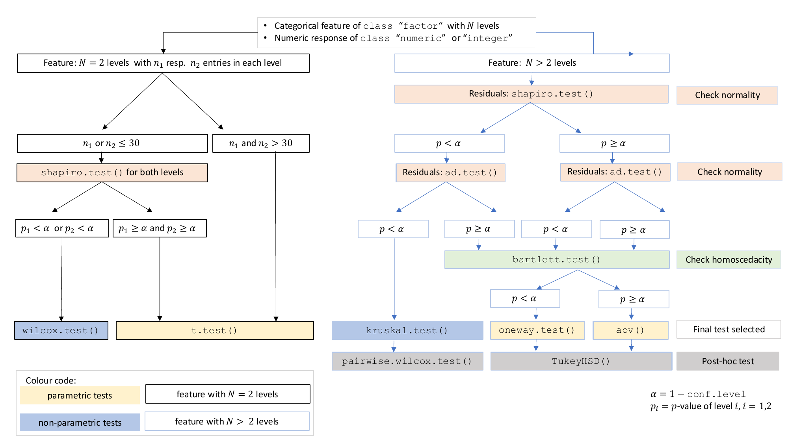

---
output:
  html_vignette:
 #pdf_document:
    toc: true
    number_sections: true
    toc_depth: 3
title: "visStatistics: The right test, visualised"
author: "Sabine Schilling"
date: "`r Sys.Date()`"
bibliography: visstat.bib
vignette: >
  %\VignetteIndexEntry{visStatistics}
  %\VignetteEngine{knitr::rmarkdown}
  %\VignetteEncoding{UTF-8}
editor_options:
  markdown:
    wrap: sentence
---

```{r, include = FALSE}
knitr::opts_chunk$set(
  echo = TRUE,
  eval = TRUE,
  collapse = TRUE,
  comment = "#>",
  fig.width = 8,
  fig.height = 5,
  out.width = "100%"
)
```

```{r setup}
library(visStatistics)
```

# Introduction

`visStatistics` automatically selects and visualises appropriate statistical hypothesis tests between a response and a feature variable in a data frame.
The choice of test depends on the `class`, distribution, and sample size of the input variables, as well as the user-defined 'conf.level'.
The main function `visstat()` visualises the selected test with appropriate graphs (box plots, bar charts, regression lines with confidence bands, mosaic plots, residual plots, Q-Q plots), annotated with the main test results, including any assumption checks and post-hoc analyses.
A minimal function call looks like:

`visstat(dataframe, varsample = "response", varfactor = "feature")`

The input `data.frame` must be column-based, and the response `varsample` and feature `varfactor` must be character strings naming columns of the `data.frame`.

This scripted workflow is particularly suited for browser-based interfaces that rely on server-side R applications connected to secure databases, where users have no direct access, or for quick data visualisations, e.g., in statistical consulting projects.

This scripted workflow is particularly well suited for interactive interfaces where users access data only through a graphical front end backed by server-side R sessions, as well as for quick data exploration e.g. in statistical consulting contexts.

The remainder of this vignette is organised as follows:

-   Section 2 summarises the decision logic used to select a statistical test.

-   Sections 3–5 provide background on the implemented tests and illustrate the decision logic using examples.
    Function names in parentheses in the headings indicate the corresponding statistical hypothesis test function in R,

-   Section 6 outlines the main limitations of the package.

-   Section 7 provides an overview of the implemented tests.

# Decision logic

Throughout the remainder, data of class `"numeric"` or `"integer"` are referred as numerical, while data of class `"factor"` are referred to as categorical.
The significance level $\alpha$, used throughout for hypothesis testing, is defined as `1 - conf.level`, where `conf.level` is a user-controllable argument (defaulting to `0.95`).

The choice of statistical tests performed by the function `visstat()` depends on whether the data are numerical or categorical, the number of levels in the categorical variable, the distribution of the data, as well as the user-defined 'conf.level'.

The function prioritizes interpretable visual output and tests that remain valid under the following decision logic:

## Numerical response and categorical predictor

When the response is numerical and the predictor is categorical, a statistical hypothesis test of central tendencies is selected.

-   If the categorical predictor has exactly two levels, Welch's t-test (`t.test()`) is applied whenever both groups contain more than 30 observations, with the validity of the test supported by the approximate normality of the sampling distribution of the mean under the central limit theorem [@Rasch:2011, @Lumley:2002].
    For smaller samples, group - wise normality is assessed using the Shapiro - Wilk test (`shapiro.test()`) at the significance level $\alpha$.
    If both groups are found to be approximately normally distributed according to the Shapiro--Wilk test, Welch's t-test is applied; otherwise, the Wilcoxon rank- sum test (`wilcox.test()`) is used.

-   For predictors with more than two levels, a model of Fisher's one-way analysis of variables (ANOVA) (`aov()`) is initially fitted.
    The normality of residuals is evaluated using both the Shapiro--Wilk test (`shapiro.test()`) and the Anderson-Darling test (`ad.test()`); residuals are considered approximately normal if at least one of the two tests yields a result exceeding the significance threshold $\alpha$.
    If this condition is met, Bartlett's test (`bartlett.test()`) assesses homoscedasticity.
    When variances are homogeneous ($p > \alpha$), Fisher's one-way ANOVA (`aov()`) is applied with Tukey's Honestly Significant Differences (HSD) (`TukeyHSD()`) for post-hoc comparison.
    If variances differ significantly ($p \le \alpha$), Welch's heteroscedastic one- way ANOVA (`oneway.test()`) is used, also followed by Tukey's HSD. If residuals are not normally distributed according to both tests ($p \le \alpha$), the Kruskal--Wallis test (`kruskal.test()`) is selected, followed by pairwise Wilcoxon tests (`pairwise.wilcox.test()`).
    A graphical overview of the decision logic used is provided in the figure below.

```{r fig-decision-switch, echo=FALSE, results='asis'}
if (knitr::opts_knit$get("rmarkdown.pandoc.to") == "html") {
  cat('
<div style="border: 1px solid #666; padding: 10px; display: inline-block; text-align: center;">
  
  <p style="font-style: italic; font-size: 90%; margin-top: 0.5em;">
    Decision tree used to select the appropriate statistical test for a categorical
    predictor and numerical response, based on the number of factor levels, normality,
    and homoscedasticity.
  </p>
</div>
')
} else {
  cat('
\\begin{center}
\\fbox{%
  \\begin{minipage}{0.95\\linewidth}
    \\centering
    \\includegraphics[width=\\linewidth]{../man/figures/decision_tree.png}\\\\
    \\vspace{0.5em}
    \\textit{Decision tree used to select the appropriate statistical test for a categorical predictor and numerical response, based on the number of factor levels, normality, and homoscedasticity.}
  \\end{minipage}
}
\\end{center}
')
}
```

## Numerical response and numerical feature

When both the response and predictor are numeric, a simple linear regression model (`lm()`) is fitted and analysed in detail, including residual diagnostics, formal tests, and the plotting of fitted values with confidence bands.
Note that **only one** predictor variable is allowed, as the function is designed for two-dimensional visualisation.

## Categorical response and categorical feature

In the case of two categorical variables, `visstat()` tests the null hypothesis that the predictor and response variables are independent using either Pearson’s $\chi^2$-test (`chisq.test()`) or Fisher's exact test (`fisher.test()`).
The choice of test is based on Cochran's rule [@Cochran:1954], which advises that the $\chi^2$approximation is reliable only if no expected cell count is less than 1 and no more than 20 percent of cells have expected counts below 5.

# Numerical response and categorical feature

If the feature consists of `class` "`factor`" with two or more levels and the response is of `class` "`numeric`" or "`integer`" (both having mode "`numerical`"), statistical tests are applied to compare the central tendencies across groups.
This section describes the conditions under which parametric and non-parametric tests are chosen, based on the response type, the number of factor levels, and the underlying distributional assumptions.

## Categorical feature with two levels: Welch's t-test and Wilcoxon rank-sum

test

When the feature variable has exactly two levels, Welch's t-test or the Wilcoxon rank-sum test is applied.

### Welch's t-test (`t.test()`)

Welch's t-test (`t.test()`) assumes that the observations are independent and that the response variable is approximately normally distributed within each group.
In contrast to Student's t-test, it does not require the assumption of equal variances (homoscedasticity) between groups.
Welch's t-test remains valid and exhibits only minimal loss of efficiency even when the assumptions of Student's t-test -- namely, normality and equal variances of the response variable across groups -- are satisfied [@Moser:1992; @Delacre:2017].
Therefore, Student's t-test is not implemented.

Welch's t-test evaluates the null hypothesis that the means of two groups are equal without assuming equal variances.
The test statistic is given by [@Welch:1947; @Satterthwaite:1946]

$$
t = \frac{\bar{x}_1 - \bar{x}_2}{\sqrt{\frac{s_1^2}{n_1} + \frac{s_2^2}{n_2}}},
$$ where $\bar{x}_1$ and $\bar{x}_2$ are the sample means, $s_1^2$ and $s_2^2$ the sample variances, and $n_1$, $n_2$ the sample sizes in the two groups.
The statistic follows a *t*-distribution with degrees of freedom approximated by the Welch-Satterthwaite equation:

$$
\nu \approx \frac{
\left( \frac{s_1^2}{n_1} + \frac{s_2^2}{n_2} \right)^2
}{
\frac{(s_1^2 / n_1)^2}{n_1 - 1} + \frac{(s_2^2 / n_2)^2}{n_2 - 1}
}.
$$

The resulting p-value is computed from the *t*-distribution with $\nu$ degrees of freedom.

### Wilcoxon rank-sum test (`wilcox.test()`)

The two-sample Wilcoxon rank-sum test (also known as the Mann-Whitney test) is a non-parametric alternative that does not require the response variable to be approximately normally distributed within each group.
It tests for a difference in location between two independent distributions [@Wilcoxon:1945; @Mann:1947].
If the two groups have distributions that are sufficiently similar in shape and scale, the Wilcoxon rank-sum test can be interpreted as testing whether the medians of the two populations are equal [@Hollander:2014].

The two-level factor variable `varfactor` defines two groups, with sample sizes $n_1$ and $n_2$.
All $n_1 + n_2$ observations are pooled and assigned ranks from $1$ to $n_1 +
n_2$.
Let $W_{\text{Wilcoxon}}$ denote the sum of the ranks assigned to the group corresponding to the first level of `varfactor` containing $n_1$ observations.
The test statistic returned by `visstat()` is then computed as

$$
W = W_{\text{Wilcoxon}} - \frac{n_1(n_1 + 1)}{2}.
$$

If both groups contain fewer than 50 observations and the data contain no ties, the *p*-value is computed exactly.
Otherwise, a normal approximation with continuity correction is used.

### Graphical output

<!-- The below paragph is a repetition of the decision logic:  -->

```{=html}
<!-- `visstat()` selects between Welch's t-test and the Wilcoxon rank-sum test
as follows. If both groups contain more than 30 observations, Welch's t-test is
always applied, relying on the central limit theorem to justify its application
regardless of underlying normality [@Rasch:2011; @Lumley:2002]. -->
```

```{=html}
<!-- If either group contains fewer than 30 observations, the Shapiro--Wilk test
(`shapiro.test()`) is applied separately to each group. Welch's t-test is used
if both tests do not reject normality at the significance level $\alpha$;
otherwise, the Wilcoxon rank-sum test is applied. -->
```

The graphical output consists of box plots overlaid with jittered points to display individual observations.
When Welch's t-test is applied, the function includes confidence intervals based on the user-specified `conf.level`.

The title is structured as follows:

-   First line: Test name and chosen significance level $\alpha$.

-   Second line: Null hypotheses automatically adapted based on the user- specified `varsample` and `varfactor`.

-   Third line: Test statistic, p-value and automated comparison with $\alpha$

The function returns a list containing the results of the applied test and the summary statistics used to construct the plot.

### Examples

#### Welch's t-test {.unnumbered}

The *Motor Trend Car Road Tests* dataset (`mtcars`) contains 32 observations, where `mpg` denotes miles per (US) gallon, and `am` represents the transmission type (`0` = automatic, `1` = manual).

```{r}
mtcars$am <- as.factor(mtcars$am)
t_test_statistics <- visstat(mtcars, "mpg", "am")
```

Increasing the confidence level `conf.level` from the default 0.95 to 0.99 results in wider confidence intervals, as a higher confidence level requires more conservative bounds to ensure that the interval includes the true parameter value with greater certainty.

```{r}
mtcars$am <- as.factor(mtcars$am)
t_test_statistics_99 <- visstat(mtcars, "mpg", "am", conf.level = 0.99)
```

#### Wilcoxon rank sum test {.unnumbered}

The Wilcoxon rank sum test is exemplified on differences between the central tendencies of grades of "boys" and "girls" in a class:

```{r}
grades_gender <- data.frame(
  sex = as.factor(c(rep("girl", 21), rep("boy", 23))),
  grade = c(
    19.3, 18.1, 15.2, 18.3, 7.9, 6.2, 19.4,
    20.3, 9.3, 11.3, 18.2, 17.5, 10.2, 20.1, 13.3, 17.2, 15.1, 16.2, 17.0,
    16.5, 5.1, 15.3, 17.1, 14.8, 15.4, 14.4, 7.5, 15.5, 6.0, 17.4,
    7.3, 14.3, 13.5, 8.0, 19.5, 13.4, 17.9, 17.7, 16.4, 15.6, 17.3, 19.9, 4.4, 2.1
  )
)

wilcoxon_statistics <- visstat(grades_gender, "grade", "sex")
```

## Categorical feature with more than two levels

If the feature is of `class` "`factor`" with **more than two levels** and the response is of `mode` "`numerical`", `visstat()` either performs Fisher’s one- way ANOVA [@Fisher:1935] (`aov()`), Welch’s heteroscedastic one-way ANOVA [@Welch:1951] (`oneway.test()`) or, as a non-parametric alternative, the Kruskal --Wallis test [@Kruskal:1952] (`kruskal.test()`).

In the remainder of this section, we briefly introduce the tests themselves, the assumption checks, and the post-hoc procedures, and illustrate each test with an example.

### Fisher's one-way ANOVA (`aov()`)

Fisher's one-way ANOVA (`aov()`) tests the null hypothesis that the means of multiple groups are equal.
It assumes independent observations, normally distributed residuals, and **homogeneous** variances across groups.
The test statistic is the ratio of the variance explained by differences among group means (between-group variance) to the unexplained variance within groups:

$$
F = \frac{\text{between-group variance}}{\text{within-group variance}}
= \frac{\frac{\sum_{i=1}^{k} n_i (\bar{x}_i - \bar{x})^2}{k - 1}}
{\frac{\sum_{i=1}^{k}\sum_{j=1}^{n_i}(x_{ij}-\bar{x}_i)^2}{N - k}},
$$

where $\bar{x}_i$ is the mean of group $i$, $\bar{x}$ is the overall mean, $x_{ij}$ is the observation $j$ in group $i$, $n_i$ is the sample size in group $i$, $k$ is the number of groups, and $N$ is the total number of observations.

Under the null hypothesis, this statistic follows an F-distribution with two parameters for degrees of freedom: the numerator ($k - 1$) and the denominator ($N - k$).
The resulting p-value is computed from this distribution.

### Welch’s heteroscedastic one-way ANOVA (`oneway.test()`)

When only the assumptions of independent observations and normally distributed residuals are met, but *homogeneous variances* across groups *cannot be assumed* , Welch's heteroscedastic one-way ANOVA (`oneway.test()`) [@Welch:1951] provides an alternative to `aov()`.
It compares group means using weights based on sample sizes and variances.
The degrees of freedom are adjusted using a Satterthwaite-type approximation [@Satterthwaite:1946], resulting in an F-statistic with non-integer degrees of freedom.

### Kruskal–Wallis test (`kruskal.test()`)

When the assumption of normality is not met, the Kruskal–Wallis test provides a non-parametric alternative.
It compares group distributions based on ranked values and tests the null hypothesis that the groups come from the same population — specifically, that the distributions have the same location [@Kruskal:1952].
If the group distributions are sufficiently similar in shape and scale, then the Kruskal–Wallis test can be interpreted as testing for equality of medians across groups [@Hollander:2014].

The test statistic is defined as:

$$
H = \frac{12}{N(N+1)} \sum_{i=1}^{k} n_i \left(\bar{R}_i - \bar{R} \right)^2,
$$

where $n_i$ is the sample size in group $i$, $k$ is the number of groups, $\bar{R}_i$ is the average rank of group $i$, $N$ is the total sample size, and $\bar{R} = \frac{N+1}{2}$ is the average of all ranks.
Under the null hypothesis, $H$ approximately follows a $\chi^2$ distribution with $k - 1$ degrees of freedom.

### Test choice

### Testing the assumptions (`visAnovaAssumptions()`)

The test logic for `aov()` and `oneway.test()` follows from their respective assumptions.
`visstat()` initially models the data using `aov()` and analyses the residuals.

If both of the following conditions are met: (1) the standardised residuals follow a normal distribution, and (2) the residuals exhibit homoscedasticity (equal variances across groups), then the test statistic from `aov()` is returned.

If only the normality assumption is satisfied, `visstat()` applies `oneway.test()`.
If the normality assumption is violated, `kruskal.test()` is used instead.

These assumptions are tested using the `visAnovaAssumptions()` function.

#### Normality of residuals (`shapiro.test()` and `ad.test()`)

The `visAnovaAssumptions()` function assesses the normality of standardised residuals from the ANOVA fit using both the Shapiro--Wilk test (`shapiro.test()`) and the Anderson--Darling test (`ad.test()`).
Normality is assumed if at least one of the two tests yields a p-value greater than $\alpha$.
<!-- (see Figure @ref(fig:fig-decision-tree)). -->

The function generates two diagnostic plots:

-   a scatter plot of the standardised residuals against the fitted means of the linear model for each level of the feature (`varfactor`), and
-   a Q--Q plot of the standardised residuals.

#### Equal variances across groups (`bartlett.test()`)

Both `aov()` and `oneway.test()` assess whether two or more samples drawn from normal distributions have the same mean.
While `aov()` assumes homogeneity of variances across groups, `oneway.test()` does not require the variances to be equal.

Homoscedasticity is assessed using Bartlett's test (`bartlett.test()`), which tests the null hypothesis that the variances across all levels of the grouping variable are equal.

### Controlling the family-wise error rate

After a significant test result, we would like to identify which specific groups differ significantly from each other.
However, simple pairwise comparisons of group means or medians following an ANOVA or Kruskal--Wallis test increase the probability of incorrectly declaring a significant difference when, in fact, there is none.

This error is quantified by the family-wise error rate $\alpha_{PF}$ (pronounced “alpha per family of tests”), which refers to the probability of making at least one Type I error, that is, falsely rejecting the null hypothesis across all pairwise comparisons.

Given $n$ levels of the categorical variable, there are

$$
M = \frac{n \cdot (n - 1)}{2}
$$

pairwise comparisons possible, defining a *family of tests* [@Abdi:2007].

#### Šidák correction {.unnumbered}

If $\alpha_{PT}$ (pronounced “alpha per test”) is the probability of making a Type I error in one comparison, then $1 - \alpha_{PT}$ is the probability of not making a Type I error in one comparison.

If all $M$ comparisons are **independent** of each other, the probability of making no Type I error across the entire family of pairwise comparisons is $(1 -
\alpha_{PT})^M$.
The family-wise error rate is then given by its complement [@Abdi:2007]:

$$
\alpha_{PF} = 1 - (1 - \alpha_{PT})^M.
$$

Let us illustrate the inflation of the family-wise error rate with increasing group number $n$ (equal to the number of `levels` in the categorical variable)) by the following examples: With $\alpha_{PT}=0.05$ comparing $n=3$ groups results in a family-wise error rate of $\alpha_{PF} \approx 14\%$, whereas comparing $n=6$ groups (as in the examples below) already leads to the probability of at least one time falsely rejecting the null hypothesis of $\alpha_{PF} \approx 54\%$.

Solving the last equation defining $\alpha_{PF}$ for $\alpha_{PT}$ yields the Šidák equation [@Sidak:1967]:

$$
\alpha_{PT}=1-(1-{\alpha_{PF}})^{1/M}.
$$ This shows that, in order to achieve a given family-wise error rate, the corresponding per-test significance level must be reduced when there are more than two groups.
<!-- ###### Šidák  correction in `visstat()` {.unnumbered} -->

`visstat()` sets $\alpha_{PF}$ to the user-defined $\alpha = 1 -$ `conf.level`, resulting in

$$\alpha_{Sidak}=\alpha_{PT} = \alpha_{Sidak}= 1 - \texttt{conf.level}^{1 / M}.
$$

The default settings result in $\alpha_{PF} = 5\%$.
For example, for $n = 3$ groups, this leads to $\alpha_{PT} = 1.70\%$; for $n = 6$ groups to $\alpha_{PT} = 0.34\%$; and for $n = 10$ groups already to the very small $\alpha_{PT} = 0.11\%$.

These examples illustrate that the Šidák approach becomes increasingly conservative as the number of comparisons grows.
Moreover, since the method assumes independence among tests, it may be overly conservative when this assumption is violated.

#### Post-hoc test following an ANOVA: `TukeyHSD()` {.unnumbered}

In contrast to the general-purpose Šidák correction, Tukey's Honestly Significant Differences procedure (`TukeyHSD()`) is specifically designed for pairwise mean comparisons following an ANOVA (either `aov()` or `oneway.test()`).
It controls the family-wise error rate using a critical value from the studentised range distribution, which properly accounts for the correlated nature of pairwise comparisons sharing a common residual variance [@Hochberg:1987].

Based on the user-specified confidence level (`conf.level`), `visstat()` constructs confidence intervals for all pairwise differences between factor level means.
A significant difference between two means is indicated when the corresponding confidence interval does not include zero.
`visstat()` returns both the HSD-adjusted p-values and the associated confidence intervals for all pairwise comparisons.

#### Post-hoc test following the Kruskal--Wallis rank sum test: `pairwise.wilcox.test()` {.unnumbered}

As a post-hoc analysis following the Kruskal--Wallis test, `visstat()` applies the pairwise Wilcoxon rank sum test using `pairwise.wilcox.test()` to compare each pair of factor levels (see section “Wilcoxon rank-sum test (`wilcox.test()`)”).

The resulting p-values from all pairwise comparisons are then adjusted for multiple testing using Holm's method [@Holm:1979]: These p-values are first sorted from smallest to largest and tested against thresholds that become less strict as their rank increases.
This stepwise adjustment does not assume independence among tests and is typically less conservative than the Šidák method, while still ensuring strong control of the family-wise error rate.

### Graphical output

The graphical output for all tests based on a numerical response and a categorical feature with more than two levels consists of two panels: the first focuses on the residual analysis, and the second on the actual test chosen by the decision logic.

The residual panel addresses the assumption of normality, both graphically and through formal tests.
It displays a scatter plot of the standardised residuals versus the predicted values, as well as a normal Q--Q plot comparing the sample quantiles to the theoretical quantiles.
If the residuals are normally distributed, no more than $5\%$ of the standardised residuals should exceed approximately $|2|$ and in the Q--Q plot the data points should approximately follow the red straight line.

To assume normality of residuals, the formal tests for normality (Shapiro--Wilk and Anderson--Darling) should result in p-values greater than the user-defined $\alpha$.

To assume homogeneity of variances, Bartlett's test (shown in the first line of the panel title) should also result in a p-value greater than $\alpha$.

`visstat()` then illustrates, in the subsequent graph, either the `kruskal.test()`, the `oneway.test()`, or `aov()` result (see also Section "Decision logic").

If neither normality of the residuals nor homogeneity of variances is given, the `kruskal.test()` is executed.
The result is illustrated using box plots alongside jittered data points, with the title displaying the p-value from `kruskal.test()`.

Above each box plot, the number of observations per level is shown.
Different green letters below a pair of box plots indicate that the two groups are considered significantly different, based on Holm's-adjusted pairwise Wilcoxon rank sum test p-values smaller than $\alpha$.

If normality of the residuals can be assumed, a parametric test is chosen: either `aov()`, if homoscedasticity is also assumed, or `oneway.test()` otherwise.
`visstat()` displays the name of the test and the corresponding $F$ and p-value in the title.

The graph shows both the `conf.level` $\cdot\,100\%$ confidence intervals and the wider Šidák-corrected $(1 - \alpha_{Sidak}) \cdot 100\%$ confidence intervals, alongside jittered data points for each group.

Different green letters below a pair of confidence intervals indicate that the two groups are considered significantly different, based on the results of the `TukeyHSD()` procedure.

The function returns a list containing the relevant test statistics along with the post-hoc-adjusted $p$-values for all pairwise comparisons.

### Examples

#### One-way test {.unnumbered}

The `npk` dataset reports the yield of peas (in pounds per block) from an agricultural experiment conducted on six blocks.
In this experiment, the application of three different fertilisers -- nitrogen (N), phosphate (P), and potassium (K) -- was varied systematically.
Each block received either none, one, two, or all three of the fertilisers,

```{r}
oneway_npk <- visstat(npk, "yield", "block",conf.level=0.99)
```

Normality of residuals is supported by graphical diagnostics (scatter plot of standardised residuals, Q-Q plot) and formal tests (Shapiro--Wilk and Anderson- Darling, both with $p > \alpha$).
However, homogeneity of variances is not supported at the given confidence level ($p < \alpha$, `bartlett.test()`), so the p-value from the variance-robust `oneway.test()` is reported.
Post-hoc analysis with `TukeyHSD()` shows no significant yield differences between blocks, as all share the same group label (e.g., all green letters).

#### ANOVA example {.unnumbered}

<!-- {.unnumbered} -->

The `InsectSprays` dataset reports insect counts from agricultural experimental units treated with six different insecticides.
To stabilise the variance in counts, we apply a square root transformation to the response variable.

```{r}
insect_sprays_tr <- InsectSprays
insect_sprays_tr$count_sqrt <- sqrt(InsectSprays$count)
test_statistic_anova=visstat(insect_sprays_tr, "count_sqrt", "spray")
# test_statistic_anova 
```

After the transformation, the homogeneity of variances can be assumed ($p>
\alpha$ as calculated with the `bartlett.test()`), and the test statistic and p-value of the `aov()` is displayed.

#### Kruskal--Wallis rank sum test {.unnumbered}

The `iris` dataset contains petal width measurements (in cm) for three different iris species.

```{r}
visstat(iris, "Petal.Width", "Species")
```

In this example, scatter plots of the standardised residuals and the Q-Q plot suggest that the residuals are not normally distributed.
This is confirmed by very small p-values from both the Shapiro--Wilk and Anderson-Darling tests.

If both p-values are below the significance level $\alpha$, `visstat()` switches to the non-parametric `kruskal.test()`.
Post-hoc analysis using `pairwise.wilcox.test()` shows significant differences in petal width between all three species, as indicated by distinct group labels (all green letters differ).

# Numerical response and numerical feature

## Simple linear regression (`lm()`)

If both the feature `varfactor` and the response `varsample` are numerical and contain only one level each, `visstat()` performs a simple linear regression.

The resulting regression plot displays the point estimate of the regression line

$$
y = a + b \cdot x,
$$

where $y$ is the response variable, $x$ is the feature variable, $a$ is the intercept, and $b$ is the slope of the regression line.

### Residual analysis

`visstat()` checks the normality of the standardised residuals from `lm()` both graphically and using the Shapiro--Wilk and Anderson-Darling tests.
If the p-values for the null hypothesis of normally distributed residuals from both tests are smaller than $1 -$`conf.int`, the title of the residual plot will display the message: "Requirement of normally distributed residuals not met".

Regardless of the result of the residual analysis, `visstat()` proceeds to perform the regression.
The title of the graphical output indicates the chosen confidence level (`conf.level`), the estimated regression parameters with their confidence intervals and p-values, and the adjusted $R^2$.
The plot displays the raw data, the fitted regression line, and both the confidence and prediction bands corresponding to the specified `conf.level`.

`visstat()` returns a list containing the regression test statistics, the p-values from the normality tests of the standardised residuals, and the pointwise estimates of the confidence and prediction bands.

### Examples

#### dataset: `cars`{.unnumbered}

The `cars` dataset reports the speed of cars in miles per hour (`speed`) and the stopping distance in feet (`dist`).

```{r}
linreg_cars <- visstat(cars, "dist", "speed")
```

Increasing the confidence level `conf.level` from the default 0.95 to 0.99 results in wider confidence and prediction bands:

```{r}
linreg_cars <- visstat(cars, "dist", "speed", conf.level = 0.99)
```

p-values greater than `conf.level` in both the Anderson-Darling normality test and the Shapiro--Wilk test of the standardised residuals indicate that the normality assumption of the residuals underlying the linear regression is met.

```{r}
linreg_trees <- visstat(trees, "Volume", "Girth", conf.level = 0.9)
```

#### dataset: `trees`{.unnumbered}

The `trees` dataset provides measurements of the diameter (`Girth`, in inches), `Height` (in feet), and `Volume` (in cubic feet) of black cherry trees.
In this example, we choose `Volume` as the response and `Girth` as the feature.

```{r}
linreg_cars <- visstat(trees, "Volume", "Girth", conf.level = 0.9)
```

Both the graphical analysis of the standardised residuals and p-values greater than $\alpha$ in the Anderson-Darling and Shapiro--Wilk tests suggest that the assumption of normally distributed residuals is met.
Furthermore, the linear regression model explains 93% of the total variance in the response variable `Volume`.

# Categorical response and categorical feature

```{=html}
<!-- When both the feature `varfactor` and the response `varsample` are
categorical variables (i.e., of type `factor`), `visstat()` tests the null
hypothesis that the two variables are independent. Categorical data are
typically represented as contingency tables, which cross-tabulate the observed
frequencies for each combination of factor levels. Based on these observed
frequencies, `visstat()` computes the expected frequencies under the null
hypothesis of independence.  -->
```

When both `varfactor` and `varsample` are categorical (i.e., of class `factor`), `visstat()` tests the null hypothesis that the two variables are independent.
Observed frequencies are typically arranged in a contingency table, where rows index the levels $i$ of the response variable and columns index the levels $j$ of the feature variable.

## Pearson's residuals and mosaic plots

Mosaic plots provide a graphical representation of contingency tables, where the area of each tile is proportional to the observed cell frequency.
To aid interpretation, tiles are coloured based on Pearson residuals from a chi- squared test of independence.
These residuals measure the standardised deviation of observed from expected counts under the null hypothesis of independence.

Let $O_{ij}$ and $E_{ij}$ denote the observed and expected frequencies in row $i$ and column $j$ of an $R \times C$ contingency table.
The Pearson residual for each cell is defined as

$$
r_{ij} = \frac{O_{ij} - E_{ij}}{\sqrt{E_{ij}}}, \quad i = 1, \ldots, R,\quad
j = 1, \ldots, C.
$$ Positive residuals (shaded in blue) indicate observed counts greater than expected, while negative values suggest under-representation (shaded in red).
Colour shading thus highlights which combinations of categorical levels contribute most to the overall association.

## Pearson’s $\chi^2$-test (`chisq.test()`)

The test statistic of Pearson’s $\chi^2$-test [@Pearson:1900] is the sum of squared Pearson residuals:

$$
\chi^2 = \sum_{i=1}^{R} \sum_{j=1}^{C} r_{ij}^2 =
\sum_{i=1}^{R} \sum_{j=1}^{C} \frac{(O_{ij} - E_{ij})^2}{E_{ij}}.
$$

The test statistic is compared to the chi-squared distribution with \$ (R - 1)(C - 1)\$ degrees of freedom.
The resulting p-value corresponds to the upper tail probability — that is, the probability of observing a value greater than or equal to the test statistic under the null hypothesis.

### Pearson’s $\chi^2$ test with Yates’ continuity correction

Yates’ correction is applied to the Pearson $\chi^2$ statistic in $2 \times 2$ contingency tables (with one degree of freedom).
In this case, the approximation of the discrete sampling distribution by the continuous $\chi^2$ distribution tends to overestimate the significance level of the test.
To correct for this, Yates proposed subtracting 0.5 from each absolute difference between observed and expected counts [@Yates:1934], resulting in a smaller test statistic: $$
\chi^2_{\text{Yates}} = \sum_{i=1}^{2} \sum_{j=1}^{2}
\frac{(|O_{ij} - E_{ij}| - 0.5)^2}{E_{ij}}.
$$

This reduced test statistic yields a larger p-value, thereby lowering the risk of a Type I error.

Yates' continuity correction is applied by default by the underlying routine `chisq.test()`.
## Fisher's exact test (`fisher.test()`)

The $\chi^2$ approximation is considered reliable only if no expected cell count is less than 1 and no more than 20 percent of cells have expected counts below 5 [@Cochran:1954]).
If this condition is not met, Fisher's exact test [@Fisher:1935] (`fisher.test()`) is applied instead, as it is a non-parametric method that does not rely on large-sample approximations.
The test calculates an exact p-value for testing independence by conditioning on the observed margins: the row totals $R_i = \sum_{j=1}^C O_{ij}$ and the column totals $C_j = \sum_{i=1}^R O_{ij}$, defining the structure of the contingency table.

In the $2 \times 2$ case, the observed table can be written as:

$$
\begin{array}{c|cc|c}
& C_1 & C_2 & \text{Row sums} \\\\
\hline
R_1 & a & b & a + b \\\\
R_2 & c & d & c + d \\\\
\hline
\text{Column sums} & a + c & b + d & n
\end{array}
$$

Let $$
O = \begin{bmatrix} a & b \\\\ c & d \end{bmatrix}
$$ denote the above observed $2 \times 2$ contingency table.
The exact probability of observing this table under the null hypothesis of independence, given the fixed margins, is given by the hypergeometric probability mass function (PMF)

$$
\mathbb{P}(O \mid
R_1, R_2, C_1, C_2) =
\frac{\binom{a + b}{a} \binom{c + d}{c}}{\binom{n}{a + c}},
$$

where $n = a + b + c + d$ is the total sample size.

```{=html}
<!-- Because all other cell values are determined by $a$ and the fixed margins,
-->
```

<!-- this is often written more simply as: -->

<!-- $$ -->

<!-- P(a \mid \text{margins}) = -->

<!-- \frac{\binom{a + b}{a} \binom{c + d}{c}}{\binom{n}{a + c}}. -->

<!-- $$ -->

The p-value is computed by summing the probabilities of all tables with the same margins whose probabilities under the null are less than or equal to that of the observed table.

For general $R \times C$ tables, `fisher.test()` generalises this approach using the multivariate hypergeometric distribution.

## Test choice and graphical output

If the expected frequencies are sufficiently large - specifically, if at least 80% of the cells have expected counts greater than 5 and no expected count is zero - the function uses Pearson's ${\chi}^2$-test (`chisq.test()`).

Otherwise, it switches to Fisher's exact test (`fisher.test()`) [@Cochran:1954].

For 2-by-2 contingency tables, Yates' continuity correction [@Yates:1934] is always applied to Pearson's ${\chi}^2$-test.

For all tests of independence `visstat()` displays a grouped column plot that includes the respective test's p-value in the title, as well as a mosaic plot showing colour-coded Pearson residuals and the p-value of Pearson's $\chi^2$-test.

## Transforming a contingency table to a data frame

The following examples for tests of categorical feature and response are all based on the `HairEyeColor` contingency table.

Contingency tables must be converted to the required column-based `data.frame` using the helper function `counts_to_cases()`.
The function transforms the contingency table `HairEyeColor` into `data.frame` named `HairEyeColourDataFrame`.

```{r}
HairEyeColourDataFrame <- counts_to_cases(as.data.frame(HairEyeColor))
```

## Examples

In all examples of this section, we will test the null hypothesis that hair colour ("Hair") and eye colour ("Eye") are independent of each other.

### Pearson's ${\chi}^2$-test (`chisq.test()`)

```{r}
hair_eye_colour_df <- counts_to_cases(as.data.frame(HairEyeColor))
visstat(hair_eye_colour_df, "Hair", "Eye")
```

The graphical output shows that the null hypothesis of Pearson's $\chi^2$ test -- namely, that hair colour and eye colour are independent -- must be rejected at the default significance level $\alpha=0.05$ ($p = 2.33 \cdot 10^{-25} <
\alpha$).
The mosaic plot indicates that the strongest deviations are due to over- representation of individuals with black hair and brown eyes, and of those with blond hair and blue eyes.
In contrast, individuals with blond hair and brown eyes are the most under- represented.

#### Pearson's ${\chi}^2$-test with Yate's continuity correction

In the following example, we restrict the data to participants with either black or brown hair and either brown or blue eyes, resulting in a 2-by-2 contingency table.

```{r}
hair_black_brown_eyes_brown_blue <- HairEyeColor[1:2, 1:2, ]
# Transform to data frame
hair_black_brown_eyes_brown_blue_df <- counts_to_cases(as.data.frame(hair_black_brown_eyes_brown_blue))
# Chi-squared test
visstat(hair_black_brown_eyes_brown_blue_df, "Hair", "Eye")
```

Also in this reduced dataset we reject the null hypothesis of independence of the hair colors "brown" and "black" from the eye colours "brown" and " blue".
The mosaic plot shows that blue eyed persons with black hair are under- represented.
Note the higher p-value of Pearson's ${\chi}^2$-test with Yate's continuity correction (p = 0.00354) compared to the p-value of Pearson's ${\chi}^2$-test (p = 0.00229) shown in the mosaic plot.

### Fisher's exact test (`fisher.test()`)

Again, we extract a 2-by-2 contingency table from the full dataset, this time keeping only male participants with black or brown hair and hazel or green eyes.

Pearson's ${\chi}^2$ test applied to this table would yield an expected frequency less than 5 in one of the four cells (25% of all cells), which violates the requirement that at least 80% of the expected frequencies must be 5 or greater [@Cochran:1954].

Therefore, `visstat()` automatically selects Fisher's exact test instead.

```{r}
hair_eye_colour_male <- HairEyeColor[, , 1]
# Slice out a 2 by 2 contingency table
black_brown_hazel_green_male <- hair_eye_colour_male[1:2, 3:4]
# Transform to data frame
black_brown_hazel_green_male <- counts_to_cases(as.data.frame(black_brown_hazel_green_male))
# Fisher test
fisher_stats <- visstat(black_brown_hazel_green_male, "Hair", "Eye")
```

## Saving the graphical output

All generated graphics can be saved in any file format supported by `Cairo()`, including "png", "jpeg", "pdf", "svg", "ps", and "tiff" in the user specified `plotDirectory`.
In the following example, we store the graphics in `png` format in the `plotDirectory` `tempdir()`.
The file names reflect the statistical test used and the variable names involved.

```{r}
#Graphical output written to plotDirectory: In this example 
# a bar chart to visualise the Chi-squared test and mosaic plot showing
# Pearson's residuals.
#chi_squared_or_fisher_Hair_Eye.png and mosaic_complete_Hair_Eye.png
visstat(black_brown_hazel_green_male, "Hair", "Eye",
  graphicsoutput = "png", plotDirectory = tempdir())
```

Remove the graphical output from `plotDirectory`:

```{r, eval=FALSE}
file.remove(file.path(tempdir(), "chi_squared_or_fisher_Hair_Eye.png"))
file.remove(file.path(tempdir(), "mosaic_complete_Hair_Eye.png"))
```

# Limitations

The main purpose of this package is a decision-logic based automatic visualisation of statistical test results.
Therefore, except for the user-adjustable `conf.level` parameter, all statistical tests are applied using their default settings from the corresponding base R functions.
As a consequence, paired tests are currently not supported and `visstat()` does not allow to study interactions terms between the different levels of an independent variable in an analysis of variance.
Focusing on the graphical representation of tests, only simple linear regression is implemented, as multiple linear regressions cannot be visualised.
# Implemented tests

## Numerical response and categorical feature

When the response is numerical and the feature is categorical, test of central tendencies are selected:

`t.test()`, `wilcox.test()`, `aov()`, `oneway.test()`,`kruskal.test()`

### Normality assumption check

`shapiro.test()` and `ad.test()`

### Homoscedasticity assumption check

`bartlett.test()`

### Post-hoc tests

-   `TukeyHSD()` (for `aov()`and `oneway.test()`)
-   `pairwise.wilcox.test()` (for `kruskal.test()`)

## Numerical response and numerical feature

When both the response and feature are numerical, a simple linear regression model is fitted:

`lm()`

## Categorical response and categorical feature

When both variables are categorical, `visstat()` tests the null hypothesis of independence using one of the following:

-   `chisq.test()` (default for larger samples)
-   `fisher.test()` (used for small expected cell counts based on Cochran's rule)

# Bibliography
